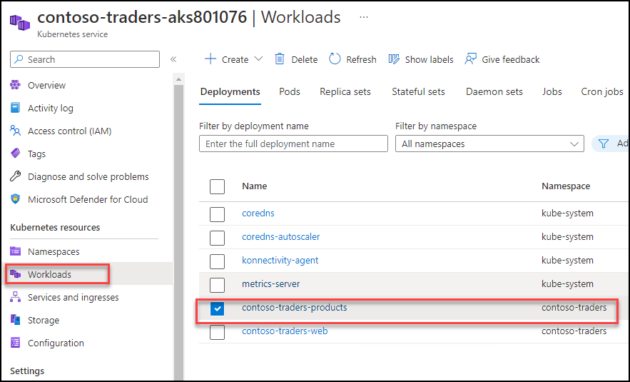
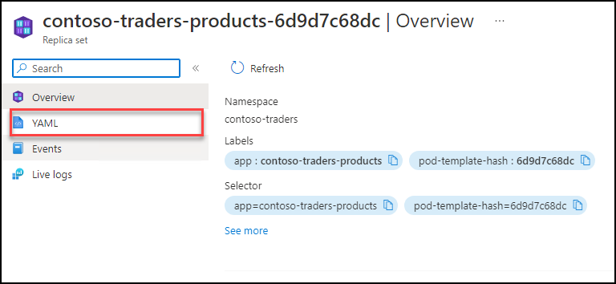
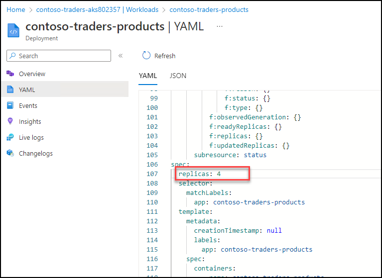
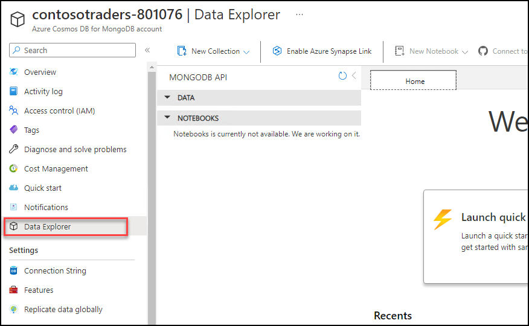
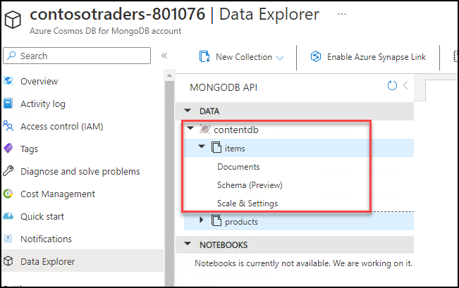
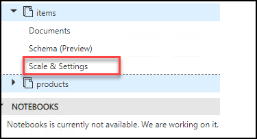
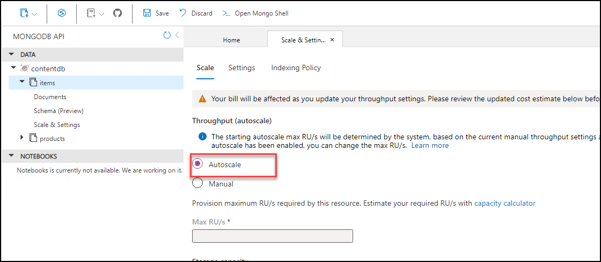
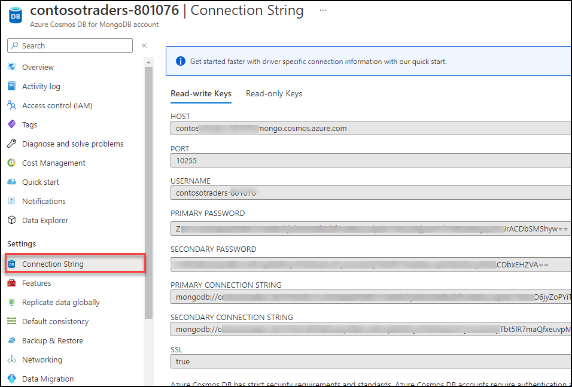
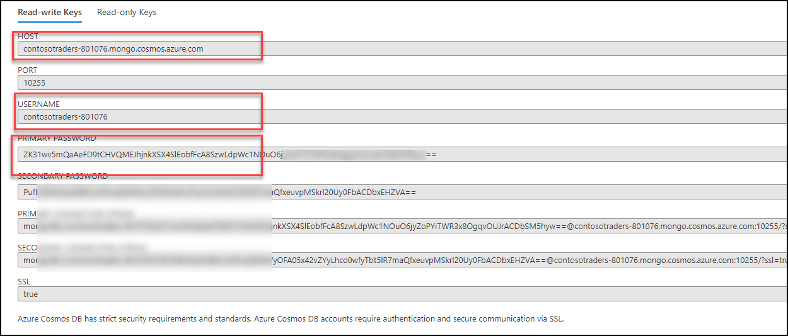

## Exercise 4: Scale the application and testing HA

**Duration**: 40 minutes

## Overview

At this point, you have deployed a single instance of the Web and Products API service containers. In this exercise, you will increase the number of container instances for the web service and scale the front-end on the existing cluster.

### Task 1: Increase service instances from the Azure Portal

In this task, you will increase the number of instances for the API deployment in the AKS. While it is deploying, you will observe the changing status.

1. In the AKS blade in the Azure Portal select **Workloads** and then select the **contoso-traders-products** deployment.

   

2. Select **YAML** in the window that loads and scroll down until you find **replicas** under spec section. Change the number of replicas to **2**, and then select **Review + save**. When prompted, check **Confirm manifest change** and select **Save**.

   

   > **Note**: If the deployment completes quickly, you may not see the deployment Waiting states in the portal, as described in the following steps.

3. You will see it is now deploying and that there is one healthy instance and one pending instance (3).

   

5. Open the Contoso Traders web application. The application should still work without errors.

    

### Task 2: Resolve failed replica provisioning 

In this task, you will resolve the failed API replicas. These failures occur due to the clusters'inability to meet the requested resources.

1. In the AKS blade in the Azure Portal select **Workloads** (1) and then select the ** contoso-traders-product ** (2) deployment. 

   

1. Select the **YAML** navigation item.

   

1. In the **YAML** screen scroll down and change the following items:

   - Modify **ports** and remove the **hostPort**. Two Pods cannot map to the same host port.

      ```yaml
      ports:
        - containerPort: 3001
          protocol: TCP
      ```

   - Modify the **cpu** and set it to **100m**. CPU is divided between all Pods on a Node.

      ```yaml
      resources:
        requests:
          cpu: 100m
          memory: 128Mi
      ```

   Select **Review + save** and, when prompted, confirm the changes, and select **Save**.

   

1. Return to the **Workloads** main view on the AKS Azure Portal and you will now see that the Deployment is healthy with two Pods operating.

   
   
### Task 3: Configure Horizontal Autoscaling for AKS pods

In this task you will be configuring the Horizontal Autoscaling for your AKS pods.
   
1. Navigate back to your windows command shell.

1. Run the below command to configure the Horizontal autoscaling for you apiProducts pods

   ``` bash 
   kubectl autoscale deployment contoso-traders-products -n contoso-traders --cpu-percent=50 --min=1 --max=10 ```
   
   
   
1. Now run the below command to check the status of the newly made HorizontalPodAutoscaler

   ``` kubectl get hpa -n contoso-traders ```
   
   


### Task 4: Restart containers and test HA

In this task, you will restart containers and validate that the restart does not impact the running service.

1. In the AKS blade in the Azure Portal select **Workloads** (1) and then select the **contoso-traders-product** (2) deployment. 

   

1. Select the **YAML** navigation item and increase the required replica count to `4`. 

   

1. After a few moments you will find that the contoso-traders-product deployment is now running 4 replicas successfully.

   

1. Return to the browser tab with the web application stats page loaded. Refresh the page over and over. You will not see any errors.

   

1. Select two of the Pods at random and choose **Delete**. Select **Confirm delete**, and press **Delete** again.

   

1. Kubernetes will launch new Pods to meet the required replica count. Depending on your view you may see the old instances Terminating and new instances being Created.

   

1. Return to the API Deployment and scale it back to `1` replica. See Step 3 above for how to do this if you are unsure.

1. Return to the sample web site's stats page in the browser and refresh while Kubernetes is scaling down the number of Pods. You should be able to see the website running without any issues

    

### Task 5: Configure CosmosDB Autoscale

In this task, you will setup Autoscale on Azure Cosmos DB.

1. In the Azure Portal, navigate to the **Contosotraders-<inject key="DeploymentID" />** Azure Cosmos DB Account.

2. Select **Data Explorer**.

    

3. Within **Data Explorer**, expand the `contentdb` (1) database.

    

4. Under the `contentdb` database, expand **Items** collection, select **Scale & Settings**.

    

5. On the **Scale**, select **Autoscale** (1) for the **Throughput** setting under **Scale** and click on **Save** (2).

    

### Task 6: Test CosmosDB Autoscale

In this task, you will run a performance test script that will test the Autoscale feature of Azure Cosmos DB so you can see that it will now scale greater than 400 RU/s.

1. In the Azure Portal, navigate to the **contosotraders-<inject key="DeploymentID" />** Azure Cosmos DB Account.

2. Select **Connection String** under **Settings**.

   

3. On the **Connection String** pane, copy the **HOST**, **USERNAME**, and **PRIMARY PASSWORD** values. Save these for use later.

    

4. Open the Command prompt, connect to build agent vm using the **Command to Connect to Build Agent VM**, which is given on lab environment details page.

5. When asked for the password, enter **Build Agent VM Password** given below.

   * build agent Password: **<inject key="Build Agent VM Password"></inject>**

6. On the **Build agent VM**, navigate to the `~/lab-files` directory.

    ```bash
    cd ~/labfiles
    ```

7. Run the following command to open the `perftest.sh` script for editing in Vim.

    ```bash
    vi perftest.sh
    ```

8. There are several variables declared at the top of the `perftest.sh` script. Modify the **host**, **username**, and **password** variables by setting their values to the corresponding Cosmos DB Connection String values that were copied previously.

    

9. Then press **_ESC_**, write **_:wq_** to save you changes and close the file.
    
    **Note**: If **_ESC_** doesn't work press `ctrl+[` and then write **_:wq_** to save you changes and close the file.

10. Run the following command to execute the `perftest.sh` script to run a small load test against Cosmos DB. This script will consume RU's in Cosmos DB by inserting many documents into the Sessions container.

    ```bash
    bash ./perftest.sh
    ```

    > **Note:** The script will take a minute to complete executing.

11. Once the script has completed, navigate back to the **Cosmos DB account** in the Azure portal.

12. Scroll down on the **Overview** pane of the **Cosmos DB account** blade and locate the **Request Charge** graph.

    > **Note:** It may take 2 - 5 minutes for the activity on the Cosmos DB collection to appear in the activity log. Wait a couple minutes and then refresh the pane if the recent Request charge doesn't show up right now.

13. Notice that the **Request charge** now shows there was activity on the **Cosmos DB account** that exceeded the 400 RU/s limit that was previously set before Autoscale was turned on.

    
    
    >**Note**: In case if you don't see data on the graph. Please set the time range to last 1 hour.

14. Click on the Next button present in the bottom-right corner of this lab guide to continue with the next exercise.

## Summary

In this exercise, you have increased service instnace and configured horizontal autoscaling for AKS pods. Also, you have configured and tested CosmosDB Autoscale.

