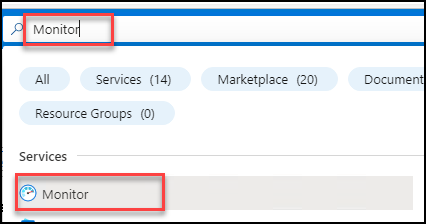
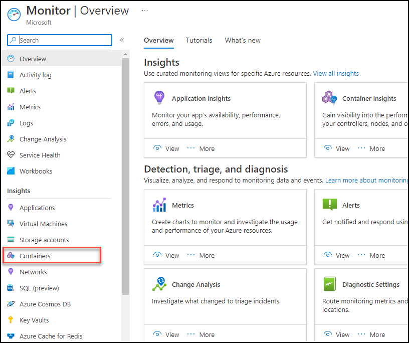
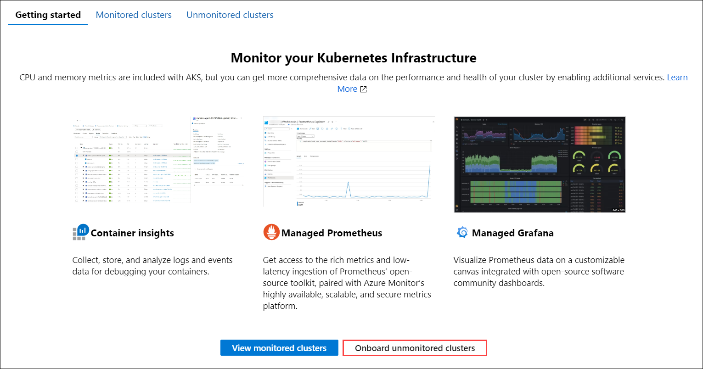
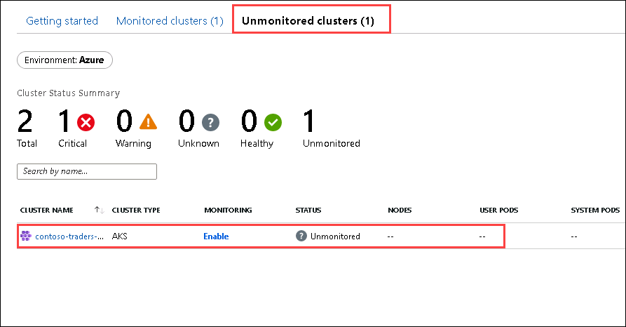
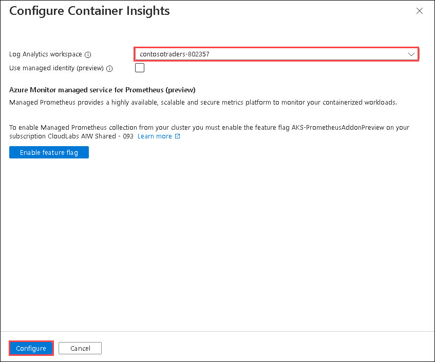

## Exercise 6: Azure Monitor for Containers - Optional
   
**Duration**: 20 Minutes

## Overview

In this exercise, you will be configuring the Azure Monitor on your containers. Azure Monitor helps you maximize the availability and performance of your applications and services. It delivers a comprehensive solution for collecting, analyzing, and acting on telemetry from your cloud and on-premises environments. 

A few examples of what you can do with Azure Monitor include:

- Detect and diagnose issues across applications and dependencies with Application Insights.
- Correlate infrastructure issues with VM insights and Container insights.
- Collect data from monitored resources by using Azure Monitor Metrics.
  
### Task 1: Deploy Azure Monitor for Containers

In this task, you will be configuring Azure Monitor container insights for the Unmonitored AKS cluster.
  
1. Navigate back to the Azure portal in the browser and search for **Monitor**. 
    
1. Select **Monitor** from the list.

   
     
1. From the left navigation pane, select **Container** from under the Insights menu.
     
   
     
1. On the Getting Started page, click on **Onboard unmonitored clusters** to onboard your container and cluster

   
    
1. You will be redirected to the **Unmonitored Cluster** section, here click on your AKS cluster to onboard it to Azure Monitor.

   

1. Once you click on the Cluster, you will be redirected to the Kubernetes service resource. Select **Logs** under Monitoring from the left menu and click on **Configure** to Configure Azure Monitor container insights.

   
   
1. In the Configure Container Insights pane, select the **contosotraders-<inject key="DeploymentID" enableCopy="false"/>** Log Analytics workspace from the drop-down and click on **Configure**.

    
    

### Task 2: Review Azure Monitor metrics & Setup Alerts

In this task, you will be reviewing the monitored AKS cluster that you configured in the previous task and setting up the alerts.

1. Once you onboarded the cluster to Azure monitor. To review the logs, navigate to the **Monitored clusters** section and select your Kubernetes service.

   
   
1. You will be redirected to the Insight section in your Kubernetes service resource blade and you should be able to see some logs.

   > **Note**: The Azure Monitor can take up to 15 minutes to populate the data in the insight blade.
    
    

1. Now set up the alerts, Click on **Recommended alerts** on the same insight page.

    

1. A new window will open for **Recommended alerts**, on the page enable the **Restarting container count** to set up the alert for this
  
     
     
1. So far, we have enabled the alerts and you can see these alerts using Log analytic workspace and Azure Monitor, to read more about this:  https://learn.microsoft.com/en-us/azure/azure-monitor/containers/container-insights-overview

## Summary

In this exercise, you have configured Azure Monitor container insights for an unmonitored AKS cluster and reviewed them. Also, you have set up the alerts for the recommendations.

## Lab ends
