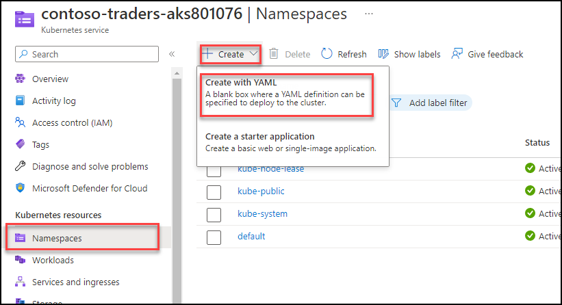
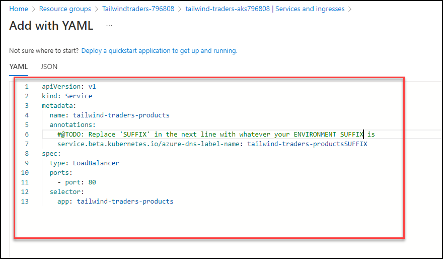
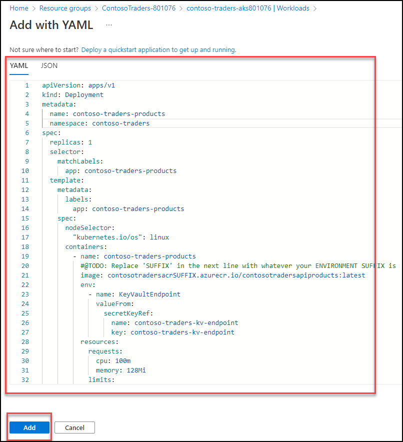

# Exercise 3: Deploy the Application to Azure Kubernetes Service

In this exercise you will be setting up the key vault secrets and later will be deploying the app to Azure kubernetes services using the docker images

## Task 2: Tunnel into the Azure Kubernetes Service cluster  

This task will gather the information you need about your Azure Kubernetes Service cluster to connect to the cluster and execute commands to connect to the Kubernetes management dashboard from the cloud shell.

> **Note**: The following tasks should be executed in command prompt.

1. Open a new command prompt in your jump VM and login to azure with the below commands after updating the values in the command.

   * Username: **<inject key="AzureAdUserEmail"></inject>**
   * Password: **<inject key="AzureAdUserPassword"></inject>**

    ```
    az login -u [username] -p [Password]
    ```

1. Verify that you are connected to the correct subscription with the following command to show your default subscription:

   ```bash
   az account show
   ```

   - Ensure you are connected to the correct subscription. List your subscriptions and then set the subscription by its id with the following commands (similar to what you did in cloud shell before the lab):

   ```bash
   az account list
   az account set --subscription {id}
   ```

1. Configure kubectl to connect to the Kubernetes cluster. Make sure to replace the SUFFIX with the given DeploymentID **<inject key="DeploymentID" enableCopy="true"/>** value in the below command.

   ```bash
   az aks get-credentials -a --name contoso-traders-aksSUFFIX --resource-group ContosoTraders-SUFFIX
   ```

1. Test that the configuration is correct by running a simple kubectl command to produce a list of nodes:

   ```bash
   kubectl get nodes
   ```

   
   
   
## Task 3: Deploy a service using the Azure Portal
   
In this task, you will deploy the API Carts application to the Azure Kubernetes Service cluster using the Azure Portal.
   
1. Define a new Namespace for our API deployment. Select the Namespaces blade of the **contoso-traders-aks<inject key="DeploymentID"/>** AKS resource detail page of the Azure Portal, and on the Namespaces tab select **+ Create** and then select **Create with YAML** button.

    
    
1. In the **Add with YAML** screen, paste the following YAML and click on **Add**. Once added you should be able to see a new namespace with **contoso-traders** name.

    ```yaml
    apiVersion: v1
    kind: Namespace
    metadata:
      labels:
        name: contoso-traders
      name: contoso-traders
    ```   
1. Define a Service for our API so that the application is accessible within the cluster. Select the **Services and ingresses** blade of the contoso-traders-aks[SUFFIX] AKS resource detail page of the Azure Portal, and on the Services tab, select **+ Create** and choose **Create with YAML**. 
    
    

1. In the **Add with YAML** screen, paste the YAML below and choose **Add**. Make sure to update the SUFFIX value in the YAML file.

       ```yaml
    apiVersion: v1
kind: Service
metadata:
  name: contoso-traders-products
  namespace: contoso-traders
  annotations:
    #@TODO: Replace 'SUFFIX' in the next line with whatever your ENVIRONMENT github secret value is
    service.beta.kubernetes.io/azure-dns-label-name: contoso-traders-productsSUFFIX
spec:
  type: LoadBalancer
  ports:
    - port: 80
  selector:
    app: contoso-traders-products
    ``` 
    
    

1. Select Workloads under the Kubernetes resources section in the left navigation. From the Workloads view, with Deployments selected (the default), then select + Add.

    

1. In the Add with YAML screen that loads, paste the following YAML and update the [LOGINSERVER] placeholder with the name of the ACR instance.

    ```YAML
    apiVersion: apps/v1
kind: Deployment
metadata:
  name: contoso-traders-products
    namespace: contoso-traders
spec:
  replicas: 1
  selector:
    matchLabels:
      app: contoso-traders-products
  template:
    metadata:
      labels:
        app: contoso-traders-products
    spec:
      nodeSelector:
        "kubernetes.io/os": linux
      containers:
        - name: contoso-traders-products
          #@TODO: Replace 'SUFFIX' in the next line with whatever your ENVIRONMENT SUFFIX is
          image: contosotradersacrSUFFIX.azurecr.io/contosotradersapiproducts:latest
          env:
            - name: KeyVaultEndpoint
              valueFrom:
                secretKeyRef:
                  name: contoso-traders-kv-endpoint
                  key: contoso-traders-kv-endpoint
          resources:
            requests:
              cpu: 1000m
              memory: 128Mi
          ports:
            - containerPort: 80
              hostPort: 3001
              protocol: TCP
            ```
   

1. Select Add to initiate the deployment. This can take a few minutes after which you will see the deployment listed and after few seconds, it should be in running state.

     


## Task 4: Deploy a service using kubectl

In this task, you will deploy the web service using kubectl

1. Open a **new** windows command prompt.

1. Create a text file called `web.deployment.yml` in the `~/lab-files` folder using the windows command prompt using VS code.
   Editor.

   ```bash
   cd C:/lab-files
   code web.deployment.yml
   ```

1. Copy and paste the following text into the editor:

    > **Note**: Be sure to copy and paste only the contents of the code block carefully to avoid introducing any special characters.

    ```yaml
    apiVersion: apps/v1
kind: Deployment
metadata:
  labels:
    app: contoso-traders-web
  name: contoso-traders-web
  namespace: contoso-traders
spec:
  replicas: 1
  selector:
    matchLabels:
      app: contoso-traders-web
  strategy:
    rollingUpdate:
      maxSurge: 1
      maxUnavailable: 1
    type: RollingUpdate
  template:
    metadata:
      labels:
        app: contoso-traders-web
      name: contoso-traders-web
    spec:
      containers:
      - image: contosotradersacrSUFFIX.azurecr.io/contosotradersuiweb:latest
        env:
          - name: contosotraderproduct
            value: http://contoso-traders-products:3001
        livenessProbe:
          httpGet:
            path: /
            port: 3000
          initialDelaySeconds: 30
          periodSeconds: 20
          timeoutSeconds: 10
          failureThreshold: 3
        imagePullPolicy: Always
        name: contoso-traders-web
        ports:
          - containerPort: 3000
            hostPort: 80
            protocol: TCP
        resources:
          requests:
            cpu: 1000m
            memory: 128Mi
        securityContext:
          privileged: false
        terminationMessagePath: /dev/termination-log
        terminationMessagePolicy: File
      dnsPolicy: ClusterFirst
      restartPolicy: Always
      schedulerName: default-scheduler
      securityContext: {}
      terminationGracePeriodSeconds: 30
    ```

1. Update the `suffix` entry to match the name of your ACR Login Server.

    

1. Enter **CTRL + S** button to **Save**.

1. Now again, navigate back to window command shell and create a text file called `web.service.yml` in the `~/lab-files` folder using the Azure Cloud Shell Editor.

    ```bash
    code web.service.yml
    ```

1. Copy and paste the following text into the editor:

    > **Note**: Be sure to copy and paste only the contents of the code block carefully to avoid introducing any special characters.

    ```yaml
    apiVersion: v1
kind: Service
metadata:
  labels:
    app: contoso-traders-web
  name: contoso-traders-web
  namespace: contoso-traders
spec:
  ports:
    - name: web-traffic
      port: 80
      protocol: TCP
      targetPort: 3000
  selector:
    app: contoso-traders-web
  sessionAffinity: None
  type: LoadBalancer
    ```

1. Save changes with **CTRL+S** and close the VS Code.

1. Login to Azure using the below commands.

    ```
    az login -u [username] -p [Password]
    ```

1. Execute the commands below to deploy the application described by the YAML files. You will receive a message indicating the items `kubectl` has created a web deployment and a web service.

    ```bash
       kubectl create --save-config=true -f web.deployment.yml -f web.service.yml
    ```

    

1. Return to the AKS blade in the Azure Portal. From the navigation menu, under **Kubernetes resources**, select the **Services and ingresses** view. You should be able to access the website via an external endpoint.

    

    
