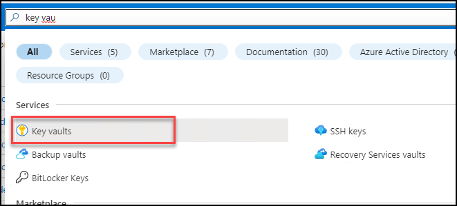
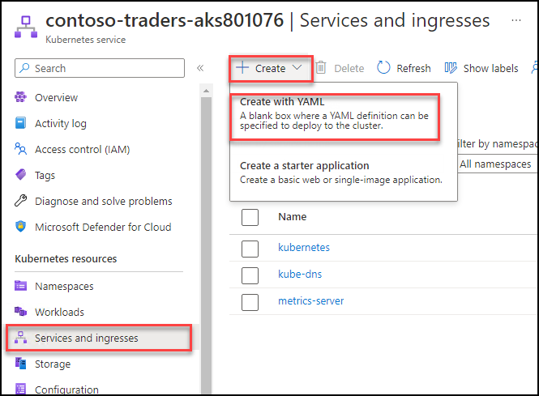
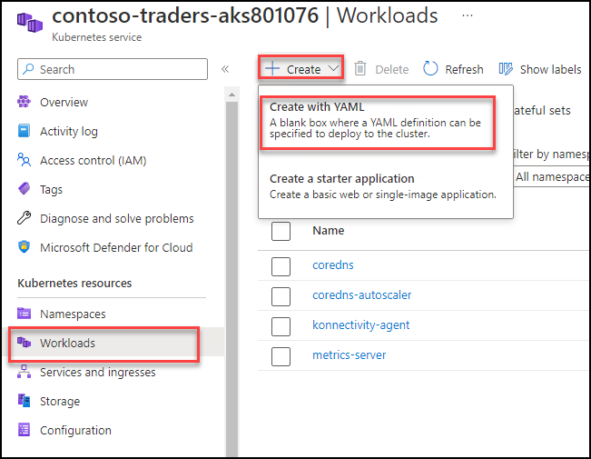
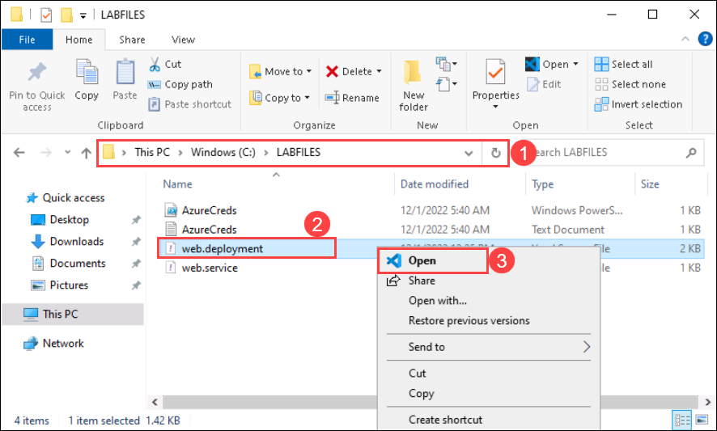

## Exercise 3: Deploy the application to the Azure Kubernetes Service
   
**Duration**: 40 Minutes

## Overview

In this exercise, you will deploying your containerized web application to AKS(Azure Kubernetes Service) with the help of Key Vault secrets and ACR where you have stored your containerized web application images. Also, you will be exploring two ways to deploy the app to AKS. 

### Task 1: Tunnel into the Azure Kubernetes Service cluster  

This task will gather the information you need about your Azure Kubernetes Service cluster to connect to the cluster and execute commands to connect to the Kubernetes management dashboard from the cloud shell.

> **Note**: The following tasks should be executed in command prompt.

1. Open a new command prompt in your jump VM and login to azure with the below commands after updating the values in the below command.

   * Username: **<inject key="AzureAdUserEmail"></inject>**
   * Password: **<inject key="AzureAdUserPassword"></inject>**

    ```
    az login -u [username] -p [Password]
    ```

1. Verify that you are connected to the correct subscription with the following command to show your default subscription:

   ```bash
   az account show
   ```

   - Ensure you are connected to the correct subscription. If not, list your subscriptions and then set the subscription by its ID with the following commands:

   ```bash
   az account list
   az account set --subscription {id}
   ```

1. Setup the Kubernetes cluster connection using kubectl. Make sure to replace the SUFFIX with the given DeploymentID **<inject key="DeploymentID" enableCopy="true"/>** value in the below command.

   ```bash
   az aks get-credentials -a --name contoso-traders-aksSUFFIX --resource-group ContosoTraders-SUFFIX
   ```

1. Run a quick kubectl command to generate a list of nodes to verify that the setup is correct.

   ```bash
   kubectl get nodes
   ```

      

### Task 2: Setup Key Vault & Secrets 

In this task, you will be generating a secret in Key vault and creating the connection between AKS and Key vault.

1. Navigate to Azure portal, search for **Key Vault** in the search bar and select **Key vaults** from the list.

    

1. Then select **contosotraderskv<inject key="DeploymentID" enableCopy="false" />** **Key vaults** from the list.

1. Once you are in **contosotraderskv<inject key="DeploymentID" enableCopy="false" />** Key vault page, select **secrets** under Objects from the left side menu.

    
    
1. Now click on the **Generate/Import** button to create the new secret.

    
    
1. In the **Create a secret** pane, enter the following details:

    - Name: **mongodbconnetion**
    - Secret Value: Paste the connection string of Azure CosmosDB for MongoDB account which you have copied in previous exercise.
    
    Keep other values default and click on **Create**
    
     
     
     
     
1. Open a new **Command Prompt** and run the below command to create secret using kubectl. Make sure to update your key vault secret in the below command which you created in the previous steps. 

    ```sh
    kubectl create secret generic mongodbconnection --from-literal=mongodbconnection=[yourkeyvaultsecret] 
    ```
    
    
1. Navigate back to browser and open **contoso-traders-aks<inject key="DeploymentID" enableCopy="false"/>** AKS in Azure portal, select **Configuration** from the left side menu and click on **Secrets** section. Under secrets you should be able to see the newly created secret. 

     
     

### Task 3: Deploy a namespace, service, and workload in the Azure Kubernetes Service using the Azure Portal
   
In this task, you will deploy the API Carts application to the Azure Kubernetes Service cluster using the Azure Portal.
   
1. Define a new Namespace for your API deployment. Select the **Namespaces** blade of the **contoso-traders-aks<inject key="DeploymentID" enableCopy="false"/>** AKS resource detail page in the Azure Portal. In the Namespaces tab, select **+ Create** and then select **Create with YAML** button.

    
    
1. In the **Add with YAML** pane, paste the below YAML code which creates a namespace in AKS and click on **Add**. Once added you should be able to see a new namespace with **contoso-traders** name.
    >**Info**: The below YAML file will create a new namespace named as contoso-traders, you will be using and deploying all the services and workloads to this namespace only in the next tasks. Namespaces can be used to organize pods and deployments in a groupd way. 
   

    ```yaml
    apiVersion: v1
    kind: Namespace
    metadata:
      labels:
        name: contoso-traders
      name: contoso-traders
    ```
    
1. Define a Service for your API, so that the application is accessible within the cluster. Select the **Services and ingresses** blade of the **contoso-traders-aks<inject key="DeploymentID" enableCopy="false"/>** AKS resource detail page in the Azure Portal. In the Services tab, select **+ Create** and choose **Create with YAML**. 
    
    

1. In the **Add with YAML** pane, paste the below YAML code which creates a service in AKS and click on **Add**. Make sure to replace the SUFFIX with the given DeploymentID **<inject key="DeploymentID" enableCopy="true"/>** value in the YAML file.
    >**Info**: The below YAML script will create a AKS service inside the contoso-traders namespace that you have created in previous steps. AKS Serviceis a abstract way to expose an application running on a set of Pods as a network service. 


    ```yaml
    apiVersion: v1
    kind: Service
    metadata:
      name: contoso-traders-products
      namespace: contoso-traders
      annotations:
        #@TODO: Replace 'SUFFIX' in the next line with whatever your ENVIRONMENT github secret value is
        service.beta.kubernetes.io/azure-dns-label-name: contoso-traders-productsSUFFIX
    spec:
      type: LoadBalancer
      ports:
        - port: 80
      selector:
        app: contoso-traders-products
     ``` 
    
     

1. Select **Workloads** under the Kubernetes resources section in the left navigation. With **Deployments** selected by default, select **+ Create** and then choose **Create with YAML**.

    

1. In the **Add with YAML** pane, paste the below YAML code which creates a workload in AKS and click on **Add**. Make sure to replace the SUFFIX with the given DeploymentID **<inject key="DeploymentID" enableCopy="true"/>** value in the YAML file to update the LOGINSERVER name of the ACR instance.
    >**Info**: The below YAML file will create a deployment pods in the namespace contoso-traders. A Kubernetes Deployment tells Kubernetes how to create or modify instances of the pods that hold a containerized application. Deployments can help to efficiently scale the number of replica pods, enable the rollout of updated code in a controlled manner, or roll back to an earlier deployment version if necessary.

    ```YAML
    apiVersion: apps/v1
    kind: Deployment
    metadata:
      name: contoso-traders-products
      namespace: contoso-traders
    spec:
      replicas: 1
      selector:
        matchLabels:
          app: contoso-traders-products
      template:
        metadata:
          labels:
            app: contoso-traders-products
        spec:
          nodeSelector:
            "kubernetes.io/os": linux
          containers:
            - name: contoso-traders-products
              #@TODO: Replace 'SUFFIX' in the next line with whatever your ENVIRONMENT SUFFIX is
              image: contosotradersacrSUFFIX.azurecr.io/contosotradersapiproducts:latest
              env:
                - name: KeyVaultEndpoint
                  valueFrom:
                    secretKeyRef:
                      name: contoso-traders-kv-endpoint
                      key: contoso-traders-kv-endpoint
              resources:
                requests:
                  cpu: 1000m
                  memory: 128Mi
                ports:
                  - containerPort: 80
                    hostPort: 3001
                    protocol: TCP
    ```
   

1. After a few minutes, you will see the deployment listed and it should be in running state.

   


### Task 4: Deploy a service & workload using kubectl

In this task, you will deploy the web service & its workload using kubectl.

1. Open a **File Explorer** from your JumpVM.

1. Navigate to `C:\LABFILES` **(1)** directory and select `web.deployment.yml` **(2)** file. Right-click and select **Open** **(3)** to open the file in VS code.

   

1. Make sure to Update the SUFFIX with the given DeploymentID **<inject key="DeploymentID" enableCopy="true"/>** value in the YAML file to match the name of your ACR Login Server.

    

1. Save the changes by **CTRL + S** button to **Save**.

1. Navigate back to Windows command prompt and run the below command to change the directory to `~/LABFILES` folder.

    ```bash
    cd C:/LABFILES
    ```

1. Login to Azure if not already done with the below command after updating the values in the command.

   * Username: **<inject key="AzureAdUserEmail"></inject>**
   * Password: **<inject key="AzureAdUserPassword"></inject>**

    ```
    az login -u [username] -p [Password]
    ```

1. Execute the below command to deploy the application described in the YAML files. You will receive a message indicating the items `kubectl` has created a web deployment and a web service.
   >**Info**: The below kubectl command with create the Deployment workload and Service into the namespace that we have defined in to the YAML files. 

    ```bash
    kubectl create --save-config=true -f web.deployment.yml -f web.service.yml 
    ```

    

1. Return to the AKS blade in the Azure Portal. From the navigation menu, select the **Services and ingresses** under **Kubernetes resources**. You should be able to access the website via an **External endpoint**.

    

    
    
1. Click the **Next** button located in the bottom right corner of this lab guide to continue with the next exercise.

## Summary

In this exercise, you have deployed your containerized web application to AKS that contains, namespace, service, and workload in the Azure Kubernetes. Also, you have created a service to AKS and accessed website using external endpoint. Also, you have setup the key vaults secret to access the mongodb from AKS. 
