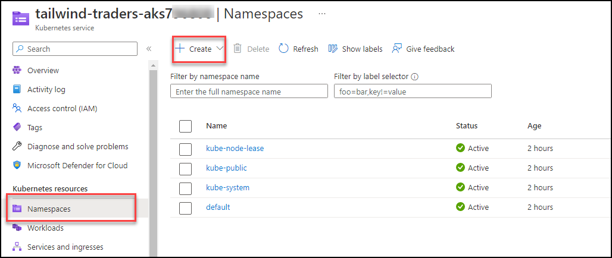
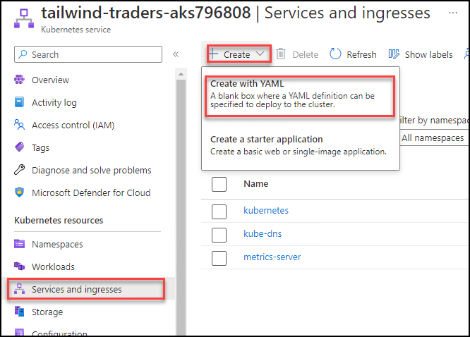

# Exercise 3: Deploy the Application to Azure Kubernetes Service

In this exercise you will be setting up the key vault secrets and later will be deploying the app to Azure kubernetes services using the docker images

## Task 2: Tunnel into the Azure Kubernetes Service cluster  

This task will gather the information you need about your Azure Kubernetes Service cluster to connect to the cluster and execute commands to connect to the Kubernetes management dashboard from the cloud shell.

> **Note**: The following tasks should be executed in command prompt.

1. Open a new command prompt from desktop of your jump VM and login to azure with the below commands after updating the values in the command

    ``` az login -u [username] -p [Password]
    ```

2. Verify that you are connected to the correct subscription with the following command to show your default subscription:

   ```bash
   az account show
   ```

   - Ensure you are connected to the correct subscription. List your subscriptions and then set the subscription by its id with the following commands (similar to what you did in cloud shell before the lab):

   ```bash
   az account list
   az account set --subscription {id}
   ```

2. Configure kubectl to connect to the Kubernetes cluster:

   ```bash
   az aks get-credentials -a --name tailwind-traders-aksSUFFIX --resource-group Tailwindtraders-SUFFIX
   ```

3. Test that the configuration is correct by running a simple kubectl command to produce a list of nodes:

   ```bash
   kubectl get nodes
   ```

   
   
   
## Task 2: Deploy a service using the Azure Portal
   
  This task will deploy the API Carts application to the Azure Kubernetes Service cluster using the Azure Portal.
   
1. Define a new Namespace for our API deployment. Select the Namespaces blade of the tailwind-traders-aks[SUFFIX] AKS resource detail page of the Azure Portal, and on the Namespaces tab select + Create and then select **Create with YAML** button.

    
    
1. In the **Add with YAML** screen, paste the following YAML and click on **Add**.

    ```yaml
    apiVersion: v1
    kind: Namespace
    metadata:
      labels:
        name: ingress-demo
      name: ingress-demo
    ```   
1. Define a Service for our API so that the application is accessible within the cluster. Select the **Services and ingresses** blade of the tailwind-traders-aks[SUFFIX] AKS resource detail page of the Azure Portal, and on the Services tab, select **+ Create** and choose **Create with YAML**. 
    
    

1. In the **Add with YAML** screen, paste the YAML below and choose **Add**. Make sure to update the SUFFIX value in the YAML file.

       ```yaml
    apiVersion: v1
kind: Service
metadata:
  name: tailwind-traders-products
  annotations:
    #@TODO: Replace 'test' in the next line with whatever your ENVIRONMENT github secret value is
    service.beta.kubernetes.io/azure-dns-label-name: tailwind-traders-products[SUFFIX]
spec:
  type: LoadBalancer
  ports:
    - port: 80
  selector:
    app: tailwind-traders-products
    ``` 
    
     

1. Select Workloads under the Kubernetes resources section in the left navigation. From the Workloads view, with Deployments selected (the default), then select + Add.

    

1. In the Add with YAML screen that loads, paste the following YAML and update the [LOGINSERVER] placeholder with the name of the ACR instance.

    ```YAML
    apiVersion: apps/v1
kind: Deployment
metadata:
  name: tailwind-traders-products
spec:
  replicas: 1
  selector:
    matchLabels:
      app: tailwind-traders-products
  template:
    metadata:
      labels:
        app: tailwind-traders-products
    spec:
      nodeSelector:
        "kubernetes.io/os": linux
      containers:
        - name: tailwind-traders-products
          #@TODO: Replace 'SUFFIX' in the next line with whatever your ENVIRONMENT SUFFIX is
          image: tailwindtradersacrSUFFIX.azurecr.io/tailwindtradersapiproducts:latest
          env:
            - name: KeyVaultEndpoint
              valueFrom:
                secretKeyRef:
                  name: tailwind-traders-kv-endpoint
                  key: tailwind-traders-kv-endpoint
          resources:
            requests:
              cpu: 100m
              memory: 128Mi
            limits:
              cpu: 250m
              memory: 256Mi
          ports:
            - containerPort: 80
            ```
   

1. Select Add to initiate the deployment. This can take a few minutes after which you will see the deployment listed.

     


## Task3: Deploy a service using kubectl
In this task, deploy the web service using kubectl

1. In the same command prompt. Run the below command to create a yml file.

    ``` code web.deployment.yml
    ```
3. Now the VS code should open for you, please paste the below content in the VS code and save it with CTRL+S.
4. 


