## Exercise 02 : Migrate MongoDB to Cosmos DB using Azure Database Migration
  
### Estimated Duration: 75 Minutes

## Overview

In this exercise, you will be migrating your on-premises MongoDB database hosted on an Azure Linux VM to Azure Cosmos DB using Azure Database Migration. Azure Database Migration Service is a tool that helps you simplify, guide, and automate your database migration to Azure.

## Objectives

In this Exercise, you will be able to complete the following tasks:

- Task 1: Explore the databases and collections in MongoDB
- Task 2: Create a Migration Project and migrate data to Azure CosmosDB

## Task 1: Explore the databases and collections in MongoDB

In this task, you will be connecting to a mongo database hosted on an Azure Linux VM and exploring the databases and collections in it.

1. While connected to your Linux VM, run the below command to connect to mongo shell to display the databases and collections in it using the mongo shell.

   ```
   mongo
   ```

      
   
   >**Note:** If you face an issue while connecting to the source DB with an error connection is refused. Run the **<inject key="Command to Connect to Build Agent VM" enableCopy="true" />** command and enter the VM password **<inject key="Build Agent VM Password" enableCopy="true" />** to connect to the Linux VM using SSH. Please run the following commands and reperform step 1 of the task.

   ```
   sudo apt install mongodb-server
   cd /etc
   sudo sed -i 's/bind_ip = 127.0.0.1/bind_ip = 0.0.0.0/g' /etc/mongod.conf
   sudo sed -i 's/#port = 27017/port = 27017/g' /etc/mongod.conf
   sudo service mongod stop
   sudo service mongod start
   ```
   
   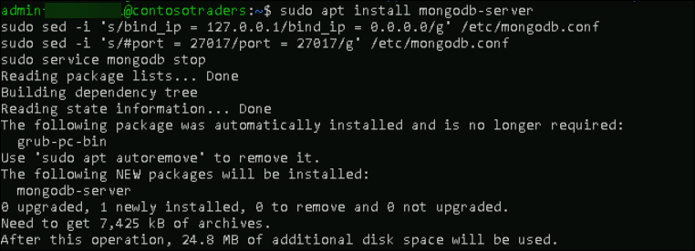
   
1. After `>`,  run the following commands to verify the database in the mongo shell. You should be able to see the **contentdb** available and **item & products** collections inside **contentdb**.

   ```
   show dbs
   use contentdb
   show collections
   ```
   
    

   >**Note:** In case you don't see the data inside the mongo. Please follow the steps mentioned below.

   - Enter `exit` to exit from mongo.

   - Please run the below-mentioned commands in the command prompt and perform steps 1 and 2 again.

   ```
   cd ~/Cloud-Native-Application/labfiles/src/developer/content-init
   npm ci
   nodejs server.js
   ```     

## Task 2: Create Migration Project and migrate data to Azure CosmosDB

In this task, you will create a Migration project within Azure Database Migration Service and then migrate the data from MongoDB to Azure Cosmos DB. In the later exercises, you will be using the Azure CosmosDB to fetch the data for the products page. 

1. Navigate to the Azure portal, and on the home page, search for **ContosoTraders-<inject key="DeploymentID" enableCopy="false" /> (1)**, then select the **ContosoTraders-<inject key="DeploymentID" enableCopy="false" /> (2)** resource group from the search results.     

   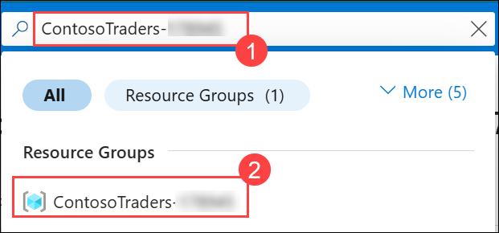

1. In the **ContosoTraders-<inject key="DeploymentID" enableCopy="false" />**  resource group, search for **contosotraders (1)** in the search box, and then select the **contosotraders (2)** Virtual machine from the results. 

   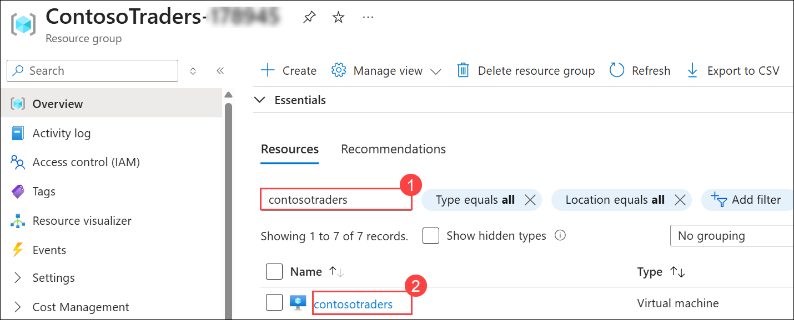

1. Copy the **Private IP address** and paste it into Notepad for later use.

   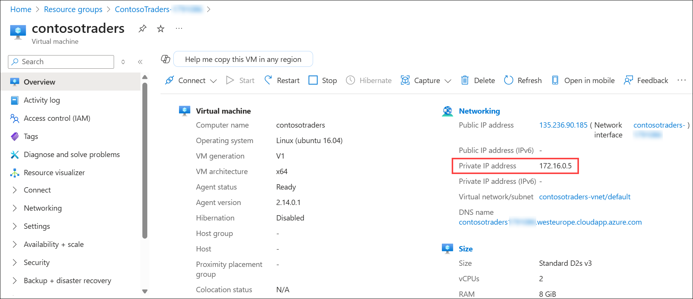

1. Navigate back to **ContosoTraders<inject key="DeploymentID" enableCopy="false" />** resource group, search for **contosotraders-<inject key="DeploymentID" enableCopy="false" /> (1)** and open **contosotraders-<inject key="DeploymentID" enableCopy="false" /> (2)** Azure Cosmos DB for MongoDB account (RU) resource.

   

1. In the left-hand menu, select **Data Explorer (1)**. Now click on the drop-down arrow, adjacent to **+ New Collection (2)** and then select **+ New Database (3)**.

   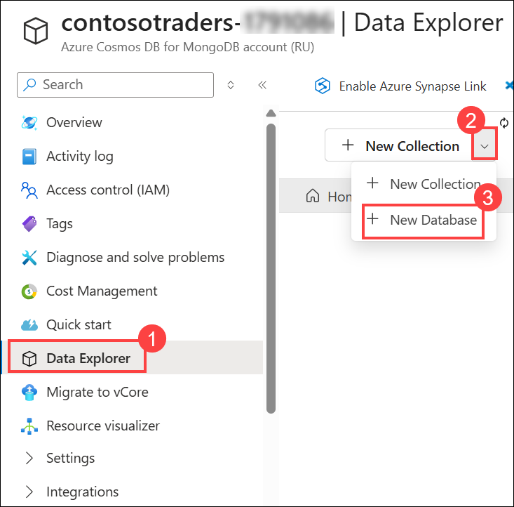

   >**Note:** If a pop-up appears saying **Welcome! What is Cosmos DB?**, click **Close X** to dismiss it.

      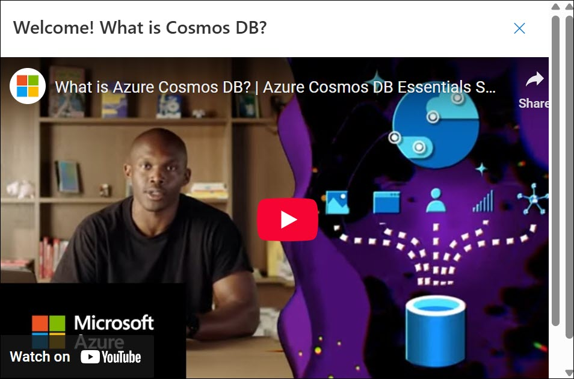

1. Provide the following details under **New Database** and then click on **OK (5)**.

   - Provide name as `contentdb` **(1)** for **Database id**

   - Select the **Provision throughput** checkbox **(2)**

   - Select **Databse throughput (400 - unlimited RU/s)** as **Manual** **(3)** 

   - Provide the **Database Required RU/s** value to `400` **(4)**

     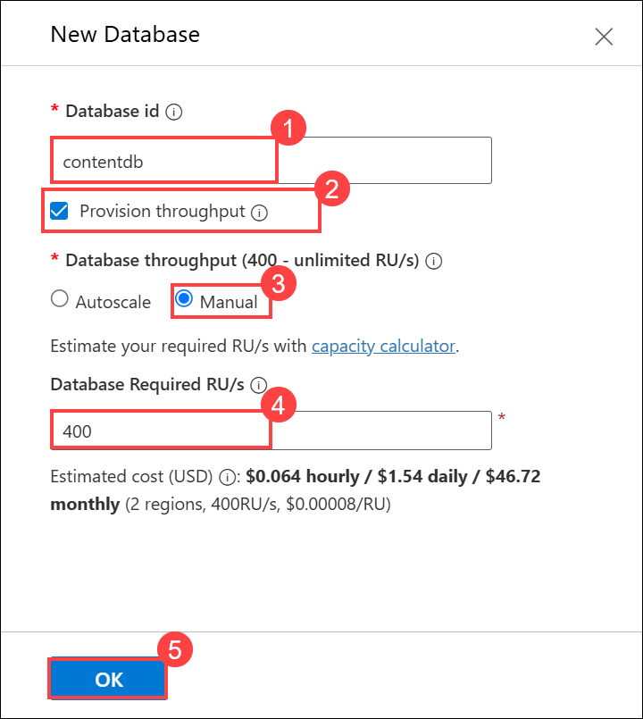

1. Navigate back to the **ContosoTraders-<inject key="DeploymentID" enableCopy="false" />** resource group, search for **contosotraders<inject key="DeploymentID" enableCopy="false" /> (1)** and then select **contosotraders<inject key="DeploymentID" enableCopy="false" /> (2)** Azure Database Migration Service (Classic).

   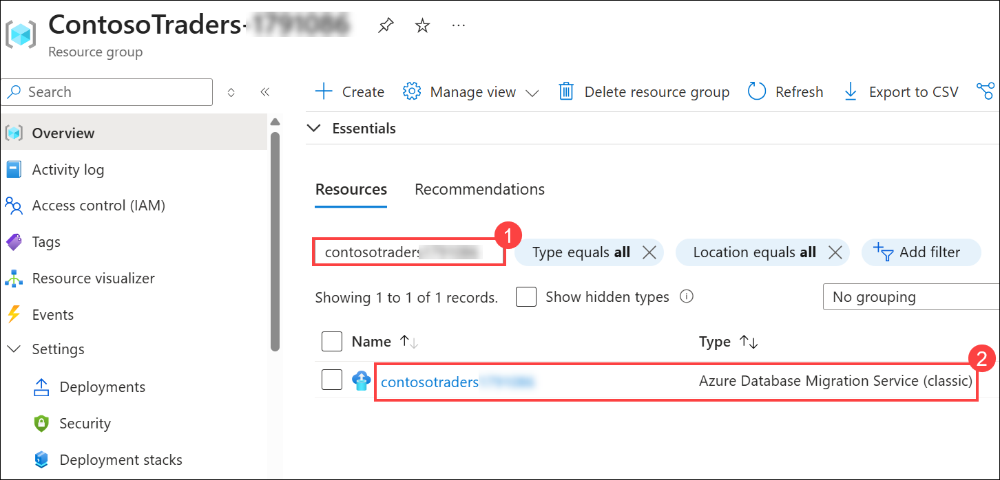

1. On the Azure Database Migration Service blade, select **+ New Migration Project** on the **Overview** pane.

   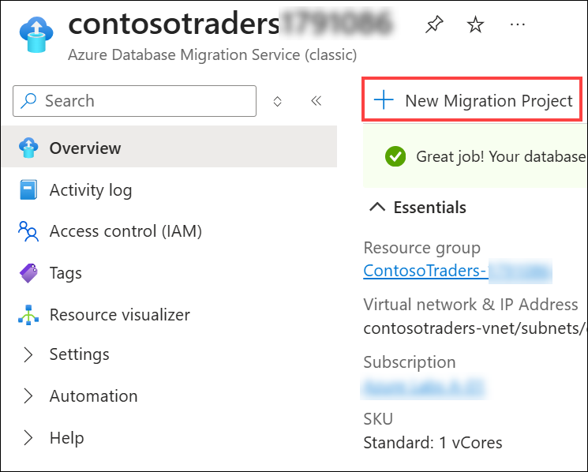

1. On the **New migration project** pane, enter the following values and then select **Create and run activity (5)**

    - **Project name:** `contoso` **(1)**
    
    - **Source server type:** `MongoDB` **(2)**
    
    - **Target server type:** `Cosmos DB (MongoDB API)` **(3)**
    
    - **Migration activity type:** `Offline data migration` **(4)**

      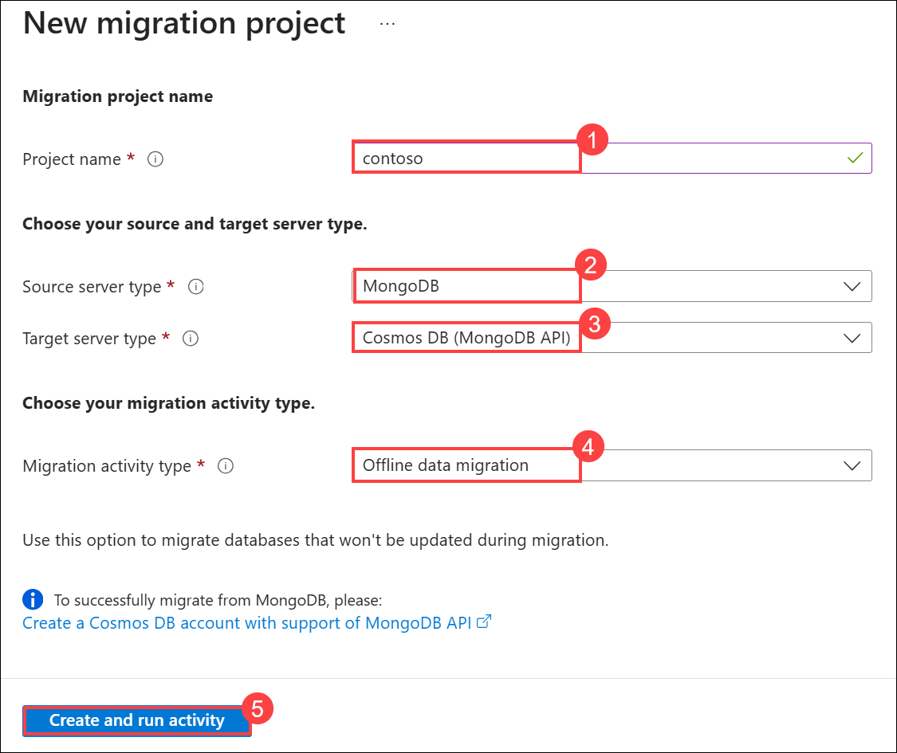

      >**Note:** The **Offline data migration** activity type is selected since you will be performing a one-time migration from MongoDB to Cosmos DB. Also, the data in the database won't be updated during the migration. In a production scenario, you will want to choose the migration project activity type that best fits your solution requirements.

1. On the **MongoDB to Azure Database for CosmosDB Offline Migration Wizard** pane, enter the following values for the **Select source** tab:

    - **Mode:** **Standard mode (1)**
    
    - **Source server name:** Enter the Private IP Address of the Build Agent VM that you have copied in **Task 2 Step 3 (2)**.
    
    - **Server port:** `27017` **(3)**
    
    - **Require SSL:** Unchecked **(4)**
    
    - Select **Next : Select target >> (5)**.

    > **Note:** Leave the **User Name** and **Password** blank as the MongoDB instance on the Build Agent VM for this lab does not have authentication turned on. The Azure Database Migration Service is connected to the same VNet as the Build Agent VM, so it's able to communicate within the VNet directly to the VM without exposing the MongoDB service to the Internet. In production scenarios, you should always have authentication enabled on MongoDB.

    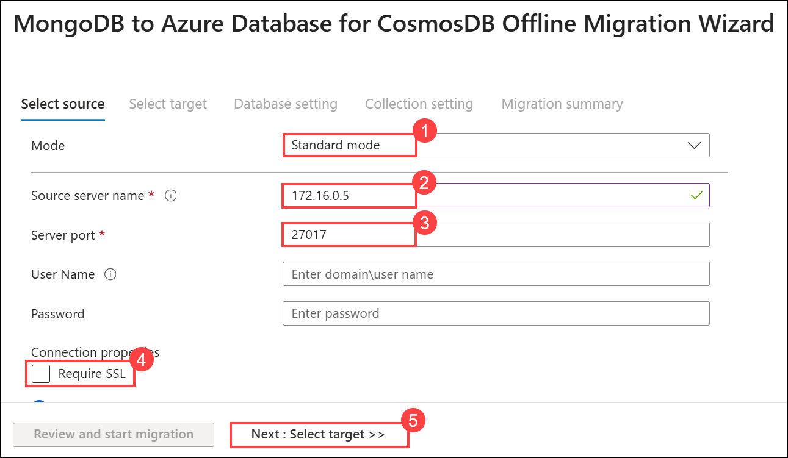
    
    > **Note:** If you face an issue while connecting to the source DB with an error connection is refused. Please run the following commands in the **build agent VM connected in CloudShell**. You can use the **Command to Connect to Build Agent VM**, which is given on the lab environment details page.

    ```bash
    cd /etc
    sudo sed -i 's/bind_ip = 127.0.0.1/bind_ip = 0.0.0.0/g' /etc/mongod.conf
    sudo sed -i 's/#port = 27017/port = 27017/g' /etc/mongod.conf
    sudo service mongodb stop
    sudo service mongodb start
    ```
    
1. On the **Select target** tab, select the following values:

    - **Mode:** **Select Cosmos DB target (1)**

    - **Subscription:** Select the Azure subscription you're using for this lab **(2)**

    - **Select Cosmos DB name:** Select the **contosotraders-<inject key="DeploymentID" enableCopy="false" /> (3)** Cosmos DB instance.

    - Notice, the **Connection String (4)** will automatically populate with the Key for your Azure Cosmos DB instance.

    - Select **Next : Database setting >> (5)**.    

      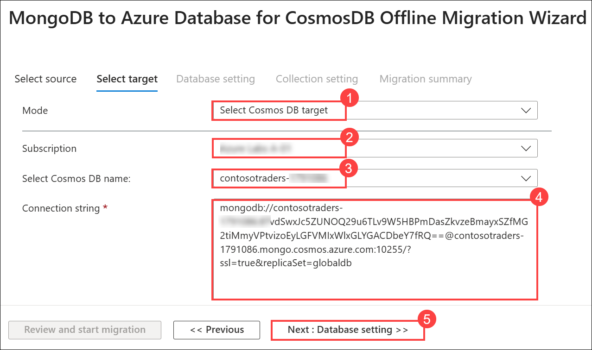

1. On the **Database setting** tab, select the `contentdb` **(1)** as **Source Database**, so this database from MongoDB will be migrated to Azure Cosmos DB and Select **Next : Collection setting >> (2)**.

   

1. On the **Collection setting** tab, expand the **contentdb** database, and ensure both the **products** and **items** collections are selected for migration **(1)**. Also, update the **Throughput (RU/s)** to `400` **(2)** for both collections and select **Next : Migration summary >> (3)**.

   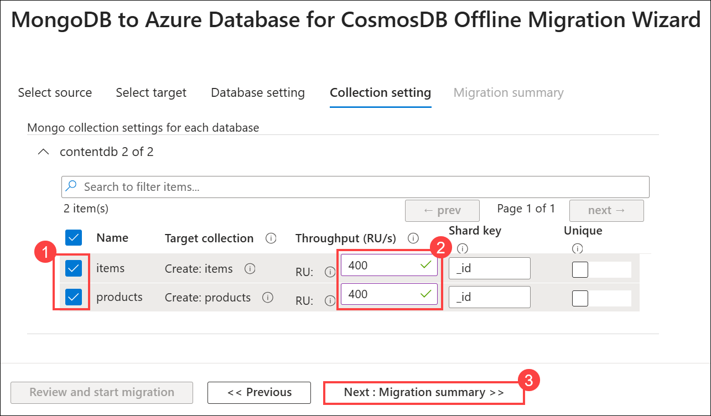

1. On the **Migration summary** tab, enter `MigrateData` **(1)** in the **Activity name** field, and then select **Start migration (2)** to initiate the migration of the MongoDB data to Azure Cosmos DB.

   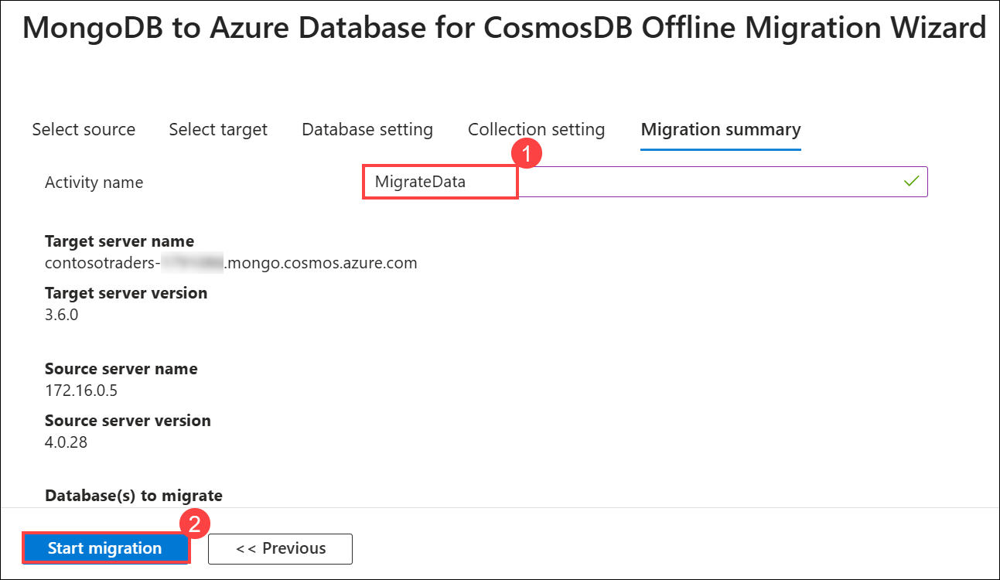

1. The migration activity's status will be displayed. The migration will be finished in a matter of seconds. Select **Refresh** to reload the status and ensure it is **Complete**. 

   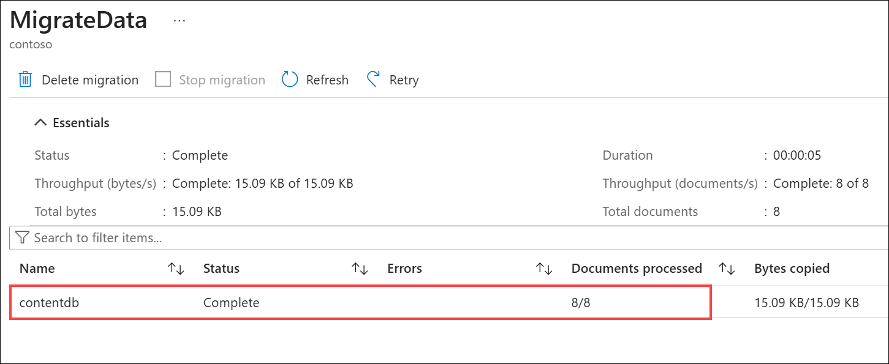

1. To verify the migrated data, navigate back to the  **ContosoTraders-<inject key="DeploymentID" enableCopy="false" />** resource group. Search for **contosotraders-<inject key="DeploymentID" enableCopy="false" /> (1)** in the search box and select **contosotraders-<inject key="DeploymentID" enableCopy="false" /> (2)** Azure Cosmos DB for MongoDB account (RU) from the search results. 

   

1. Select **Data Explorer (1)** from the left menu. You will see the `items` and `products` collections listed within the `contentdb` database **(2)** and you will be able to explore the documents **(3)**.

   .png "Cosmos DB is open")

> **Congratulations** on completing the task! Now, it's time to validate it. Here are the steps:
> - Hit the Validate button for the corresponding task. If you receive a success message, you can proceed to the next Exercise. 
> - If not, carefully read the error message and retry the step, following the instructions in the lab guide. 
> - If you need any assistance, please contact us at cloudlabs-support@spektrasystems.com. We are available 24/7 to help you out.

<validation step="4a5c93cd-63af-49ac-8a9d-a6c92e6a71dd" />

## Summary

In this exercise, you have accomplished the following:
- Task 1: Explored the databases and collections in MongoDB
- Task 2: Created a Migration Project and migrated data to Azure Cosmos DB

Click the **Next >>** button located in the bottom right corner of this lab guide to continue with the next exercise.


