# Exercício 4: Dimensione a aplicação e valide o HA

### Duração estimada: 90 minutos

## Visão geral

Neste ponto, implementou uma única instância dos contentores de serviço da API Web e de produtos. Neste exercício, irá aumentar o número de instâncias de contentores para o serviço Web e escalar o front-end no cluster existente.

## Objectivos do Laboratório

Poderá completar as seguintes tarefas:

- Tarefa 1: modificar as implementações de recursos do Kubernetes no serviço Kubernetes
- Tarefa 2: Resolver falha no aprovisionamento de réplicas
- Tarefa 3: configurar o escalonamento automático horizontal para os pods de serviço Kubernetes
- Tarefa 4: Dimensionamento automático no cluster do Azure Kubernetes Service
- Tarefa 5: reiniciar contentores e validar HA
- Tarefa 6: configurar a escala automática do CosmosDB
- Tarefa 7: testar a escala automática do CosmosDB

### Tarefa 1: modificar as implementações de recursos do Kubernetes no serviço Kubernetes

Nesta tarefa, irá aumentar o número de instâncias para a implementação da API no AKS. Durante a implementação, observará a mudança de estado.

1. Navegue até ao portal Azure, abra **contoso-traders-aks<inject key="DeploymentID" enableCopy="false" />** serviço Kubernetes de **ContosoTraders-<inject key="DeploymentID" enableCopy=" false" />** grupo de recursos. Selecione **Cargas de trabalho (1)** nas características do Kubernetes no menu do lado esquerdo e, em seguida, selecione a implementação **contoso-traders-products (2)**.

   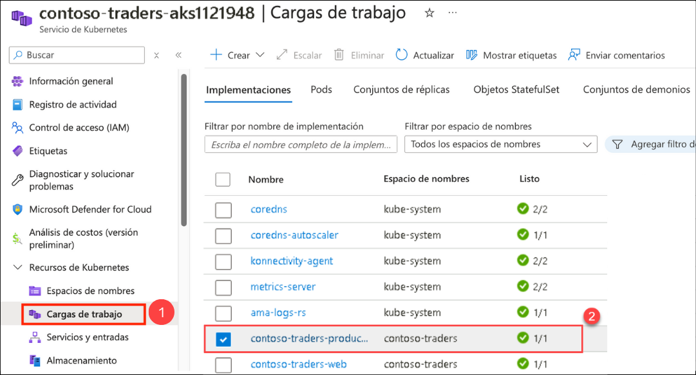

1. Selecione **YAML (1)** no menu esquerdo na vista geral de **contoso-traders-products** e desça até encontrar **réplicas** na secção **especificações**. Altere o número de réplicas para **2 (2)** e selecione **Revisar + guardar (3)**. Quando lhe for pedido para confirmar a alteração do manifesto, assinale **Confirmar alteração do manifesto** e selecione **Guardar**.

   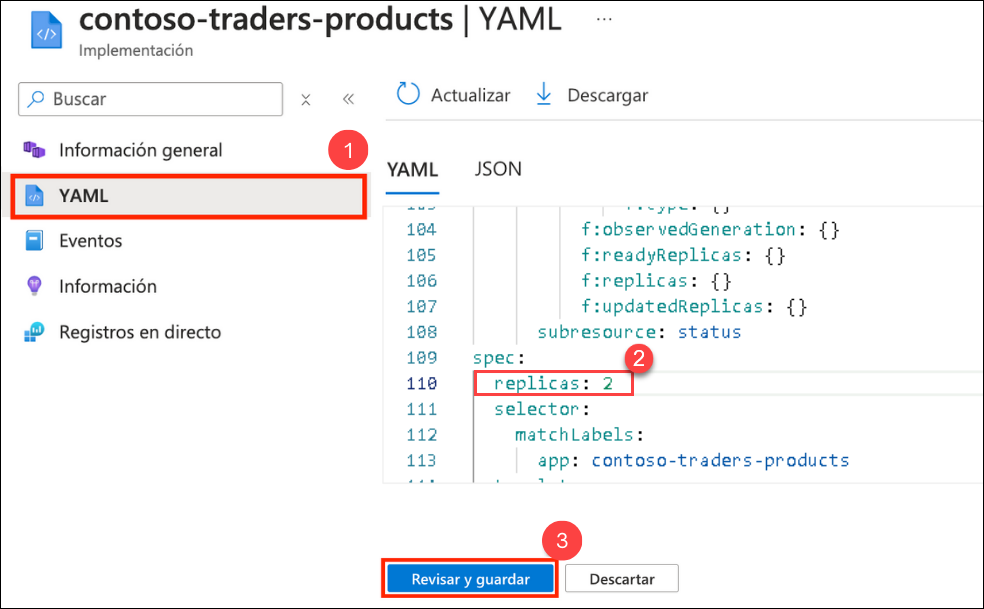

    >**Nota**: Se a implementação for concluída rapidamente, poderá não ver a implementação em estados de espera no portal, conforme descrito nos passos seguintes.

1. Está a ser implementado no momento e pode ver que há uma instância íntegra e uma instância em espera.

1. Abra a aplicação Web Contoso Traders e verá que a aplicação ainda deve funcionar sem erros.

   

### Tarefa 2: Resolver falha no aprovisionamento de réplicas

Nesta tarefa, irá resolver as réplicas de API com falha. Estas falhas ocorrem devido à incapacidade de atender aos recursos solicitados.

1. No serviço **contoso-traders-aks<inject key="DeploymentID" enableCopy="false" />** Kubernetes, seleccione **Cargas de trabalho (1)** e, em seguida, seleccione **contoso- traders-products (2)** implantação.

   

1. Selecione **YAML** no menu esquerdo na vista geral de **contoso-traders-products**.

   

1. No ecrã **YAML**, desça e altere os seguintes itens:

    - Na secção **spec** adicione as seguintes **portas (1)**.

      ```yaml
      ports:
        - containerPort: 3001
          protocol: TCP
      ```

    - Modifique a **cpu** e configure-a para **100m (2)**. A CPU é dividida entre todos os pods de um Node.

      ```yaml
      resources:
        requests:
          cpu: 100m
          memory: 128Mi
      ```

   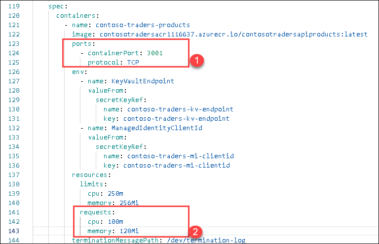

1. Selecione **Revisar + guardar** e, quando solicitado, Confirmar alteração do manifesto, assinale **Confirmar alteração do manifesto** e selecione **Guardar**.

1. Volte à vista principal **Cargas de trabalho** do serviço **contoso-traders-aks<inject key="DeploymentID" enableCopy="false" />** Kubernetes, actualize a página e verá agora que o A a implantação está íntegra com **dois** pods em funcionamento.

   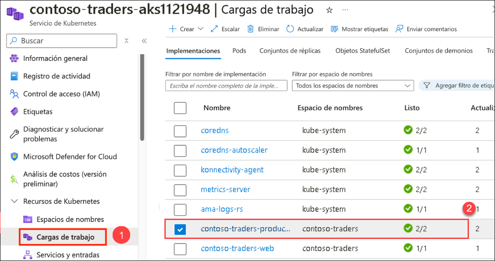

### Tarefa 3: configurar o escalonamento automático horizontal para os pods de serviço Kubernetes

Nesta tarefa, irá configurar o escalonamento automático horizontal para os seus pods de serviço Kubernetes.

1. Navegue de volta para o prompt de comando do Windows.

1. Execute o comando abaixo para configurar o escalonamento automático horizontal para os seus pods de produtos API.

    ```bash
    kubectl autoscale deployment contoso-traders-products -n contoso-traders --cpu-percent=50 --min=1 --max=10
    ```

   

1. Execute o comando abaixo para verificar o estado do Horizontal Pod Au recentemente adicionado escalador.

    ```
    kubectl get hpa -n contoso-traders
    ```

   

### Tarefa 4: escalonamento automático no cluster do serviço Azure Kubernetes

Nesta tarefa, irá ativar o escalonador automático de cluster para o cluster AKS existente e dimensionará automaticamente os pools de nós do cluster.

1. Navegue de volta para o prompt de comando do Windows. Se não estiver ligado ao Azure, inicie sessão no Azure com o comando abaixo após atualizar os valores no comando abaixo.

    * Nome de utilizador: **<inject key="AzureAdUserEmail"></inject>**
    * Palavra-passe: **<inject key="AzureAdUserPassword"></inject>**

    ```
    az login -u [username] -p [Password]
    ```

1. Para configurar a ligação do cluster Kubernetes, certifique-se de que substitui o SUFFIX pelo valor DeploymentID **<inject key="DeploymentID" enableCopy="true"/>** fornecido no comando abaixo e execute.

    ```
    az aks get-credentials --resource-group ContosoTraders-SUFFIX --name contoso-traders-aksSUFFIX
    ```

1. Verifique a `contagem` de pools de nós no cluster e certifique-se de que `enablingAutoScaling` é `null`. Certifique-se de que substitui o SUFFIX pelo valor DeploymentID **<inject key="DeploymentID" enableCopy="true"/>** fornecido no comando abaixo.

    ```
    az aks nodepool list --resource-group ContosoTraders-SUFFIX --cluster-name contoso-traders-aksSUFFIX
    ```

   

1. Execute o comando abaixo para ativar o dimensionamento automático do cluster no cluster existente. Verifique se `enablingAutoScaling` é `true`. Certifique-se de que substitui o SUFFIX pelo valor DeploymentID **<inject key="DeploymentID" enableCopy="true"/>** fornecido no comando abaixo.

    ```
    az aks update --resource-group ContosoTraders-SUFFIX --name contoso-traders-aksSUFFIX --enable-cluster-autoscaler --min-count 1 --max-count 3
    ```

   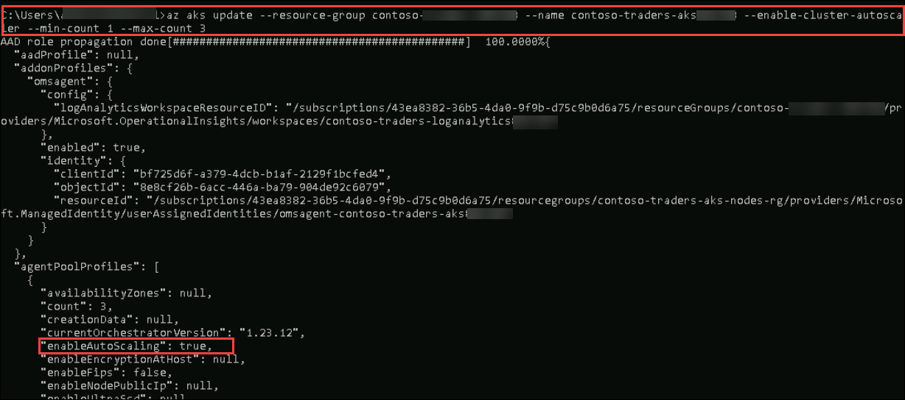

   >**Nota**: Tenha em atenção que o comando acima pode demorar até 5 minutos para concluir a atualização. Antes de realizar qualquer ação adicional, certifique-se de que é executada com sucesso.

1. Execute o comando abaixo para dimensionar automaticamente os pools de nós no cluster existente. Certifique-se de que substitui o SUFFIX pelo valor DeploymentID **<inject key="DeploymentID" enableCopy="true"/>** fornecido no comando abaixo.

    ```
    az aks update --resource-group ContosoTraders-SUFFIX --name contoso-traders-aksSUFFIX --update-cluster-autoscaler --min-count 1 --max-count 5
    ```

   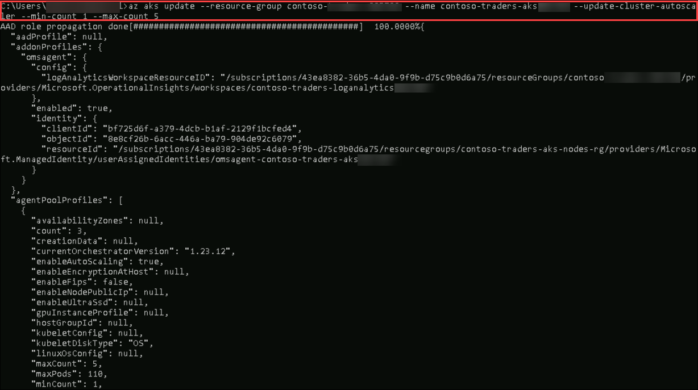

    >**Nota**: Tenha em atenção que o comando acima pode demorar até 5 minutos para concluir a atualização. Antes de realizar qualquer ação adicional, certifique-se de que é executada com sucesso.

### Tarefa 5: reiniciar os contentores e validar o HA

Nesta tarefa, irá reiniciar os contentores e validar se a reinicialização não afeta o serviço em execução.

1. Na folha Serviço Azure Kubernetes, selecione **Cargas de trabalho (1)** e, em seguida, selecione a implementação **contoso-traders-product (2)**.

   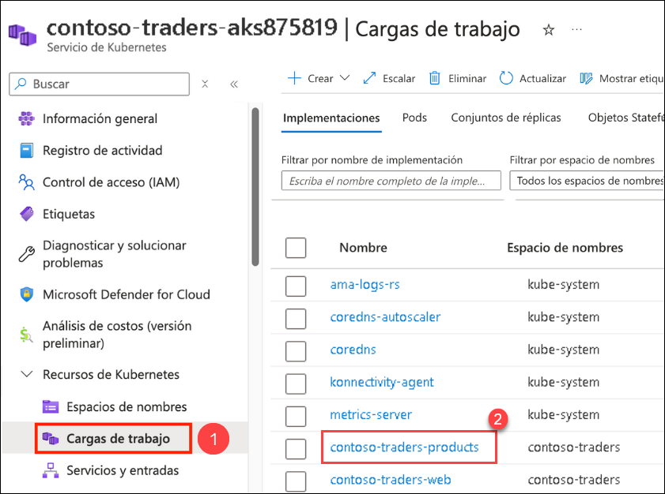

1. Selecione o item de navegação **YAML (1)** e aumente a contagem de réplicas necessária para `4` **(2)** e clique em **Revisar + guardar (3)** e, quando solicitado , Confirmar alteração do manifesto, assinale **Confirmar alteração do manifesto** e selecione **Guardar**.

   

1. Após alguns momentos, irá descobrir que a implementação do **contoso-traders-product** está agora a executar `4` réplicas com êxito.

   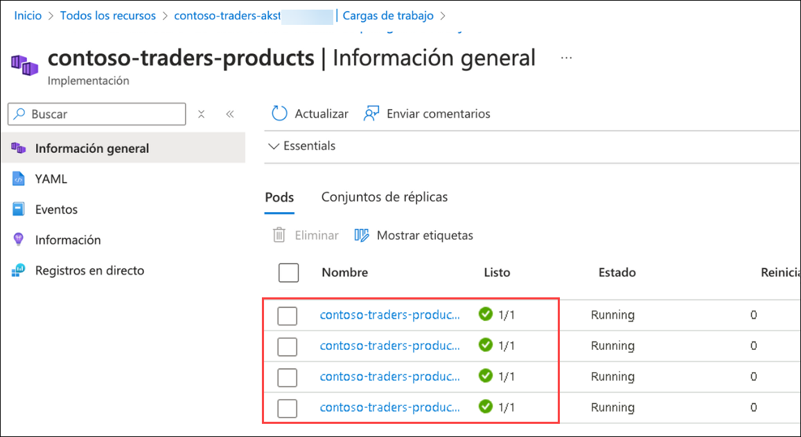

1. Volte ao separador do navegador com a página de estatísticas da aplicação web carregada. Atualize a página repetidamente. Não verá nenhum erro.

   

1. Volte para **contoso-traders-products| Na página Visão geral**, selecione **dois dos pods (1)** aleatoriamente e escolha **Apagar (2)**.

   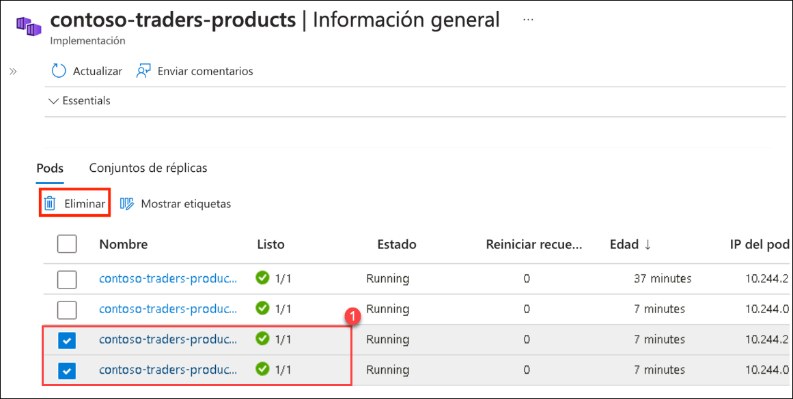

1. Na página **Apagar**, selecione **Confirmar eliminação (1)** e clique novamente em **Apagar (2)**.

   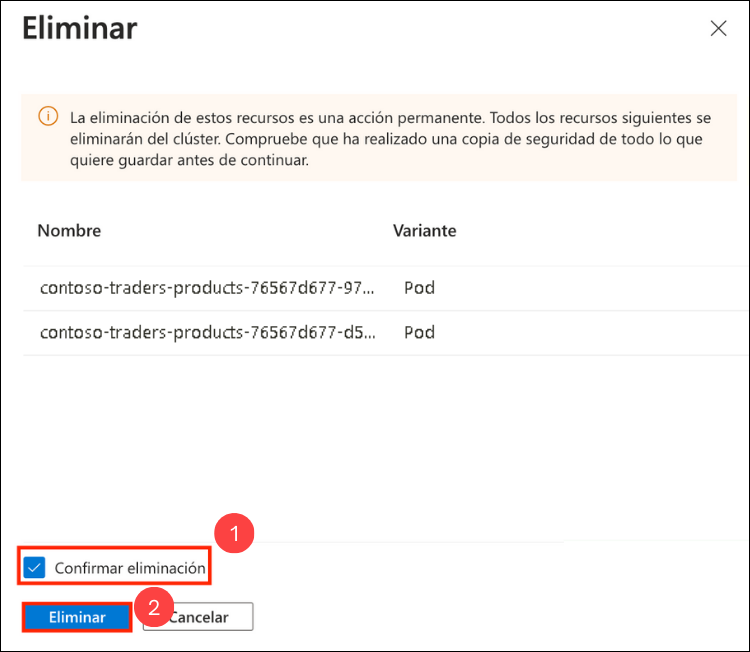

1. O Kubernetes lançará novos pods para satisfazer a contagem de réplicas necessária. Dependendo da sua visão, poderá ver as instâncias antigas a serem encerradas e novas instâncias a serem criadas.

   

1. Volte à implementação da API **contoso-traders-product**. Selecione o item de navegação **YAML** e reduza-o para a réplica `1`.

    

1. Selecione **Revisar + guardar** e, quando solicitado, Confirmar alteração do manifesto, assinale **Confirmar alteração do manifesto** e selecione **Guardar**.

1. Volte à página de estatísticas do site ContosoTarders no browser e atualize enquanto o Kubernetes reduz o número de pods. Deve conseguir ver o site a funcionar sem problemas

   

### Tarefa 6: Configurar a escala automática do CosmosDB

Nesta tarefa, irá configurar o dimensionamento automático no Azure Cosmos DB.

1. No Portal do Azure, navegue até **Contosotraders-<inject key="DeploymentID" enableCopy="false" />** Conta do Azure Cosmos DB.

2. Selecione **Data Explorer (1)** no menu do lado esquerdo. No **Data Explorer**, expanda a base de dados `contentdb` **(2)**.

   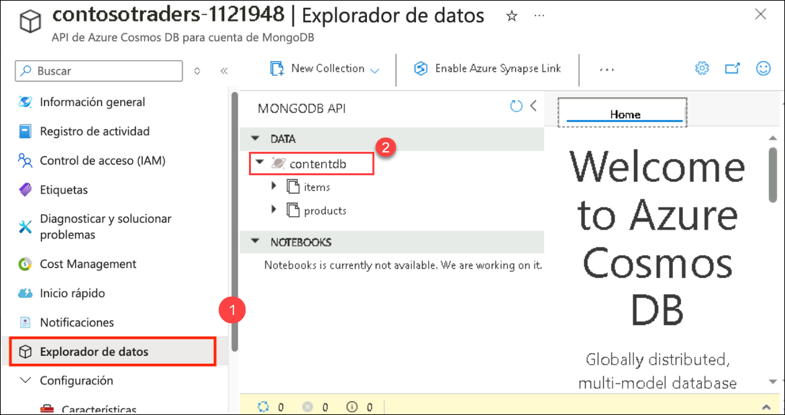

4. Na base de dados `contentdb`, expanda a coleção **Items (1)**, selecione **Settings (2)**.

   

5. No separador **Escala e definições (1)**, selecione **Escala automática (2)** para a definição **Taxa de transferência** em **Escala** e clique em **Guardar (3)** .

   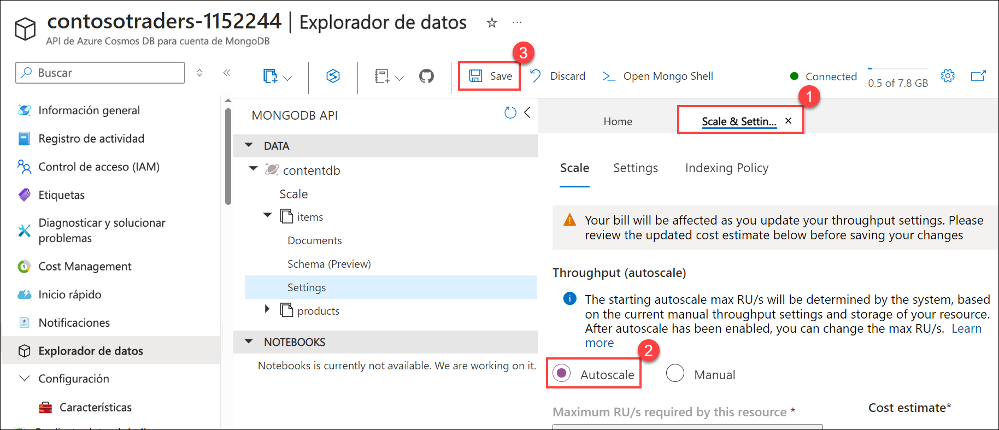

### Tarefa 7: testar a escala automática do CosmosDB

Nesta tarefa, irá executar um script de teste de desempenho que testará a funcionalidade Autoscale do Azure Cosmos DB para que possa ver que agora será dimensionado para mais de 400 RU/s.

1. No Portal do Azure, navegue até **contosotraders-<inject key="DeploymentID" enableCopy="false" />** Conta do Azure Cosmos DB.

2. Selecione **String de ligação** em **Definições**.

   

3. No painel **Connection String**, copie os valores **HOST (1)**, **USERNAME (2)** e **PRIMARY PASSWORD (3)**. Guarde-os num ficheiro de texto para uso posterior.

   

4. Abra o comando de linha e ligue-se à VM do agente de construção utilizando o comando fornecido **<inject key="Command to Connect to Build Agent VM" enableCopy="true" />**.

5. Quando a palavra-passe for solicitada, introduza **Build Agent VM Password** fornecida abaixo.

   * Password: **<inject key="Build Agent VM Password" enableCopy="true" />**

6. Na **VM do agente de compilação**, navegue até ao diretório `~/labfiles`.

    ```bash
    cd Cloud-Native-Application/labfiles/src
    ```

7. Execute o seguinte comando para abrir o script `perftest.sh` na janela do editor.

    ```bash
    sudo chmod 777 perftest.sh
    vi perftest.sh
    ```

8. Existem diversas variáveis ​​declaradas no topo do script `perftest.sh`. Prima **_i_** para entrar no modo `inserir`. Em seguida, modifique as variáveis ​​​​**host**, **username** e **password** definindo os seus valores para os valores correspondentes da cadeia de ligação do Cosmos DB que foram copiados anteriormente.

   

9. De seguida, prima **_ESC_**, escreva **_:wq_** para guardar as suas alterações e feche o ficheiro.

   >**Nota**: Se **_ESC_** não funcionar, prima `ctrl+[` e depois escreva **_:wq_** para guardar as suas alterações e fechar o ficheiro.

10. Execute o seguinte comando para executar o script `perftest.sh` para executar um pequeno teste de carga no CosmosDB. Este script irá consumir RUs no CosmosDB inserindo muitos documentos no contentor Sessions.

    ```bash
    bash ./perftest.sh
    ```

    > **Nota:** O script demorará alguns minutos a concluir a sua execução.

11. Assim que a execução do script estiver concluída, navegue de volta para a **conta CosmosDB** no portal Azure.

12. Desça no painel **Visão geral** da folha **Conta Cosmos DB** e localize o gráfico **Solicitar cobrança**.

    > **Nota:** Pode demorar 2 a 5 minutos para que a atividade na coleção do CosmosDB apareça no registo de atividades. Aguarde alguns minutos e atualize a página se a cobrança de pedidos recentes não aparecer agora.

13. Note que a **Cobrança de pedidos** mostra agora que houve atividade na **conta CosmosDB** que excedeu o limite de 400 RU/s definido anteriormente antes da ativação do dimensionamento automático.

    

    >**Nota**: Caso não veja os dados no gráfico, defina o intervalo de tempo para durar 1 hora.

14. Clique no botão **Seguinte** localizado no canto inferior direito deste guia de laboratório para continuare com o exercício seguinte.

## Resumo

Neste exercício, aumentou as instâncias de serviço e configurou o dimensionamento automático horizontal para pods AKS. Além disso, configurou e testou o dimensionamento automático do CosmosDB.

### Concluiu o laboratório com sucesso
