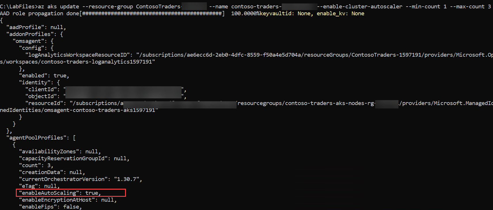
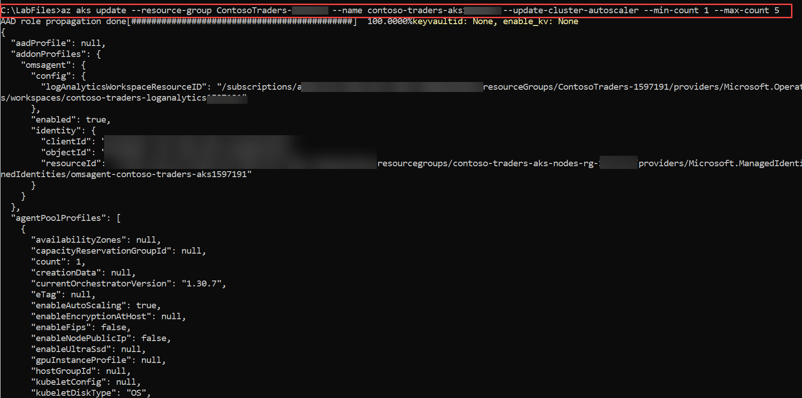
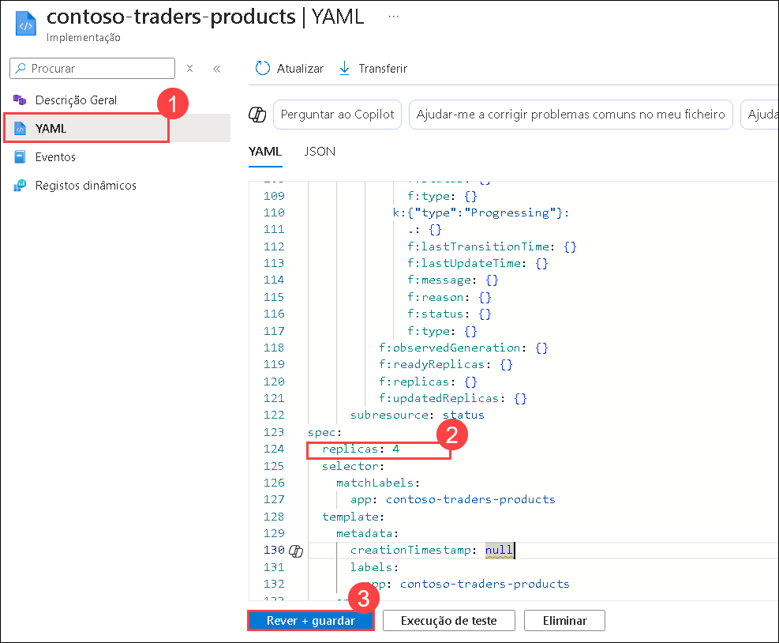
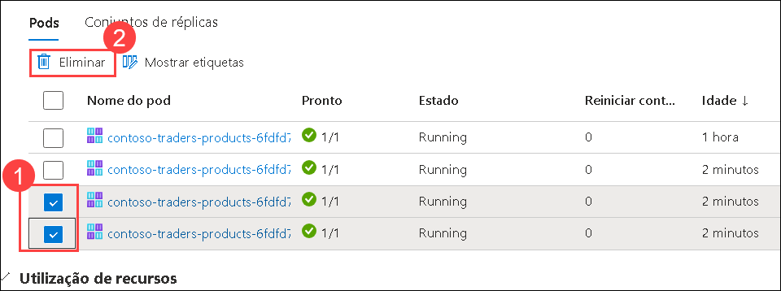
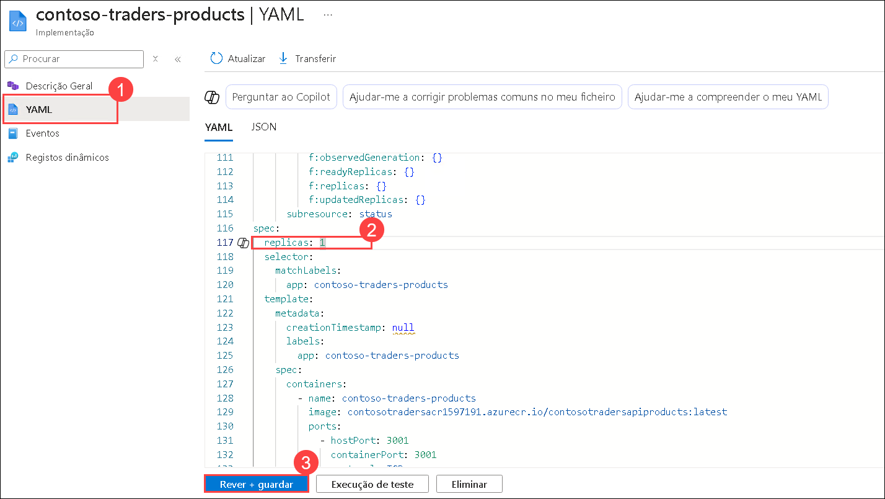
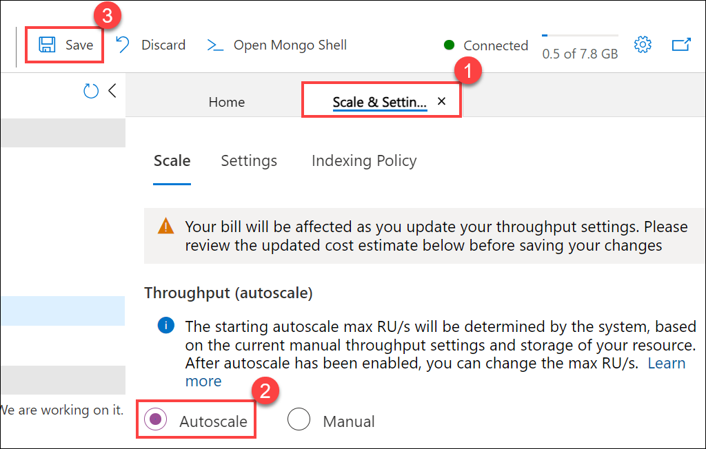
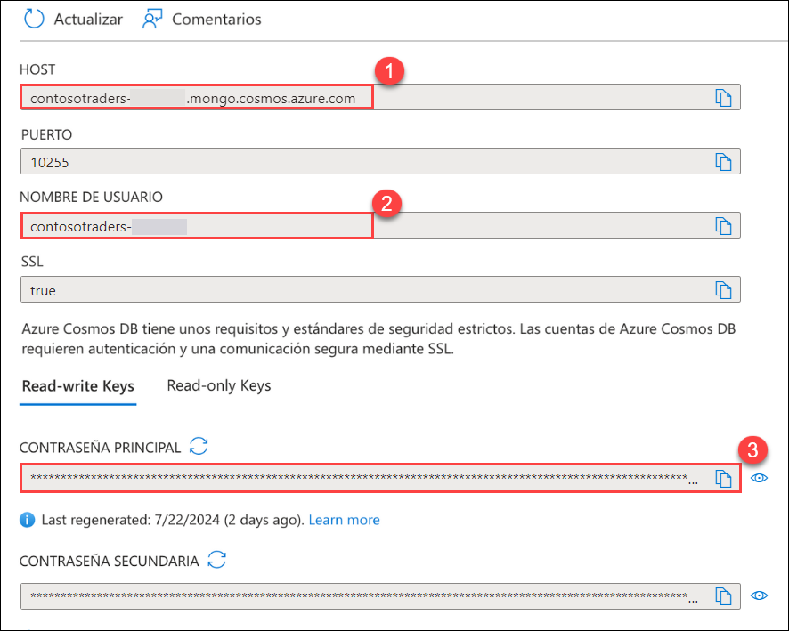

# Exercício 4: Escalar a aplicação e validar a Alta Disponibilidade (HA)

### Duração estimada: 120 Minutos

## Descrição Geral

No exercício anterior, você implantou uma única instância dos contêineres dos serviços Web e da API de Produtos. Agora, neste exercício, você irá escalar horizontalmente o serviço Web, aumentando o número de réplicas de contêiner. Com isso, a aplicação de front-end será expandida dentro do cluster existente, garantindo maior disponibilidade e capacidade de atendimento.

## Objetivos do Laboratório

Poderá completar as seguintes tarefas:

- Tarefa 1: Modificar as implantações de recursos do Kubernetes no serviço Kubernetes
- Tarefa 2: Resolver o provisionamento de réplicas com falha
- Tarefa 3: Configurar o Escalonamento Automático Horizontal para os pods do serviço Kubernetes
- Tarefa 4: Escalonamento automático no cluster do Serviço de Kubernetes do Azure
- Tarefa 5: Reiniciar contêineres e validar a Alta Disponibilidade (HA)
- Tarefa 6: Configurar o escalonamento automático do Cosmos DB
- Tarefa 7: Testar o escalonamento automático do Cosmos DB

### Tarefa 1: Modificar as implantações de recursos do Kubernetes no serviço Kubernetes

Nesta tarefa, você escalará a implantação da API no AKS, aumentando o número de réplicas. Durante o processo de escalonamento, você observará o status da implantação à medida que ela progride.

1. No portal do Azure, acesse o serviço Kubernetes **contoso-traders-aks<inject key="DeploymentID" enableCopy="false" />** dentro do grupo de recursos **contosoTraders-<inject key="DeploymentID" enableCopy=" false" />**.

   

1. No menu à esquerda, em Recursos do Kubernetes, selecione **Cargas de trabalho** **(1)** e, em seguida, clique na implantação **contoso-traders-products** **(2)**.

   

1. Selecione **YAML** **(1)** no menu esquerdo na visão geral de **contoso-traders-products** e role para baixo até encontrar **replicas** na seção **spec**. Altere o número de réplicas para **2** **(2)** e, em seguida, selecione **Revisar + salvar (3)**.

   

1. Quando solicitado a confirmar a alteração do manifesto, marque **Confirmar alteração do manifesto (1)** e clique em **Salvar (2)**. Em seguida, clique em **Visão Geral (3)** para navegar de volta para as implantações.

    

    >**Observação**: Se a implantação for concluída rapidamente, você pode не ver a implantação nos estados de espera no portal, conforme descrito nos passos seguintes.

1. No momento, a implantação está em andamento: é possível visualizar uma instância em execução e saudável, enquanto outra ainda está em fase de inicialização.

1. Abra a aplicação Web Contoso Traders, e você verá que a aplicação ainda deve funcionar sem erros.

   

1. Se você encontrou algum erro ou dificuldade ao adicionar uma nova instância na Tarefa 1, prossiga para a Tarefa 2 para solucioná-los. Caso contrário, avance diretamente para a Tarefa 3.

> **Parabéns** por concluir a tarefa! Agora, é hora de validá-la. Aqui estão os passos:
> - Se você receber uma mensagem de sucesso, poderá prosseguir para a próxima tarefa.
> - Caso contrário, leia atentamente a mensagem de erro e repita a etapa, seguindo as instruções do guia do laboratório.
> - Se precisar de ajuda, entre em contato conosco em cloudlabs-support@spektrasystems.com. Estamos disponíveis 24/7 para ajudá-lo.    

<validation step="cd2e41f5-e0af-43fc-97ac-3358da846e31" />  

### Tarefa 2: Resolver o provisionamento de réplicas com falha

Nesta tarefa, você corrigirá falhas nas réplicas da API, geralmente causadas por recursos insuficientes para atender às demandas da aplicação. Execute esta tarefa somente se tiver identificado erros ou problemas na etapa anterior; caso contrário, você pode pular diretamente para a próxima etapa.

1. No serviço Kubernetes **contoso-traders-aks<inject key="DeploymentID" enableCopy="false" />**, selecione **Cargas de trabalho (1)** em **Recursos do Kubernetes** e, em seguida, selecione  a implantação **contoso-traders-products (2)**.

      

1. Selecione **YAML** no menu esquerdo na seção Visão geral de **contoso-traders-products**.

      

1. Na tela do **YAML**, role para baixo e atualize os seguintes itens. Selecione **Revisar + salvar** **(4)** após as alterações serem feitas.

      - Na seção **spec**, verifique se a **porta listada abaixo** **(1)** está corretamente configurada:

         ```yaml
         ports:
            - containerPort: 3001
              protocol: TCP
         ```

      - Modifique a **cpu** e a **memória (2)** na mesma seção spec. A CPU é dividida entre todos os Pods em um Nó..
   
         ```yaml
         resources:
            requests:
            cpu: 100m
            memory: 128Mi
         ```

      - Selecione **Revisar + salvar (3)**.

      

1. Quando solicitado, marque **Confirmar alteração ao manifesto** e selecione **Salvar**.

1. Retorne à visualização principal de **Cargas de trabalho** do serviço Kubernetes **contoso-traders-aks<inject key="DeploymentID" enableCopy="false" />**, atualize a página e você verá que a Implantação está saudável, com **dois** **(2)** Pods em operação.

      

### Tarefa 3: Configurar o Escalonamento Automático Horizontal para os pods do serviço Kubernetes

Nesta tarefa, você irá configurar o escalonamento automático horizontal para os pods do seu serviço Kubernetes.

1. Navegue de volta para o seu prompt de comando do Windows.

1. Execute o comando abaixo para configurar o escalonamento automático horizontal para os pods da sua API de Produtos.

      ```bash
       kubectl autoscale deployment contoso-traders-products -n contoso-traders --cpu-percent=50 --min=1 --max=10
      ```

      

1. Execute o comando abaixo para verificar o status do Horizontal Pod Autoscaler que foi adicionado recentemente.
      
      ```
       kubectl get hpa -n contoso-traders
      ```

      

### Tarefa 4: Escalonamento automático no cluster do Serviço de Kubernetes do Azure

Nesta tarefa, você habilitará o escalonador automático do cluster para o cluster AKS existente e escalará automaticamente os pools de nós do cluster.

1. Navegue de volta para o seu prompt de comando do Windows. Se não estiver logado no Azure, faça login com o comando abaixo.

      ```
      az login -u <inject key="AzureAdUserEmail"></inject> -p <inject key="AzureAdUserPassword"></inject>
      ```

1. Para configurar a conexão do cluster Kubernetes, execute o comando abaixo.

      ```
      az aks get-credentials --resource-group contosoTraders-<inject key="DeploymentID" enableCopy="true"/> --name contoso-traders-aks<inject key="DeploymentID" enableCopy="true"/>
      ```

         

1. Verifique o `count` de pools de nós no cluster e garanta que `enablingAutoScaling` seja `null/false`.

      ```
      az aks nodepool list --resource-group contosoTraders-<inject key="DeploymentID" enableCopy="true"/> --cluster-name contoso-traders-aks<inject key="DeploymentID" enableCopy="true"/>
      ```

      

1. Execute o comando abaixo para habilitar o escalonamento automático do cluster existente. Verifique se `enablingAutoScaling` é `true`.

      ```
      az aks update --resource-group contosoTraders-<inject key="DeploymentID" enableCopy="true"/> --name contoso-traders-aks<inject key="DeploymentID" enableCopy="true"/> --enable-cluster-autoscaler --min-count 1 --max-count 3
      ```

      

      >**Observação**: Tenha em mente que o comando acima pode levar até 5 minutos para concluir a atualização. Antes de tomar qualquer outra ação, certifique-se de que ele foi executado com sucesso.

1. Execute o comando abaixo para escalar automaticamente os pools de nós no cluster existente.

      ```
      az aks update --resource-group contosoTraders-<inject key="DeploymentID" enableCopy="true"/> --name contoso-traders-aks<inject key="DeploymentID" enableCopy="true"/> --update-cluster-autoscaler --min-count 1 --max-count 5
      ```

      

      >**Observação**: Tenha em mente que o comando acima pode levar até 5 minutos para concluir a atualização. Antes de prosseguir com qualquer outra ação, verifique se ele foi executado com sucesso.

### Tarefa 5: Reiniciar contêineres e validar a Alta Disponibilidade (HA)

Nesta tarefa, você reiniciará contêineres e validará que a reinicialização não afeta o serviço em execução.

1. No serviço Kubernetes **contoso-traders-aks<inject key="DeploymentID" enableCopy="false" />** , Selecione **Cargas de trabalho** em **Recursos do Kubernetes** e, em seguida, selecione a implantação **contoso- traders-products**.

      

1. Selecione o item de navegação **YAML (1)** e aumente a contagem de réplicas necessárias para `4` **(2)** e clique em **Revisar + salvar (3)**.

      

1. Quando solicitado, marque **Confirmar alteração ao manifesto (1)** e selecione **Salvar (2)**. Em seguida, clique em **Visão Geral (3)** para voltar.

      

1. ocê verá que a implantação **contoso-traders-product** agora está executando `4` réplicas com sucesso passados 5 minutos.

      

1. Retorne à aba do navegador com a página de estatísticas da aplicação web carregada. Atualize a página repetidamente. Você não verá nenhum erro.

      

1. Retorne para a página **contoso-traders-products | Na página Visão geral**, selecione **dois dos Pods (1)** aleatoriamente e escolha **Excluir (2)**.

      

1. Na página **Excluir**, selecione **Confirmar exclusão (1)** e clique novamente em **Excluir (2)**.

      

1. O Kubernetes iniciará novos Pods para atender à contagem de réplicas necessária. Dependendo da sua visualização, você pode ver as instâncias antigas sendo encerradas e novas instâncias sendo criadas.

      

1. Retorne à Implantação da API **contoso-traders-product**. Selecione o item de navegação **YAML** e reduza a escala de volta para `1` réplica.

      

1. Selecione **Revisar + salvar** e, quando for solicitado, marque **Confirmar alteração do manifesto** e selecione **Salvar**.

1. Retorne à página de estatísticas do site ContosoTraders no navegador e atualize enquanto o Kubernetes está reduzindo o número de Pods. Você deve conseguir ver o site funcionando sem problemas.

      


> **Parabéns** por concluir a tarefa! Agora, é hora de validá-la. Aqui estão os passos:
> - Se você receber uma mensagem de sucesso, poderá prosseguir para a próxima tarefa.
> - Caso contrário, leia atentamente a mensagem de erro e repita a etapa, seguindo as instruções do guia do laboratório.
> - Se precisar de ajuda, entre em contato conosco em cloudlabs-support@spektrasystems.com. Estamos disponíveis 24/7 para ajudá-lo.

<validation step="0cddaf1e-5cbe-4a3c-8b20-0e6999478048" />      

### Tarefa 6: Configurar o escalonamento automático do Cosmos DB

Nesta tarefa, você irá configurar o dimensionamento automático no Azure Cosmos DB.

1. No Portal do Azure, navegue até a conta do Azure Cosmos DB para MongoDB **contosotraders-<inject key="DeploymentID" enableCopy="false" />**.

      

1. Selecione **Data Explorer (1)** no menu do lado esquerdo. No **Data Explorer**, expanda a banco de dados `contentdb` **(2)**.
 
   

1. No banco de dados `contentdb`, expanda a coleção **Items (1)**, clique **Scale & Settings (2)**.

   .png "A implementação da API está agora íntegra")

1. Na aba **Scale & Settings (1)**, selecione **Autoscale (2)** para a definição **Throughput** em **Scale** e clique em **Save (3)** .

   

> **Parabéns** por concluir a tarefa! Agora, é hora de validá-la. Aqui estão os passos:
> - Se você receber uma mensagem de sucesso, poderá prosseguir para a próxima tarefa.
> - Caso contrário, leia atentamente a mensagem de erro e repita a etapa, seguindo as instruções do guia do laboratório.
> - Se precisar de ajuda, entre em contato conosco em cloudlabs-support@spektrasystems.com. Estamos disponíveis 24/7 para ajudá-lo.
   
<validation step="772e22fb-588f-41b1-b761-428e48c79279" />
    
### Tarefa 7: Testar o escalonamento automático do Cosmos DB

Nesta tarefa, você executará um script de teste de desempenho que testará o recurso de Escalonamento Automático do Azure Cosmos DB para que você possa ver que ele agora escalará para mais de 400 RU/s.

1. No Portal do Azure, navegue até a conta do Azure Cosmos DB para MongoDB **contosotraders-<inject key="DeploymentID" enableCopy="false" />**.

   

1. Na seção **Configurações**, clique em **Cadeia de Conexão**.

   

1. No painel **Cadeia de Conexão**, copie os valores **HOST (1)**, **USERNAME (2)** e **PRIMARY PASSWORD (3)**. Salve-os em um arquivo de texto para uso posterior.

   

1. Abra o prompt de comando e conecte-se à VM do agente de compilação usando o comando fornecido **<inject key="Command to Connect to Build Agent VM" enableCopy="true" />**.

1. Quando a senha for solicitada, insira a **Build Agent VM Password** fornecida abaixo.

   * Senha: **<inject key="Build Agent VM Password" enableCopy="true" />**

1. Na **Build agent VM**, navegue até ao diretório `~/labfiles`.

      ```bash
      cd Cloud-Native-Application/labfiles/src
      ```

1. Execute o seguinte comando para abrir o script `perftest.sh` na janela do editor.

      ```bash
      sudo chmod 777 perftest.sh
      vi perftest.sh
      ```

1. Existem diversas variáveis ​​declaradas no topo do script `perftest.sh`. Pressione **_i_** para entrar no modo `inserir`. Em seguida, modifique as variáveis ​​​​**HOST**, **USERNAME** e **PRIMARY PASSWORD** definindo seus valores para os valores correspondentes da cadeia de conexão do Cosmos DB que foram copiados anteriormente.

   

1. De seguida, prima **_ESC_**, digite **_:wq_** para salvar as suas alterações e feche o arquivo.

      >**Observação**: Se **_ESC_** não funcionar, pressione `ctrl+[` e, em seguida, depois digite: **_:wq_** para salvar as suas alterações e fechar o arquivo.

10. Execute o seguinte comando para executar o script `perftest.sh` e realizar um pequeno teste de carga contra o Cosmos DB. Este script consumirá RUs no Cosmos DB inserindo muitos documentos no contêiner de Sessões.

      ```bash
      bash ./perftest.sh
      ```

      > **Observação:** O script levará alguns minutos para concluir sua execução; se o script travar durante a execução, pressione `Ctrl+C` para interrompê-lo.

1. Assim que a execução do script estiver concluída, retorne para a conta do **Cosmos DB account** no portal Azure.

1. Role para baixo no painel de **Visão Geral** da conta do **Cosmos DB** e localize o gráfico **Cobrança de Requisição**.

      > **Observação:** Pode demorar 2 a 5 minutos para que a atividade na coleção do CosmosDB apareça no registo de atividades. Aguarde alguns minutos e atualize a página se a cobrança de pedidos recentes não aparecer imediatamente.

1. Observe que a **Cobrança de requisição** agora mostra que houve atividade na conta do **Cosmos DB** que excedeu o limite de 400 RU/s que estava definido antes de o escalonamento automático ser ativado.

   

      >**Observação**: Caso você не veja dados no gráfico, defina o intervalo de tempo para a última 1 hora.

1. Clique no botão **Próximo** localizado no canto inferior direito deste guia de laboratório para continuar com o próximo exercício.

## Resumo

Neste exercício, você aumentou as instâncias do serviço e configurou o escalonamento automático horizontal para os pods do AKS. Além disso, você configurou e testou o Escalonamento Automático do CosmosDB.

### Você concluiu o laboratório com sucesso. Clique em Próximo >> para prosseguir para o próximo exercício.


