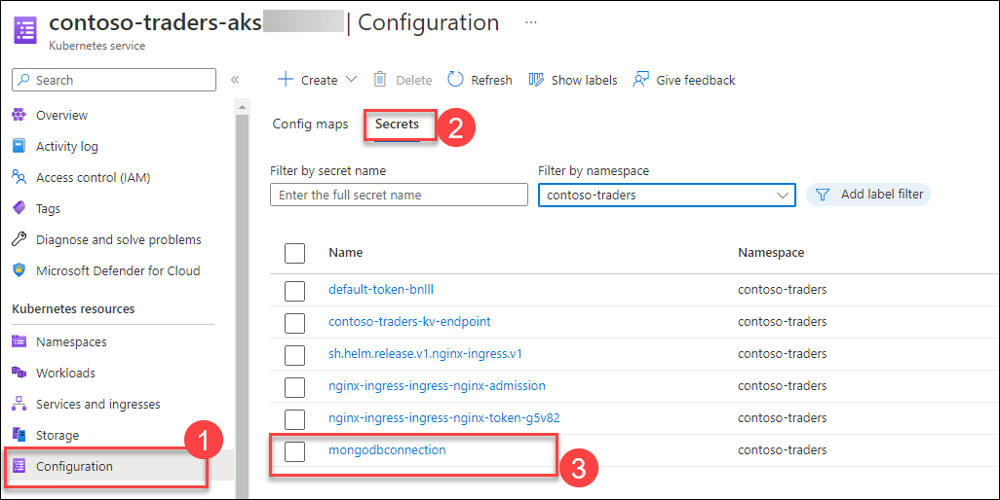
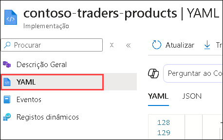
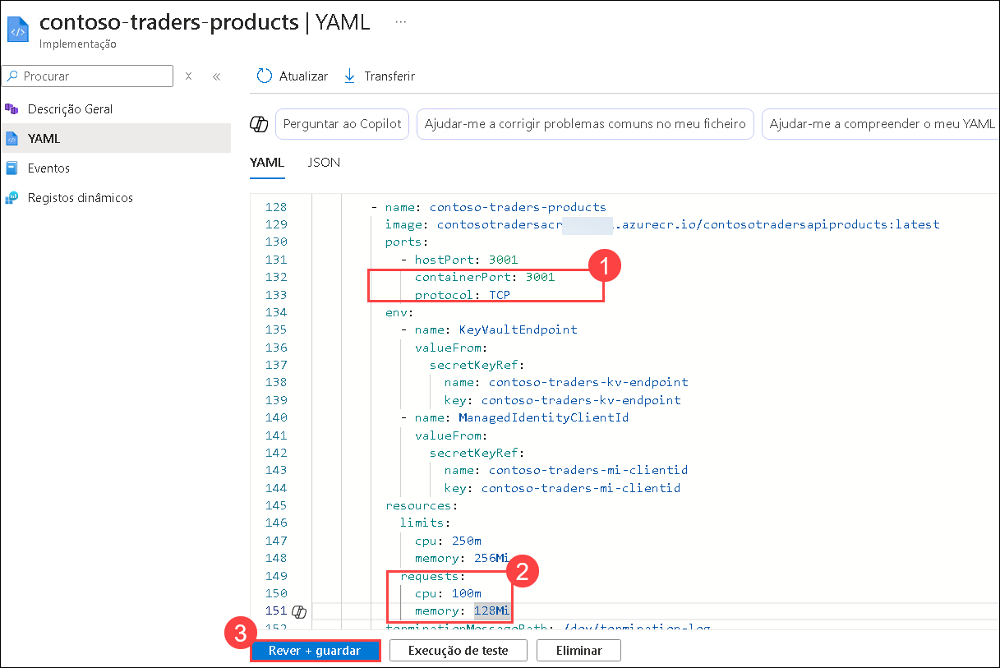
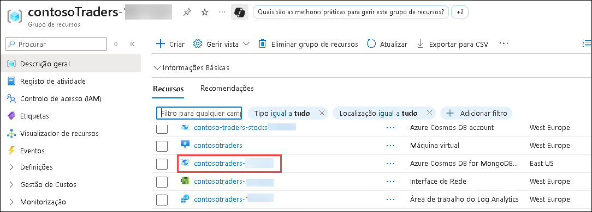
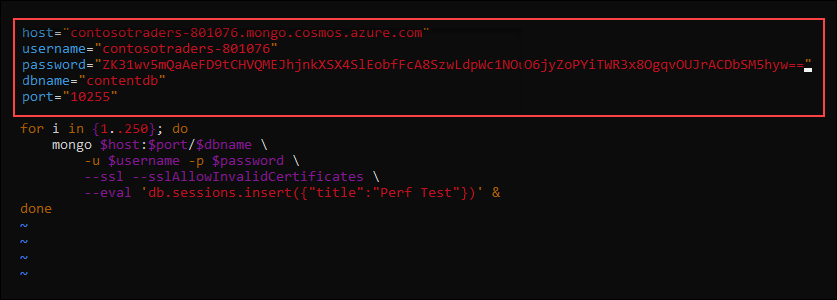
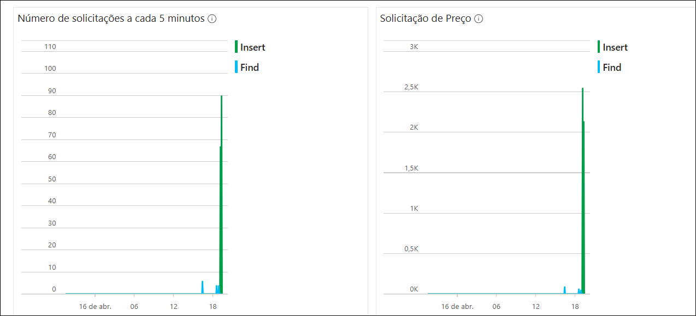

# Exercício 4: Dimensione a aplicação e valide o HA

### Duração estimada: 90 Minutos

## Descrição Geral

Neste ponto, implementou uma única instância dos contentores de serviço da API Web e de produtos. Neste exercício, irá aumentar o número de instâncias de contentores para o serviço Web e escalar o front-end no cluster existente.

## Objectivos do Laboratório

Poderá completar as seguintes tarefas:

- Tarefa 1: Modificar as implementações de Recursos Kubernetes no serviço Kubernetes
- Tarefa 2: Resolver falha no aprovisionamento de réplicas
- Tarefa 3: Configurar o escalonamento automático horizontal para os pods de serviço Kubernetes
- Tarefa 4: Dimensionamento automático no cluster do Azure Kubernetes Service
- Tarefa 5: Reiniciar contentores e validar HA
- Tarefa 6: Configurar a escala automática do CosmosDB
- Tarefa 7: Testar a escala automática do CosmosDB

### Tarefa 1: modificar as implementações de Recursos Kubernetes no serviço Kubernetes

Nesta tarefa, irá aumentar o número de instâncias para a implementação da API no AKS. Durante a implementação, observará a mudança de estado.

1. Navegue até ao portal do Azure, abra **contoso-traders-aks<inject key="DeploymentID" enableCopy="false" />** serviço Kubernetes de **contosoTraders-<inject key="DeploymentID" enableCopy=" false" />** grupo de recursos. 

   

1. Selecione **Cargas de trabalho (1)** em **Recursos Kubernetes** nas características do Kubernetes no menu do lado esquerdo e, em seguida, selecione a implementação **contoso-traders-products (2)**.

   

1. Selecione **YAML (1)** no menu à esquerda na Descrição Geral do **contoso-traders-products** e desça até encontrar **replicas** na secção **spec**. Altere o número de réplicas para **2 (2)** e depois selecione **Rever + guardar (3)**.

   

1. Quando for solicitado a confirmar a alteração do manifesto, selecione **Confirmar alteração do manifesto (1)** e clique em **Guardar (2)**. Em seguida, clique em **Descrição Geral (3)** para voltar aos deployments.

    

    >**Nota**: Se a implementação for concluída rapidamente, poderá não ver a implementação no estado em espera no portal, conforme descrito nos passos seguintes.

1. Está a ser implementado no momento e pode ver que há uma instância íntegra e uma instância em espera.

1. Abra a aplicação Web Contoso Traders e verá que a aplicação ainda deve funcionar sem erros.

   

1. Se encontrou algum erro ou problema ao adicionar uma nova instância na Tarefa 2, continue com a Tarefa 2 para os resolver. Se não encontrou nenhum problema, ignore a Tarefa 2 e avance diretamente para a Tarefa 3.

> **Parabéns** por concluir a tarefa! Agora é hora de validá-lo. Aqui estão as etapas:
> - Se você receber uma mensagem de sucesso, poderá prosseguir para a próxima tarefa.
> - Caso contrário, leia atentamente a mensagem de erro e repita a etapa, seguindo as instruções do guia do laboratório.
> - Se precisar de ajuda, entre em contato conosco em cloudlabs-support@spektrasystems.com. Estamos disponíveis 24/7 para ajudá-lo.    

<validation step="cd2e41f5-e0af-43fc-97ac-3358da846e31" />  

### Tarefa 2: Resolver falha no aprovisionamento de réplicas

Nesta tarefa, irá resolver as réplicas de API com falha. Estas falhas ocorrem devido à incapacidade de atender aos recursos solicitados.

1. No serviço **contoso-traders-aks<inject key="DeploymentID" enableCopy="false" />** Kubernetes, Selecione **Cargas de trabalho (1)** em **Recursos Kubernetes** e, em seguida, seleccione **contoso-traders-products (2)** implantação.

      

1. Selecione **YAML** no menu esquerdo na vista geral de **contoso-traders-products**.

      

1. No ecrã **YAML**, desça e altere os seguintes itens:

      - Na secção **spec** adicione as seguintes **ports (1)**.

         ```yaml
         ports:
            - containerPort: 3001
              protocol: TCP
         ```

      - Modifique a **cpu** e configure-a para **100m (2)**. A CPU é dividida entre todos os pods de um Node.
   
         ```yaml
         resources:
            requests:
            cpu: 100m
            memory: 128Mi
         ```

      - Selecione **Rever + guardar (3)**.

      

1. Confirmar alteração do manifesto, assinale **Confirmar alteração ao manifesto** e selecione **Guardar**.

1. Volte à vista principal **Cargas de trabalho** do serviço **contoso-traders-aks<inject key="DeploymentID" enableCopy="false" />** Kubernetes, actualize a página e verá agora que o A a implantação está íntegra com **two** pods em funcionamento.

      

### Tarefa 3: configurar o escalonamento automático horizontal para os pods de serviço Kubernetes

Nesta tarefa, irá configurar o escalonamento automático horizontal para os seus pods de serviço Kubernetes.

1. Navegue de volta para o **Linha de comandos** do Windows.

1. Execute o comando abaixo para configurar o escalonamento automático horizontal para os seus pods de produtos API.

      ```bash
       kubectl autoscale deployment contoso-traders-products -n contoso-traders --cpu-percent=50 --min=1 --max=10
      ```

      

1. Execute o comando abaixo para verificar o estado do Horizontal Pod Au recentemente adicionado escalador.
      
      ```
       kubectl get hpa -n contoso-traders
      ```

      

### Tarefa 4: escalonamento automático no cluster do serviço Azure Kubernetes

Nesta tarefa, irá ativar o escalonador automático de cluster para o cluster AKS existente e dimensionará automaticamente os pools de nós do cluster.

1. Navegue de volta para o Linha de comandos do Windows. Se você não estiver conectado ao Azure, faça login no Azure com o comando abaixo após atualizar os valores no comando abaixo.

      ```
      az login -u <inject key="AzureAdUserEmail"></inject> -p <inject key="AzureAdUserPassword"></inject>
      ```

1. Para configurar a conexão do cluster Kubernetes, execute o comando abaixo.

      ```
      az aks get-credentials --resource-group contosoTraders-<inject key="DeploymentID" enableCopy="true"/> --name contoso-traders-aks<inject key="DeploymentID" enableCopy="true"/>
      ```

         

1. Verifique o `count` de pools de nós no cluster e certifique-se de que `enablingAutoScaling` é `null/false`.

      ```
      az aks nodepool list --resource-group contosoTraders-<inject key="DeploymentID" enableCopy="true"/> --cluster-name contoso-traders-aks<inject key="DeploymentID" enableCopy="true"/>
      ```

      

1. Execute o comando abaixo para ativar o dimensionamento automático do cluster no cluster existente. Verifique se `enablingAutoScaling` é `true`.

      ```
      az aks update --resource-group contosoTraders-<inject key="DeploymentID" enableCopy="true"/> --name contoso-traders-aks<inject key="DeploymentID" enableCopy="true"/> --enable-cluster-autoscaler --min-count 1 --max-count 3
      ```

      

      >**Nota**: Tenha em atenção que o comando acima pode demorar até 5 minutos para concluir a atualização. Antes de realizar qualquer ação adicional, certifique-se de que é executada com sucesso.

1. Execute o comando abaixo para dimensionar automaticamente os pools de nós no cluster existente.

      ```
      az aks update --resource-group contosoTraders-<inject key="DeploymentID" enableCopy="true"/> --name contoso-traders-aks<inject key="DeploymentID" enableCopy="true"/> --update-cluster-autoscaler --min-count 1 --max-count 5
      ```

      

      >**Nota**: Tenha em atenção que o comando acima pode demorar até 5 minutos para concluir a atualização. Antes de realizar qualquer ação adicional, certifique-se de que é executada com sucesso.

### Tarefa 5: reiniciar os contentores e validar o HA

Nesta tarefa, irá reiniciar os contentores e validar se a reinicialização não afeta o serviço em execução.

1. No serviço **contoso-traders-aks<inject key="DeploymentID" enableCopy="false" />** Kubernetes, Selecione **Cargas de trabalho** em **Recursos Kubernetes** e, em seguida, seleccione **contoso- traders-products** implantação.

      

1. Selecione o item de navegação **YAML (1)** e aumente a contagem de réplicas necessária para `4` **(2)** e clique em **Rever + guardar (3)**.

      

1. Quando lhe for pedido para confirmar a alteração do manifesto, assinale **Confirmar alteração ao manifesto (1)** e selecione **Guardar (2)**. Em seguida, clique em **Descrição Geral (3)** para voltar aos deployments.

      

1. Irá verificar que o deployment **contoso-traders-product** está agora a executar `4` réplicas com sucesso passados 5 minutos.

      

1. Volte ao separador do navegador com a página de estatísticas da aplicação web carregada. Atualize a página repetidamente. Não verá nenhum erro.

      

1. Voltar para **contoso-traders-products | Na página Descrição Geral**, selecione **dois dos pods (1)** aleatoriamente e escolha **Eliminar (2)**.

      

1. Na página **Eliminar**, selecione **Confirmar eliminação (1)** e clique novamente em **Eliminar (2)**.

      

1. O Kubernetes lançará novos pods para satisfazer a contagem de réplicas necessária. Dependendo da sua visão, poderá ver as instâncias antigas a serem encerradas e novas instâncias a serem criadas.

      

1. Volte ao deployment da API **contoso-traders-product**. Selecione o item de navegação **YAML** e reduza novamente para `1` réplica.

      

1. Selecione **Rever + guardar** e, quando for solicitado a confirmar a alteração do manifesto, assinale **Confirmar alteração do manifesto** e selecione **Guardar**.

1. Volte à página de estatísticas do site ContosoTarders no browser e atualize enquanto o Kubernetes reduz o número de pods. Deve conseguir ver o site a funcionar sem problemas

      


> **Parabéns** por concluir a tarefa! Agora é hora de validá-lo. Aqui estão as etapas:
> - Se você receber uma mensagem de sucesso, poderá prosseguir para a próxima tarefa.
> - Caso contrário, leia atentamente a mensagem de erro e repita a etapa, seguindo as instruções do guia do laboratório.
> - Se precisar de ajuda, entre em contato conosco em cloudlabs-support@spektrasystems.com. Estamos disponíveis 24/7 para ajudá-lo.

<validation step="0cddaf1e-5cbe-4a3c-8b20-0e6999478048" />      

### Tarefa 6: Configurar a escala automática do CosmosDB

Nesta tarefa, irá configurar o dimensionamento automático no Azure Cosmos DB.

1. No Portal do Azure, navegue até a conta **contosotraders-<inject key="DeploymentID" enableCopy="false" />** do Azure Cosmos DB para MongoDB.

      

1. Selecione **Data Explorer (1)** no menu do lado esquerdo. No **Data Explorer**, expanda a base de dados `contentdb` **(2)**.
 
   

1. Na base de dados `contentdb`, expanda a coleção **Items (1)**, selecione **Settings (2)**.

   .png "A implementação da API está agora íntegra")

1. No separador **Scale & Settings (1)**, selecione **Autoscale (2)** para a definição **Throughput** em **Scale** e clique em **Save (3)** .

   


> **Parabéns** por concluir a tarefa! Agora é hora de validá-lo. Aqui estão as etapas:
> - Se você receber uma mensagem de sucesso, poderá prosseguir para a próxima tarefa.
> - Caso contrário, leia atentamente a mensagem de erro e repita a etapa, seguindo as instruções do guia do laboratório.
> - Se precisar de ajuda, entre em contato conosco em cloudlabs-support@spektrasystems.com. Estamos disponíveis 24/7 para ajudá-lo.
   
<validation step="772e22fb-588f-41b1-b761-428e48c79279" />
    

### Tarefa 7: Testar a escala automática do CosmosDB

Nesta tarefa, irá executar um script de teste de desempenho que testará a funcionalidade Autoscale do Azure Cosmos DB para que possa ver que agora será dimensionado para mais de 400 RU/s.

1. No Portal do Azure, navegue até a conta **contosotraders-<inject key="DeploymentID" enableCopy="false" />** do Azure Cosmos DB para MongoDB.

   

1. Selecione **Cadeia de Ligação** em **Definições**.

   

1. No painel **Cadeia de Ligação**, copie os valores **ANFITRIÃO (1)**, **NOME DE UTILIZADOR (2)** e **PALAVRA-PASSE PRIMÁRIA (3)**. Guarde-os num ficheiro de texto para uso posterior.

   

1. Abra o comando de linha e ligue-se à VM do agente de construção utilizando o comando fornecido **<inject key="Command to Connect to Build Agent VM" enableCopy="true" />**.

1. Quando a palavra-passe for solicitada, introduza **Build Agent VM Password** fornecida abaixo.

   * Password: **<inject key="Build Agent VM Password" enableCopy="true" />**

1. Na **Build agent VM**, navegue até ao diretório `~/labfiles`.

      ```bash
      cd Cloud-Native-Application/labfiles/src
      ```

1. Execute o seguinte comando para abrir o script `perftest.sh` na janela do editor.

      ```bash
      sudo chmod 777 perftest.sh
      vi perftest.sh
      ```

1. Existem diversas variáveis ​​declaradas no topo do script `perftest.sh`. Prima **_i_** para entrar no modo `inserir`. Em seguida, modifique as variáveis ​​​​**host**, **NOME DE USUÁRIO** e **SENHA PRIMÁRIA** definindo os seus valores para os valores correspondentes da cadeia de ligação do Cosmos DB que foram copiados anteriormente.

   

1. De seguida, prima **_ESC_**, escreva **_:wq_** para guardar as suas alterações e feche o ficheiro.

      >**Nota**: Se **_ESC_** não funcionar, prima `ctrl+[` e depois escreva **_:wq_** para guardar as suas alterações e fechar o ficheiro.

10. Execute o seguinte comando para executar o script `perftest.sh` para executar um pequeno teste de carga no CosmosDB. Este script irá consumir RUs no CosmosDB inserindo muitos documentos no contentor Sessions.

      ```bash
      bash ./perftest.sh
      ```

      > **Nota:** O script irá demorar alguns minutos a concluir a sua execução. Se o script ficar bloqueado durante a execução, pressione `Ctrl+C` para interromper o script.

1. Assim que a execução do script estiver concluída, navegue de volta para a **Cosmos DB account** no portal Azure.

1. Desça no painel **Descrição Geral** da folha **Cosmos DB account** e localize o gráfico **Solicitar taxa**.

      > **Nota:** Pode demorar 2 a 5 minutos para que a atividade na coleção do CosmosDB apareça no registo de atividades. Aguarde alguns minutos e atualize a página se a cobrança de pedidos recentes não aparecer agora.

1. Note que a **Solicitar taxa** mostra agora que houve atividade na **Cosmos DB account** que excedeu o limite de 400 RU/s definido anteriormente antes da ativação do dimensionamento automático.

   

      >**Nota**: Caso não veja os dados no gráfico, defina o intervalo de tempo para durar 1 hora.

1. Clique no botão **Próximo** localizado no canto inferior direito deste guia de laboratório para continuare com o exercício seguinte.

## Resumo

Neste exercício, aumentou as instâncias de serviço e configurou o dimensionamento automático horizontal para pods AKS. Além disso, configurou e testou o dimensionamento automático do CosmosDB.

### Você completou com sucesso este exercício. Clique em "Próximo" para prosseguir para o próximo exercício.


