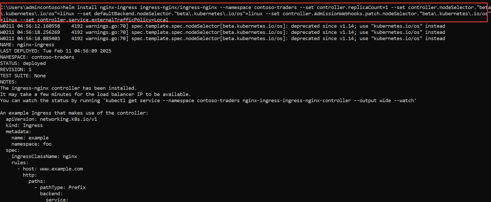

# Exercício 5: Atualização de aplicações e gestão de Ingress do Kubernetes

### Duração estimada: 70 Minutos

## Visão geral

No exercício anterior, implementamos uma restrição relacionada à escalabilidade do serviço. Neste exercício, você irá configurar as implantações da API para utilizar mapeamentos de porta dinâmicos na criação dos pods. Essa abordagem elimina limitações de portas específicas, permitindo que o escalonamento ocorra de forma mais flexível e eficiente.

No Kubernetes, os serviços conseguem identificar automaticamente as portas atribuídas dinamicamente a cada pod. Isso possibilita que várias instâncias do mesmo pod sejam executadas no mesmo nó de agente, algo que não seria viável se cada pod estivesse limitado a uma porta fixa, como a porta 3001 usada pelo serviço de API.

## Objetivos do Laboratório

Você será capaz de completar as seguintes tarefas:

- Tarefa 1: Executar uma atualização contínua
- Tarefa 2: Configurar o Ingress em Kubernetes

### Tarefa 1: Executar uma atualização contínua

Nesta tarefa, você irá modificar o código-fonte da aplicação web para aplicar alterações de configuração e atualizar a imagem Docker utilizada na implantação. Em seguida, realizará um rolling update para demonstrar como aplicar mudanças de código de forma segura.

As atualizações contínuas permitem que as mudanças sejam implantadas sem gerar tempo de inatividade: as instâncias antigas dos Pods são substituídas gradualmente pelas novas, garantindo que o serviço continue disponível durante todo o processo. Os novos Pods serão agendados em nós que possuam recursos disponíveis para suportá-los.

>**Observação**: Execute esta tarefa utilizando um novo prompt de comando, que não esteja conectado à VM do agente de compilação, mas que já esteja logado no Azure.

1. Primeiro, você modificará o código-fonte em sua aplicação web e, em seguida, criará uma nova imagem Docker que esteja alinhada com as últimas alterações.

1. Abra um novo Prompt de Comando.

1. Execute o comando fornecido **<inject key="Command to Connect to Build Agent VM" enableCopy="true" />** para se conectar à VM Linux usando ssh.

    >**Observação**: No prompt de comando, digite **yes** e pressione **Enter** quando aparecer a mensagem `Are you sure you want to continue connecting (yes/no/[fingerprint])?`

1. Assim que o ssh se conectar à VM, por favor, insira a senha da VM fornecida abaixo:

    * Senha: **<inject key="Build Agent VM Password" enableCopy="true" />**

      

      >**Observação**: Por favor, note que, por motivos de segurança, ao digitar a senha, ela não será exibida na tela.

1. Execute o comando abaixo para navegar até o diretório onde você modificará o código-fonte da aplicação web com as alterações necessárias.

    ```bash
    cd ~/Cloud-Native-Application/labfiles/src/ContosoTraders.Ui.Website/src/pages/home/sections/
    ```

    

1. Quando estiver no diretório correto, execute o comando abaixo para abrir o arquivo **hero.js** e faça a modificação de texto na página inicial da aplicação web.

    ```bash
    sudo chmod 777 hero.js
    vim hero.js
    ```

   

1. Com o arquivo aberto, pressione "i" para entrar no modo de inserção e atualize o valor existente mencionado abaixo na seção **items** e no valor de **name**.

    ```
    The latest, Fastest, Most Powerful Xbox Ever.
    ```

   

1. De seguida, pressione **_ESC_**, digite **_:wq_** para salvar as suas alterações e fechar o arquivo.

    >**Observação**: Se **_ESC_** não funcionar, pressione `ctrl+[` e depois digite **_:wq_** para salvar as suas alterações e fechar o arquivo.

1. Execute o comando abaixo para mudar o diretório para a pasta ContosoTraders.Ui.Website.

    ```bash
    cd
    cd Cloud-Native-Application/labfiles/src/ContosoTraders.Ui.Website
    ```

1. Quando estiver no diretório correto, execute o comando abaixo para criar a nova imagem docker que terá todas as últimas alterações da aplicação web.

    >**Observação**: Note desta vez estamos usando a tag "V1" para a imagem.

    ```bash
    docker build . -t contosotradersacr<inject key="DeploymentID" enableCopy="false" />.azurecr.io/contosotradersuiweb:V1 -t contosotradersacr<inject key="DeploymentID" enableCopy="false" />.azurecr.io/contosotradersuiweb:V1

    docker push contosotradersacr<inject key="DeploymentID" enableCopy="false" />.azurecr.io/contosotradersuiweb:V1
    ```

        

     > **Observação:** Esteja ciente de que o comando acima pode levar até 5 minutos para concluir o build. Antes de tomar qualquer outra ação, certifique-se de que ele foi executado com sucesso. Além disso, você pode notar alguns avisos relacionados à atualização da versão do npm, o que é esperado e não afeta a funcionalidade do laboratório.

     > **Observação:** Se ocorrer algum erro, execute o seguinte comando:

     ```
      az acr login -n contosotradersacr<inject key="DeploymentID" enableCopy="false" />
     ```

1. Assim que o build e o push do docker forem concluídos, retorne ao outro prompt de comando que não está conectado à VM Linux.

1. Abra um novo Prompt de Comando e faça login usando o seguinte comando:

     ```
      az login
     ```
1. Na aba, **Vamos fazer seu login**, escolha a conta com a qual você já está conectado.

   .png)

1. Agora insira a senha e clique em Entrar.

   .png)

   >**Observação**: Durante o login, você pode ser solicitado com uma tela perguntando: "Entrar automaticamente em todos os aplicativos e sites da área de trabalho neste dispositivo", clique em Não, apenas neste aplicativo.
   
   >**Observação**: Após executar `az login`, se for solicitado que selecione uma **assinatura ou tenant**, simplesmente pressione **Enter** para continuar com a assinatura padrão e o tenant associado à sua conta.
     
1. Execute o comando kubectl abaixo para obter a implantação atual no seu cluster AKS, pois atualizaremos a API web para usar a imagem mais recente. Certifique-se de **Copiar** o nome **contoso-traders-web###** para o bloco de notas.

    ```bash
    kubectl get deployments -n contoso-traders
    kubectl get pods -n contoso-traders
    ```

   

   

1. Agora execute o comando abaixo para visualizar a versão da imagem atual da aplicação. Certifique-se de atualizar o valor do **PODNAME** com o valor que copiou no último passo.

    ```bash
    kubectl describe pods [PODNAME] -n contoso-traders
    ```

   

1. Agora, para definir a nova imagem nos pods, execute o comando abaixo.

    ```bash
    kubectl set image deployments/contoso-traders-web -n contoso-traders contoso-traders-web=contosotradersacr<inject key="DeploymentID" />.azurecr.io/contosotradersuiweb:V1
    ```

   

1. Execute o comando kubectl abaixo para obter os pods atualizados no seu cluster AKS. Copie o nome do contoso-traders-web### para o Bloco de Notas.

    ```
     kubectl get pods -n contoso-traders
    ```

1. Agora, execute o comando abaixo para descrever os pods mais recentes e verificar que imagem está associada ao pod. Certifique-se de atualizar o valor do **PODNAME** com o valor que copiou no passo anterior.

    ```
     kubectl describe pods [PODNAME] -n contoso-traders
    ```

   

1. Assim que a atualização da imagem no pod for concluída, navegue de volta para o portal do Azure, acesse/atualize a página da aplicação web novamente e você deverá conseguir ver as alterações na página inicial.

   

> **Parabéns** por concluir a tarefa! Agora, é hora de validá-la. Aqui estão os passos:
> - Se você receber uma mensagem de sucesso, poderá prosseguir para a próxima tarefa.
> - Caso contrário, leia atentamente a mensagem de erro e repita a etapa, seguindo as instruções do guia do laboratório.
> - Se precisar de ajuda, entre em contato conosco em cloudlabs-support@spektrasystems.com. Estamos disponíveis 24/7 para ajudá-lo. 

<validation step="2215992c-23d6-4981-9192-cf953a1f8243" />   

### Tarefa 2: Configurar o Ingress em Kubernetes

Esta tarefa irá configurar uma entrada (Ingress) Kubernetes utilizando um [servidor proxy Nginx](https://nginx.org/en/) para aproveitar o roteamento baseado em caminho e a terminação TLS.

1. Execute o seguinte comando em um terminal de comando do Windows para adicionar o repositório Helm estável do Nginx:

      ```bash
      helm repo add ingress-nginx https://kubernetes.github.io/ingress-nginx
      ```

          

1. Atualize a sua lista de pacotes do helm.

      ```bash
      helm repo update
      ```

      

      > **Observação**: Se você receber um erro "nenhum repositório encontrado.", execute o seguinte comando. Isso será adicionado de volta ao repositório "estável" oficial do Helm.
      >
      > ```bash
      > helm repo add stable https://charts.helm.sh/stable
      > ```

1. Instale o recurso do Controlador de Ingress para lidar com as solicitações de ingresso à medida que chegam. O Controlador de Ingress receberá um IP público próprio no Azure Load Balancer e lidará com solicitações para múltiplos serviços nas portas 80 e 443.

      ```bash
      helm install nginx-ingress ingress-nginx/ingress-nginx --namespace contoso-traders --set controller.replicaCount=1 --set controller.nodeSelector."beta\.kubernetes\.io/os"=linux --set defaultBackend.nodeSelector."beta\.kubernetes\.io/os"=linux --set controller.admissionWebhooks.patch.nodeSelector."beta\.kubernetes\.io/os"=linux --set controller.service.externalTrafficPolicy=Local
      ```

      

1. Navegue até o Portal do Azure, abra o serviço Kubernetes **contoso-traders-aks<inject key="DeploymentID" enableCopy="false"/>**. Na seção, Recursos do Kubernetes, selecione **Serviços e entradas**  e copie o endereço IP do **IP Externo** para o serviço `nginx-ingress-RANDOM-nginx-ingress`.

      

      > **Observação**: ode levar alguns minutos para atualizar; alternativamente, você pode encontrar o IP usando o seguinte comando no Azure Cloud Shell.
      >
      > ```bash
      > kubectl get svc --namespace contoso-traders
      > ```
      >

1. No Portal do Azure, pesquise e abra o **Microsoft Entra ID** e copie o ID do Locatário.

1. Dentro do terminal de comando do Windows, crie um script para atualizar o nome DNS público para o IP externo do ingress.

      ```bash
      code update-ip.ps1
      ```

      Cole o seguinte como conteúdo. Certifique-se de substituir os seguintes espaços reservados no script:

      - `[ipaddress]`: Substitua pelo endereço IP copiado do passo 4.
      - `[KUBERNETES_NODE_RG]`: Substitua o `SUFFIX` por este valor **<inject key="DeploymentID" />**.
      - `[DNSNAME]`: substitua pelo mesmo valor de SUFFIX **<inject key="DeploymentID" />** que utilizou anteriormente neste laboratório.
      - `[PUBLICIP]`: Substitua o `SUFFIX` por este valor **<inject key="DeploymentID" />**.

         ```bash
         # Create a SecureString from the client's secret
         $securePassword = ConvertTo-SecureString $env:AppSecret -AsPlainText -Force
      
         # Create a PSCredential object using the client ID and secure password
         $credential = New-Object System.Management.Automation.PSCredential($env:AppID, $securePassword)
      
         # Authenticate using the PSCredential object
         Connect-AzAccount -ServicePrincipal -Credential $credential -TenantId $env:tenantId

         $ipaddress="INGRESS PUBLIC IP"

         $KUBERNETES_NODE_RG="contoso-traders-aks-nodes-rg-SUFFIX"

         $DNSNAME="contosotraders-SUFFIX-ingress"

         $PUBLICIP=Get-AzPublicIPAddress -ResourceGroupName contoso-traders-aks-nodes-rg-SUFFIX

         $results = @()

         ForEach ($i in $PUBLICIP)
         {
         If($i.IpAddress -eq $ipaddress){
         $PIPNAME=$i.name
         $i.DnsSettings = @{"DomainNameLabel" = $DNSNAME} 
         Set-AzPublicIpAddress -PublicIpAddress $i
         }
         }
         ```

               

1. **Salve** as alterações com o atalho **CTRL + S** e feche o editor.

1. Execute o script de atualização.

      ```bash
      powershell ./update-ip.ps1
      ```

      

1. Verifique a atualização do IP visitando a URL em seu navegador. http://contosotraders-<inject key="DeploymentID" enableCopy="false" />-ingress.<inject key="Region" enableCopy="false" />.cloudapp.azure.com/ no seu navegador.

      > **Observação**: É normal receber uma mensagem 404 neste momento.

      

      >**Observação**: Se a URL não funcionar ou se você não receber um erro 404, por favor, execute o comando abaixo e tente acessar a URL novamente.

      ```bash
      helm upgrade nginx-ingress ingress-nginx/ingress-nginx --namespace contoso-traders --set controller.service.externalTrafficPolicy=Local
      ```

1. Utilize o helm para instalar o `cert-manager`, uma ferramenta que pode provisionar certificados SSL automaticamente do letsencrypt.org.

      ```bash
      kubectl apply --validate=false -f https://github.com/cert-manager/cert-manager/releases/download/v1.9.1/cert-manager.yaml
      ```

      

1. Para criar um recurso `ClusterIssuer` personalizado para o serviço `cert-manager` usar ao lidar com solicitações de certificados SSL, execute o comando abaixo no prompt de comando do Windows.

      ```bash
      code clusterissuer.yml
      ```

1. Dentro do arquivo **clusterissuer.yml**, copie e cole o seguinte conteúdo:

      ```yaml
      apiVersion: cert-manager.io/v1
      kind: ClusterIssuer
      metadata:
        name: letsencrypt-prod
        namespace: contoso-traders
      spec:
        acme:
          # The ACME server URL
          server: https://acme-v02.api.letsencrypt.org/directory
          # Email address used for ACME registration
          email: user@contosotraders.com
          # Name of a secret used to store the ACME account private key
          privateKeySecretRef:
            name: letsencrypt-prod
          # Enable HTTP01 validations
          solvers:
          - http01:
              ingress:
                class: nginx
      ```

1. **Salve** as alterações com **Ctrl + S** e feche o editor.

1. Crie o emissor (issuer) usando `kubectl`.

      ```bash
      kubectl create --save-config=true -f clusterissuer.yml
      ```

1. Agora pode criar um objeto de certificado.

      > **Observação**:
      > O Cert-manager pode já ter criado um objeto de certificado para si utilizando o ingress-shim.
      >
      > Para verificar se o certificado foi criado com sucesso, use o comando `kubectl descreve certificado tls-secret`.
      >
      > Se já estiver disponível um certificado, passe para o passo 16.

      ```bash
      code certificate.yml
      ```

1. Dentro do arquivo **certificate.yml**, copie e cole o seguinte conteúdo:

      ```yaml
      apiVersion: cert-manager.io/v1
      kind: Certificate
      metadata:
        name: tls-secret
        namespace: contoso-traders
      spec:
        secretName: tls-secret
        dnsNames:
          - contosotraders-[SUFFIX]-ingress.[AZURE-REGION].cloudapp.azure.com
        issuerRef:
          name: letsencrypt-prod
          kind: ClusterIssuer
      ```

1. Use o conteúdo a seguir e atualize o `[SUFFIX]` com **<inject key="DeploymentID" />** e o `[AZURE-REGION]` com **<inject key="Region" />** para corresponder ao seu nome DNS do ingress.

1. Salve as alterações e feche o editor.

1. Crie o certificado utilizando `kubectl`.

      ```bash
      kubectl create --save-config=true -f certificate.yml
      ```

     > **Observação**: Para verificar o estado da emissão do certificado, use o comando `kubectl description certificado tls-secret -n contoso-traders` e procure por uma saída de Eventos semelhante a esta:
     >
     > ```text
     > Type    Reason         Age   From          Message
     > ----    ------         ----  ----          -------
     > Normal  Generated           38s   cert-manager  Generated new private key
     > Normal  GenerateSelfSigned  38s   cert-manager  Generated temporary self signed certificate
     > Normal  OrderCreated        38s   cert-manager  Created Order resource "tls-secret-3254248695"
     > Normal  OrderComplete       12s   cert-manager  Order "tls-secret-3254248695" completed successfully
     > Normal  CertIssued          12s   cert-manager  Certificate issued successfully
     > ```

     > Pode levar entre 5 e 30 minutos para que o `tls-secret` se torne disponível. Isso se deve ao atraso envolvido no provisionamento de um certificado TLS do Let's Encrypt.

   

1. Agora pode criar um recurso de entrada para as aplicações de conteúdo.

      ```bash
      code content.ingress.yml
      ```

1. Dentro do arquivo **content.ingress.yml** copie e cole o seguinte conteúdo:

      ```yaml
      apiVersion: networking.k8s.io/v1
      kind: Ingress
      metadata:
        name: contoso-ingress
        namespace: contoso-traders
        annotations:
          nginx.ingress.kubernetes.io/rewrite-target: /
          nginx.ingress.kubernetes.io/ssl-redirect: "false"
          cert-manager.io/cluster-issuer: letsencrypt-prod
      spec:
        ingressClassName: nginx  # Fixed ingress class definition
        tls:
        - hosts:
          - contosotraders-SUFFIX-ingress.[AZURE-REGION].cloudapp.azure.com
          secretName: tls-secret
        rules:
        - host: contosotraders-SUFFIX-ingress.[AZURE-REGION].cloudapp.azure.com
          http:
            paths:
            - path: /
              pathType: Prefix
              backend:
                service:
                  name: contoso-traders-web
                  port:
                    number: 80
            - path: /products  # Fixed path without regex
              pathType: Prefix
              backend:
                service:
                   name: contoso-traders-products
                   port:
                     number: 3001
      ```

1. Use o conteúdo a seguir e atualize o `[SUFFIX]`: **<inject key="DeploymentID" />** e `[AZURE-REGION]`: **<inject key="Region" />** para corresponder ao seu nome DNS do ingress.

   

1. **Salve** as alterações e feche o editor.

1. Crie a entrada utilizando `kubectl`.

      ```bash
      kubectl create --save-config=true -f content.ingress.yml
      ```

       

1. Atualize o endpoint do ingress em seu navegador. Você deve conseguir visitar o site e ver todo o conteúdo.

   

      >**Observação:** Se o site não aparecer ao acessá-lo pelo IP, use o nome DNS que você copiou. Adicione `http://` antes, cole no navegador e verifique.

1. Teste a terminação do TLS visitando novamente os serviços utilizando `https`.

      > **Observação**: Pode demorar 5 a 30 minutos para que o site SSL fique disponível. Isto deve-se ao atraso envolvido no provisionamento de um certificado TLS da Let Encrypt.

1. Clique no botão **Próximo** localizado no canto inferior direito deste guia de laboratório para continuar com o próximo exercício.

## Resumo

Neste exercício, você realizou uma atualização contínua e configurou o Ingress do Kubernetes.

### Você concluiu o laboratório com sucesso. Clique em Próximo >> para prosseguir para o próximo exercício.


