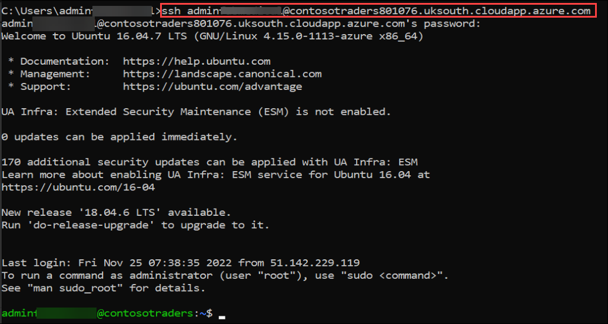
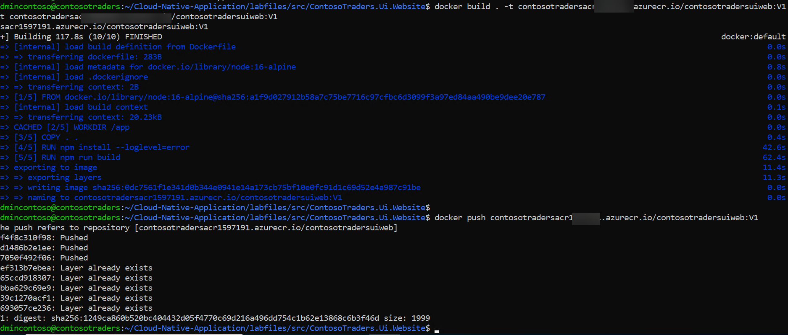
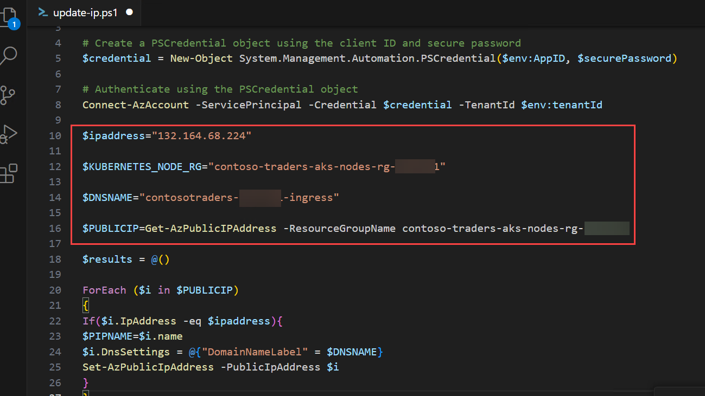
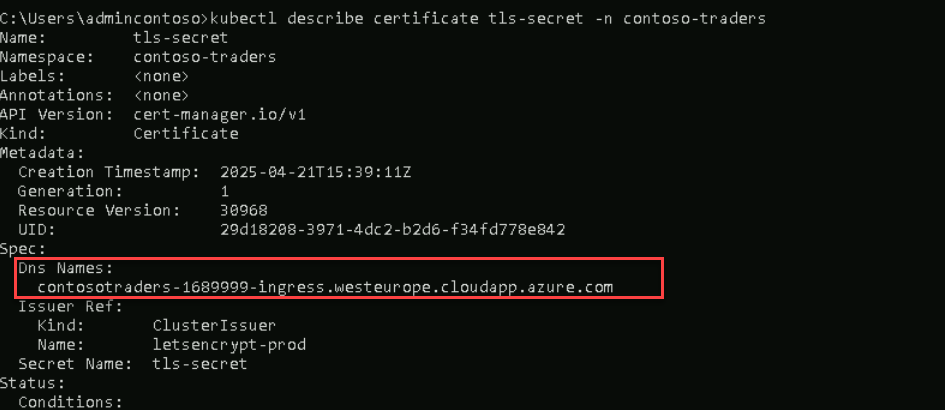
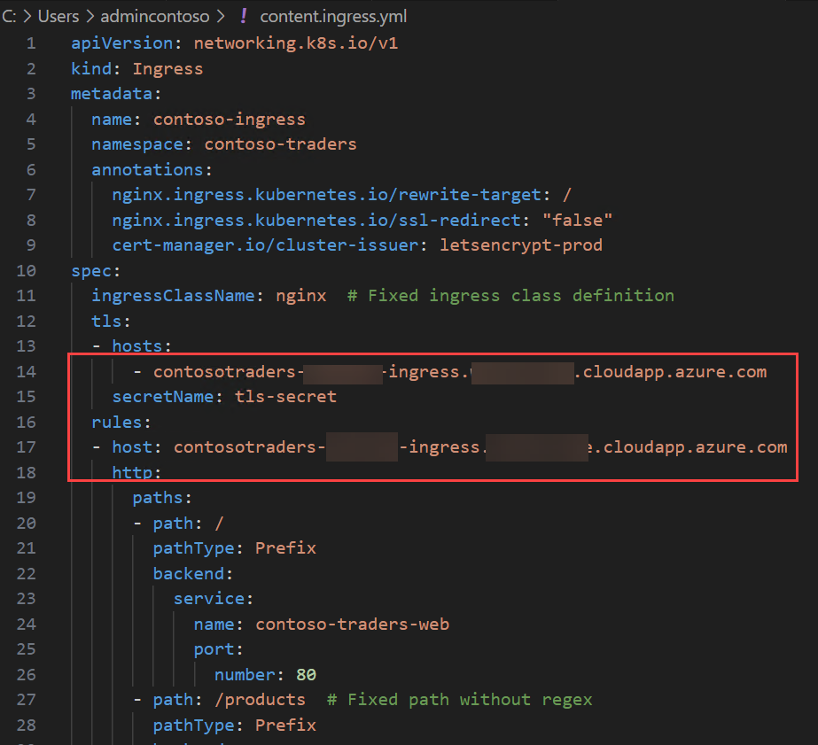

# Exercício 5: Atualização de aplicações e gestão de Ingress do Kubernetes

### Duração estimada: 60 minutos

## Visão geral

No exercício anterior, introduzimos uma restrição às propriedades de escala do serviço. Neste exercício, irá configurar as implementações de API para criar pods que utilizam mapeamentos dinâmicos de portas para eliminar a restrição de recursos de porta durante as atividades de escala.

Os serviços Kubernetes podem descobrir as portas atribuídas a cada pod, permitindo executar várias instâncias do pod no mesmo nó do agente – algo que não é possível quando se configura uma porta estática específica (como 3001 para o serviço API).

## Objectivos do Laboratório

Poderá completar as seguintes tarefas:

- Tarefa 1: Executar uma atualização contínua
- Tarefa 2: Configurar Ingress em Kubernetes

### Tarefa 1: Executar uma atualização contínua

Nesta tarefa, irá editar o código-fonte da aplicação web para atualizar algumas definições e atualizar a imagem do Docker utilizada pela implementação. Em seguida, irá executar uma atualização contínua para demonstrar como implementar uma alteração de código. As atualizações contínuas permitem que as atualizações de implementação ocorram sem tempo de inatividade, atualizando incrementalmente as instâncias de pods com novas. Os novos Pods serão agendados em Nodes com as funcionalidades disponíveis.

>**Nota**: Execute esta tarefa utilizando um novo comando de linha do Windows que não deve estar ligado à VM do agente de build, mas que deve estar ligado ao Azure.

1. Em primeiro lugar, fará algumas alterações no código-fonte da sua aplicação web e criará uma nova imagem do Docker com base nas alterações mais recentes.

1. Abra um novo Prompt de Comando.

1. Execute o comando fornecido **<inject key="Command to Connect to Build Agent VM" enableCopy="true" />** para se conectar à VM Linux usando SSH.

    >**Nota**: No prompt de comando, digite **yes** e pressione **Enter** quando aparecer a mensagem `Are you sure you want to continue connecting (yes/no/[fingerprint])?`

1. Depois que o SSH estiver conectado à VM, por favor, insira a senha da VM fornecida abaixo:

    * Password: **<inject key="Build Agent VM Password" enableCopy="true" />**

      

      >**Nota**: Por favor, note que, por motivos de segurança, ao digitar a senha, ela não será exibida na tela.

1. Navegue de volta para a **Prompt de comando** do Windows onde se ligou à sua VM Linux e execute o comando abaixo para navegar até ao diretório onde terá de fazer as alterações no código-fonte da aplicação web.

    ```bash
    cd ~/Cloud-Native-Application/labfiles/src/ContosoTraders.Ui.Website/src/pages/home/sections/
    ```

    

1. Quando estiver no diretório correto, execute o comando abaixo para abrir o ficheiro **hero.js** para fazer algumas alterações de texto na página inicial da sua aplicação web.

    ```bash
    sudo chmod 777 hero.js
    vim hero.js
    ```

   

1. Uma vez aberto o ficheiro, prima "i" para entrar no modo de inserção e atualizar o valor existente mencionado abaixo na secção **items** e no valor **name**.

    ```
    The latest, Fastest, Most Powerful Xbox Ever.
    ```

   

1. De seguida, prima **_ESC_**, escreva **_:wq_** para guardar as suas alterações e fechar o ficheiro.

    >**Nota**: Se **_ESC_** não funcionar, prima `ctrl+[` e depois escreva **_:wq_** para guardar as suas alterações e fechar o ficheiro.

1. Execute o comando abaixo para alterar o diretório para a pasta ContosoTraders.Ui.Website.

    ```bash
    cd
    cd Cloud-Native-Application/labfiles/src/ContosoTraders.Ui.Website
    ```

1. Quando estiver no diretório correto, execute o comando abaixo para criar a nova imagem docker que terá todas as alterações mais recentes da aplicação web.

    >**Nota**: Note que desta vez estamos a utilizar a tag "V1" para a imagem

    ```bash
    docker build . -t contosotradersacr<inject key="DeploymentID" enableCopy="false" />.azurecr.io/contosotradersuiweb:V1 -t contosotradersacr<inject key="DeploymentID" enableCopy="false" />.azurecr.io/contosotradersuiweb:V1

    docker push contosotradersacr<inject key="DeploymentID" enableCopy="false" />.azurecr.io/contosotradersuiweb:V1
    ```

        

     > **Nota:** Tenha em atenção que o comando acima pode demorar até 5 minutos para completar a compilação. Antes de realizar qualquer ação adicional, certifique-se de que é executada com sucesso. Além disso, poderá notar alguns avisos relacionados com a atualização da versão do npm que é esperada e não afeta a funcionalidade do laboratório.

     > **Nota:** Se ocorrer um erro, execute o seguinte comando:

     ```
      az acr login -n contosotradersacr<inject key="DeploymentID" enableCopy="false" />
     ```

1. Assim que a construção e o push do docker estiverem concluídos, navegue de volta para o outro comando de linha que não está ligado à VM Linux.

1. Abra uma nova janela da Linha de Comandos e inicie sessão utilizando o seguinte comando:

     ```
      az login
     ```
1. Execute o comando kubectl abaixo para obter a implementação atual no seu AKS, pois agora iremos atualizar a API web para a imagem mais recente. **Copie** o nome de **contoso-traders-web###** para o bloco de notas.

    ```bash
    kubectl get deployments -n contoso-traders
    kubectl get pods -n contoso-traders
    ```

   

   

1. Agora execute o comando abaixo para visualizar a versão da imagem atual da aplicação. Certifique-se de que atualiza o valor **PODNAME** com o valor que copiou no último passo.

    ```bash
    kubectl describe pods [PODNAME] -n contoso-traders
    ```

   

1. Agora para definir a nova imagem nos pods, execute o comando abaixo.

    ```bash
    kubectl set image deployments/contoso-traders-web -n contoso-traders contoso-traders-web=contosotradersacr<inject key="DeploymentID" />.azurecr.io/contosotradersuiweb:V1
    ```

   

1. Execute o comando kubectl abaixo para obter os pods atualizados no seu AKS. Copie o nome do contoso-traders-web### para o Bloco de Notas.

    ```
     kubectl get pods -n contoso-traders
    ```

1. Agora, execute o comando abaixo para descrever os pods mais recentes e verificar que imagem está associada ao pod. Certifique-se de atualizar o valor de PODNAME com o valor que copiou no passo anterior.

    ```
     kubectl describe pods [PODNAME] -n contoso-traders
    ```

   

1. Assim que a atualização da imagem para o pod estiver concluída, navegue de volta para o portal Azure e navegue/atualize novamente a página da aplicação Web e poderá ver as alterações na página inicial.

   

   >**Nota:** Se você não receber o resultado dentro de um minuto, prossiga para a próxima tarefa sem esperar. Você pode verificar o resultado mais tarde.

> **Parabéns** por concluir a tarefa! Agora é hora de validá-lo. Aqui estão as etapas:
> - Se você receber uma mensagem de sucesso, poderá prosseguir para a próxima tarefa.
> - Caso contrário, leia atentamente a mensagem de erro e repita a etapa, seguindo as instruções do guia do laboratório.
> - Se precisar de ajuda, entre em contato conosco em cloudlabs-support@spektrasystems.com. Estamos disponíveis 24/7 para ajudá-lo. 

<validation step="2215992c-23d6-4981-9192-cf953a1f8243" />   

### Tarefa 2: Configurar Ingress em Kubernetes

Esta tarefa irá configurar uma entrada Kubernetes utilizando um [servidor proxy Nginx](https://nginx.org/en/) para tirar partido do encaminhamento baseado em caminhos e da terminação TLS.

1. Execute o seguinte comando num terminal de comando do Windows para adicionar o repositório Helm estável do Nginx:

    ```bash
    helm repo add ingress-nginx https://kubernetes.github.io/ingress-nginx
    ```

        

2. Atualize a sua lista de pacotes do helm.

    ```bash
    helm repo update
    ```

    

    > **Nota**: Se receber a mensagem "nenhum repositório encontrado." erro e execute o seguinte comando. Este será adicionado de volta ao repositório "estável" oficial do Helm.
    >
    > ```bash
    > helm repo add stable https://charts.helm.sh/stable
    > ```

3. Instale a funcionalidade Controlador de Ingress para lidar com pedidos de entrada à medida que estes chegam. O Controlador de Ingresso receberá um IP público próprio no Balanceador de Carga do Azure e processará solicitações de vários serviços nas portas 80 e 443.

    ```bash
    helm install nginx-ingress ingress-nginx/ingress-nginx --namespace contoso-traders --set controller.replicaCount=1 --set controller.nodeSelector."beta\.kubernetes\.io/os"=linux --set defaultBackend.nodeSelector."beta\.kubernetes\.io/os"=linux --set controller.admissionWebhooks.patch.nodeSelector."beta\.kubernetes\.io/os"=linux --set controller.service.externalTrafficPolicy=Local
    ```

    

4. Navegue até ao Portal Azure, abra o serviço **contoso-traders-aks<inject key="DeploymentID" enableCopy="false"/>** Kubernetes. Selecione **Services and ingresses** nos recursos do Kubernetes e copie o endereço IP para o **External IP** para o serviço `nginx-ingress-RANDOM-nginx-ingress`.

    > **Nota**: A atualização pode demorar alguns minutos.
    >
    > ```bash
    > kubectl get svc --namespace contoso-traders
    > ```
    >
   

5. No terminal de comandos do Windows, crie um script para atualizar o nome DNS público do IP de entrada externo.

    ```bash
    code update-ip.ps1
    ```

    Cole o seguinte como conteúdo. Certifique-se de que substitui os seguintes espaços reservados no script:

    - `[ipaddress]`: Substitua pelo endereço IP copiado do passo 4.
    - `[KUBERNETES_NODE_RG]`: Substitua o `SUFFIX` por este valor **<inject key="DeploymentID" />**.
    - `[DNSNAME]`: substitua pelo mesmo valor de SUFFIX **<inject key="DeploymentID" />** que utilizou anteriormente neste laboratório.
    - `[PUBLICIP]`: Substitua o `SUFFIX` por este valor **<inject key="DeploymentID" />**.

      ```bash
      # Create a SecureString from the client's secret
      $securePassword = ConvertTo-SecureString $env:AppSecret -AsPlainText -Force
      
      # Create a PSCredential object using the client ID and secure password
      $credential = New-Object System.Management.Automation.PSCredential($env:AppID, $securePassword)
      
      # Authenticate using the PSCredential object
      Connect-AzAccount -ServicePrincipal -Credential $credential -TenantId $env:tenantId

      $ipaddress="INGRESS PUBLIC IP"

      $KUBERNETES_NODE_RG="contoso-traders-aks-nodes-rg-SUFFIX"

      $DNSNAME="contosotraders-SUFFIX-ingress"

      $PUBLICIP=Get-AzPublicIPAddress -ResourceGroupName contoso-traders-aks-nodes-rg-SUFFIX

      $results = @()

      ForEach ($i in $PUBLICIP)
      {
      If($i.IpAddress -eq $ipaddress){
      $PIPNAME=$i.name
      $i.DnsSettings = @{"DomainNameLabel" = $DNSNAME} 
      Set-AzPublicIpAddress -PublicIpAddress $i
      }
      }
      ```

            

6. **Guarde** as alterações e feche o editor.

7. Execute o script de atualização.

    ```bash
    powershell ./update-ip.ps1
    ```

   

8. Verifique a atualização do IP visitando a URL no seu navegador.

   > **Observação**: É normal receber uma mensagem 404 neste momento.

    ```text
    http://contosotraders-<inject key="DeploymentID" />-ingress.<inject key="Region" />.cloudapp.azure.com/
    ```

    

    >**Nota**: Se o URL não funcionar ou não receber um erro 404. Execute o comando mencionado abaixo e tente aceder novamente ao URL.

    ```bash
    helm upgrade nginx-ingress ingress-nginx/ingress-nginx --namespace contoso-traders --set controller.service.externalTrafficPolicy=Local
    ```

9. Utilize o helm para instalar o `cert-manager`, uma ferramenta que pode aprovisionar certificados SSL automaticamente em letsencrypt.org.

    ```bash
    kubectl apply --validate=false -f https://github.com/cert-manager/cert-manager/releases/download/v1.9.1/cert-manager.yaml
    ```

10. Para criar um recurso `ClusterIssuer` personalizado para o serviço `cert-manager` utilizar ao lidar com pedidos de certificados SSL, execute o comando abaixo na linha de comandos do Windows.

    ```bash
    code clusterissuer.yml
    ```

11. No interior do ficheiro **clusterissuer.yml** copie e cole o seguinte conteúdo:

    ```yaml
    apiVersion: cert-manager.io/v1
    kind: ClusterIssuer
    metadata:
      name: letsencrypt-prod
      namespace: contoso-traders
    spec:
      acme:
        # The ACME server URL
        server: https://acme-v02.api.letsencrypt.org/directory
        # Email address used for ACME registration
        email: user@contosotraders.com
        # Name of a secret used to store the ACME account private key
        privateKeySecretRef:
          name: letsencrypt-prod
        # Enable HTTP01 validations
        solvers:
        - http01:
            ingress:
              class: nginx
    ```

12. **Guarde** as alterações e feche o editor.

13. Crie o emissor (issuer) usando `kubectl`.

    ```bash
    kubectl create --save-config=true -f clusterissuer.yml
    ```

14. Agora pode criar um objeto de certificado.

    > **Nota**:
    > O Cert-manager pode já ter criado um objeto de certificado para si utilizando o ingress-shim.
    >
    > Para verificar se o certificado foi criado com sucesso, utilize o comando `kubectl descreve certificado tls-secret`.
    >
    > Se já estiver disponível um certificado, passe para o passo 16.

    ```bash
    code certificate.yml
    ```

15. No interior do ficheiro **certificate.yml** copie e cole o seguinte conteúdo:

     ```yaml
     apiVersion: cert-manager.io/v1
     kind: Certificate
     metadata:
       name: tls-secret
       namespace: contoso-traders
     spec:
       secretName: tls-secret
       dnsNames:
         - contosotraders-[SUFFIX]-ingress.[AZURE-REGION].cloudapp.azure.com
       issuerRef:
         name: letsencrypt-prod
         kind: ClusterIssuer
     ```

16. Use o seguinte como conteúdo e atualize `[SUFFIX]` com **<inject key="DeploymentID" />** e `[AZURE-REGION]` com **<inject key="Region" />** para corresponder ao seu nome DNS de entrada.

14. Guarde as alterações e feche o editor.

15. Crie o certificado utilizando `kubectl`.

    ```bash
    kubectl create --save-config=true -f certificate.yml
    ```

    > **Nota**: Para verificar o estado da emissão do certificado, utilize o comando `kubectl description certificado tls-secret -n contoso-traders` e procure uma saída _Events_ semelhante a esta:
    >
        > ```text
        > Type    Reason         Age   From          Message
        > ----    ------         ----  ----          -------
        > Normal  Generated           38s   cert-manager  Generated new private key
        > Normal  GenerateSelfSigned  38s   cert-manager  Generated temporary self signed certificate
        > Normal  OrderCreated        38s   cert-manager  Created Order resource "tls-secret-3254248695"
        > Normal  OrderComplete       12s   cert-manager  Order "tls-secret-3254248695" completed successfully
        > Normal  CertIssued          12s   cert-manager  Certificate issued successfully
        > ```

      > Pode demorar 5 a 30 minutos até que o tls-secret fique disponível. Isto deve-se ao atraso envolvido no provisionamento de um certificado TLS da Let Encrypt. Também, anote o nome DNS, vamos usá-lo mais tarde nas mesmas tarefas.

      

16. Agora pode criar um recurso de entrada para as aplicações de conteúdo.

    ```bash
    code content.ingress.yml
    ```

17. Dentro do ficheiro **content.ingress.yml** copie e cole o seguinte conteúdo:

    ```yaml
    apiVersion: networking.k8s.io/v1
    kind: Ingress
    metadata:
      name: contoso-ingress
      namespace: contoso-traders
      annotations:
        nginx.ingress.kubernetes.io/rewrite-target: /
        nginx.ingress.kubernetes.io/ssl-redirect: "false"
        cert-manager.io/cluster-issuer: letsencrypt-prod
    spec:
      ingressClassName: nginx  # Fixed ingress class definition
      tls:
      - hosts:
          - contosotraders-SUFFIX-ingress.[AZURE-REGION].cloudapp.azure.com
        secretName: tls-secret
      rules:
      - host: contosotraders-SUFFIX-ingress.[AZURE-REGION].cloudapp.azure.com
        http:
          paths:
          - path: /
            pathType: Prefix
            backend:
              service:
                name: contoso-traders-web
                port:
                  number: 80
          - path: /products  # Fixed path without regex
            pathType: Prefix
            backend:
              service:
                 name: contoso-traders-products
                 port:
                   number: 3001
    ```

18. Use o seguinte como conteúdo e atualize `[SUFFIX]`: **<inject key="DeploymentID" />** e `[AZURE-REGION]`: **<inject key="Region" />** para corresponder ao seu nome DNS de entrada.

    

19. **Guarde** as alterações e feche o editor.

20. Crie a entrada utilizando `kubectl`.

    ```bash
    kubectl create --save-config=true -f content.ingress.yml
    ```

        

21. Atualize o endpoint de entrada no seu browser. Deverá poder visitar o site e ver todo o conteúdo.

    

    >**Nota:** Se o site não aparecer ao acessá-lo pelo IP, use o nome DNS que você copiou. Adicione `http://` antes, cole no navegador e verifique.

22. Teste a terminação do TLS visitando novamente os serviços utilizando `https`.

     > **Nota**: Pode demorar 5 a 30 minutos para que o site SSL fique disponível. Isto deve-se ao atraso envolvido no provisionamento de um certificado TLS da Let Encrypt.

23. Clique no botão **Próximo** localizado no canto inferior direito deste guia de laboratório para continuar com o próximo exercício.

## Resumo

Neste exercício, executou uma atualização contínua e configurou o Kubernetes Ingress.

### Concluiu o laboratório com sucesso
