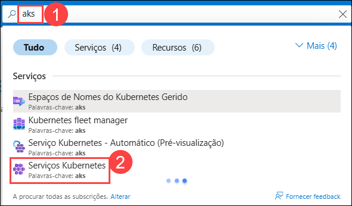

# Exercício 6: Azure Monitor para Contêineres

### Duração estimada: 40 Minutos

## Visão geral

Neste exercício, você explorará os Container Insights do Azure Monitor para o cluster AKS. O Azure Monitor é uma ferramenta essencial para maximizar a disponibilidade e o desempenho de aplicações e serviços, oferecendo uma solução completa para coletar, analisar e agir com base na telemetria de ambientes em nuvem e locais (on-premises).

Alguns exemplos do que pode fazer com o Azure Monitor incluem:

- Detetar e diagnosticar problemas em aplicações e dependências com o Application Insights.
- Correlacionar problemas de infraestrutura utilizando os VM Insights e os Container Insights.
- Coletar dados dos recursos monitorados por meio das métricas do Azure Monitor.

## Objetivos do Laboratório

Você será capaz de completar as seguintes tarefas:

- Tarefa 1: Rever as métricas do Azure Monitorar

### Tarefa 1: Revisar as métricas do Azure Monitorar

Nesta tarefa, você revisará o cluster AKS monitorado, com foco na inspeção visual das métricas e logs disponíveis no Azure Monitor. Nenhum alerta ou problema deverá aparecer, a menos que tenha sido configurado previamente.

1. No portal do Azure, procure por **aks (1)** e selecione **Serviços do Kubernetes (2)** no resultado.

    

1. Na página Serviços do Kubernetes, selecione **contoso-traders-aks<inject key="DeploymentID" enableCopy="false"/>**.

    
   
1. Na seção **Monitorar**, no painel de recursos do seu serviço Kubernetes, é possível visualizar logs relacionados à atividade do serviço, como uso de CPU do nó, uso de memória do nó, entre outros.
   
    

    > **Observação**: O Azure Monitor pode levar até 15 minutos para popular os dados no painel de insights.
    
    > **Importante**:Esta tarefa é apenas para revisão visual. Caso queira monitorar possíveis problemas, você pode configurar regras de alerta no Azure Monitor — por exemplo, para identificar alto uso de CPU ou consumo excessivo de memória. Para instruções detalhadas sobre como criar e gerenciar alertas, consulte a documentação oficial do Azure.

> **Parabéns** por concluir a tarefa! Agora, é hora de validá-la. Aqui estão os passos:
> - Se você receber uma mensagem de sucesso, poderá prosseguir para a próxima tarefa.
> - Caso contrário, leia atentamente a mensagem de erro e repita a etapa, seguindo as instruções do guia do laboratório.
> - Se precisar de ajuda, entre em contato conosco em cloudlabs-support@spektrasystems.com. Estamos disponíveis 24/7 para ajudá-lo.    

<validation step="ba51688d-c5b8-43c8-811c-e78e9a5539ce" />    

## Resumo

Neste exercício, você revisou os insights de contêiner do Azure Monitor para o cluster AKS.

**Você concluiu o laboratório com sucesso!**

## Conclusão

Ao completar este laboratório prático de **Aplicações Nativas para Nuvem**, você adquirirá experiência prática em conteinerização de aplicações, publicação de imagens Docker em um registro de contêiner e implantação no Azure Kubernetes Service (AKS). Além disso, aprenderá a gerenciar o ciclo de vida dos contêineres, escalar implantações e monitorar aplicações com o Azure Monitor. Essa prova de conceito oferece uma visão prática e valiosa sobre como construir, implantar e operar aplicações modernas e nativas da nuvem utilizando contêineres e Kubernetes.
