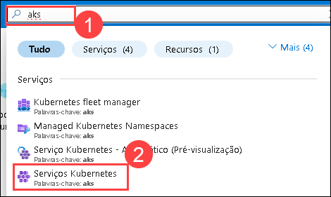
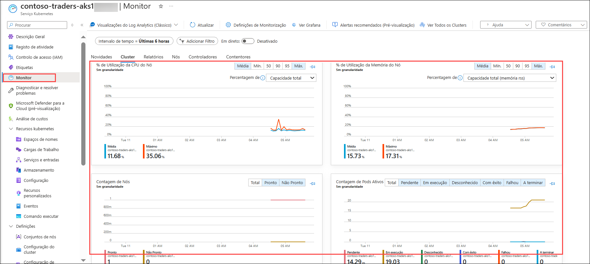

# Exercício 6: Azure Monitor para contentores

### Duração estimada: 20 Minutos

## Visão geral

Neste exercício, irá analisar os insights do contentor no Azure Monitor para o cluster AKS. O Azure Monitor ajuda-o a maximizar a disponibilidade e o desempenho das suas aplicações e serviços. Oferece uma solução abrangente para recolher, analisar e atuar na telemetria dos seus ambientes de cloud e locais.

Alguns exemplos do que pode fazer com o Azure Monitor incluem:

- Detetar e diagnosticar problemas em aplicações e dependências com o Application Insights.
- Correlacionar problemas de infraestrutura com insights de VM e insights de contentores.
- Recolher dados de recursos monitorizados utilizando métricas do Azure Monitor.

## Objectivos do Laboratório

Poderá completar as seguintes tarefas:

- Tarefa 1: Rever as métricas do Azure Monitorar

### Tarefa 1: Rever as métricas do Azure Monitorar

Nesta tarefa, irá rever o cluster AKS monitorizado.Esta tarefa está focada na revisão visual das métricas e dos registos disponíveis no Azure Monitor para o seu cluster AKS. Não se espera a deteção de alertas ou problemas, a menos que sejam configurados explicitamente.

1. Navegue de volta para o portal do Azure e procure **aks (1)**, selecione **Serviços Kubernetes (2)** no resultado.

    

1. Na página Serviços Kubernetes, selecione **contoso-traders-aks<inject key="DeploymentID" enableCopy="false"/>**.

    
   
1. Navegue até a seção **Monitorar** folha de recursos do serviço Kubernetes, você poderá ver alguns logs.
   
    

    > **Nota**: O Monitorar do Azure pode demorar até 15 minutos a preencher os dados na folha de insights.
    
    > **Importante**: Esta tarefa destina-se apenas à revisão visual. Se desejar explorar alertas, pode configurar uma regra de alerta no Azure Monitor. Por exemplo, pode criar um alerta para utilização elevada de CPU ou consumo de memória. Consulte a documentação da Azure para obter orientações sobre como configurar regras de alerta.

> **Parabéns** por concluir a tarefa! Agora é hora de validá-lo. Aqui estão as etapas:
> - Se você receber uma mensagem de sucesso, poderá prosseguir para a próxima tarefa.
> - Caso contrário, leia atentamente a mensagem de erro e repita a etapa, seguindo as instruções do guia do laboratório.
> - Se precisar de ajuda, entre em contato conosco em cloudlabs-support@spektrasystems.com. Estamos disponíveis 24/7 para ajudá-lo.    

<validation step="ba51688d-c5b8-43c8-811c-e78e9a5539ce" />    

## Resumo

Neste exercício, reviu os insights do contentor do Azure Monitor para o cluster AKS.

### Concluíste o laboratório com sucesso.

Ao concluir este laboratório prático de Cloud Native Applications irá adquirir experiência prática na conteinerização de aplicações, no envio de imagens Docker para um registo de contêineres e na sua implementação no Azure Kubernetes Service (AKS). Irá também compreender como gerir o ciclo de vida dos contêineres, escalar implementações e monitorizar aplicações utilizando o Azure Monitor. Esta prova de conceito fornecerá conhecimentos valiosos sobre como desenvolver e gerir aplicações modernas e nativas da cloud utilizando contêineres e Kubernetes.
