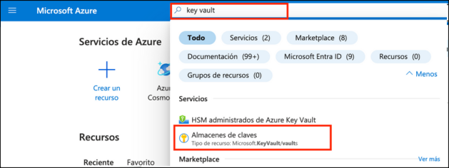
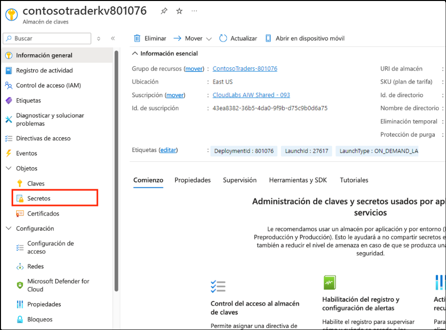
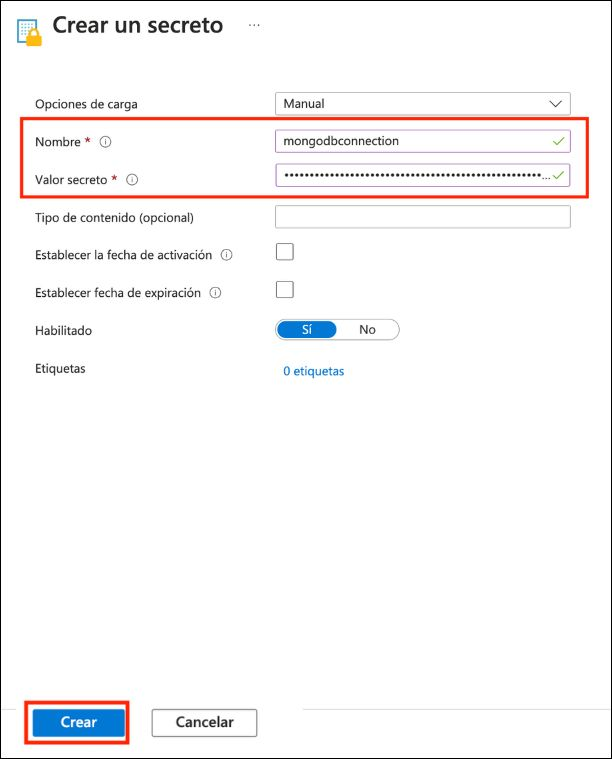
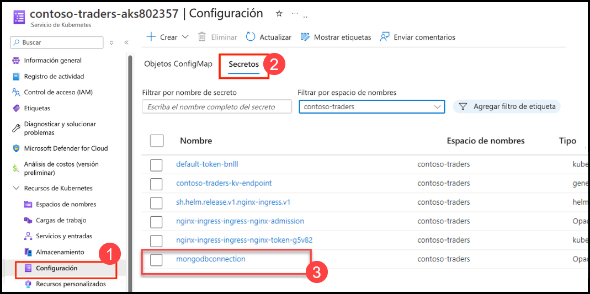
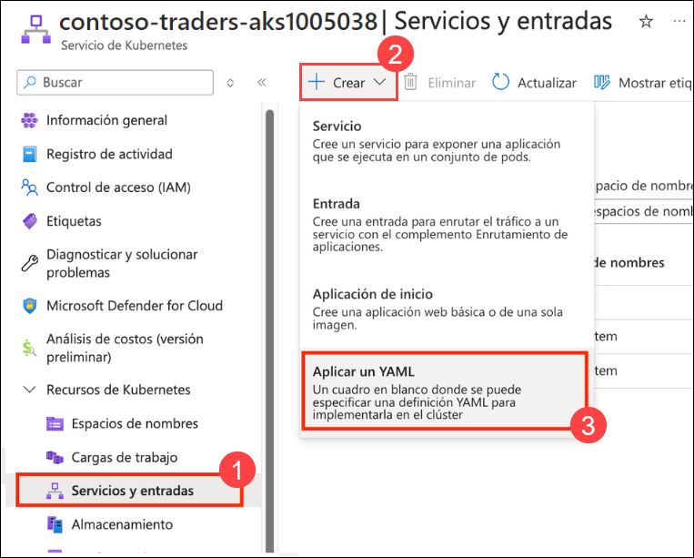
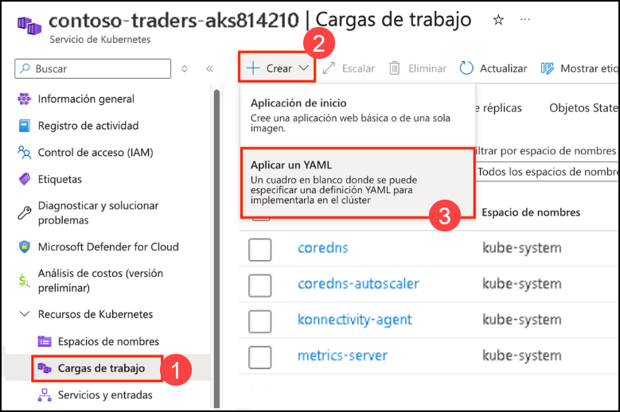
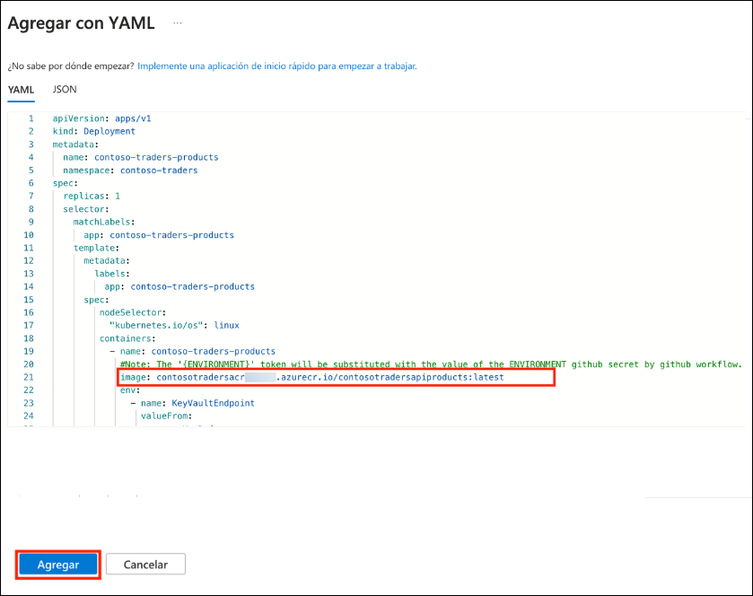

# Exercício 3: Implementar a aplicação no Azure Kubernetes Service

### Duração estimada: 90 minutos

## Visão geral

Neste exercício, irá implementar a sua aplicação Web containerizado no AKS (Azure Kubernetes Service) usando o serviço Azure Key Vault para gerir segredos e do Azure Container Registry para armazenar as imagens da aplicação Web containerizada. Além disso, irá explorar duas formas de implantar a aplicação no AKS.

## Objectivos do Laboratório

Poderá completar as seguintes tarefas:

- Tarefa 1: Conectar ao cluster do Azure Kubernetes Service
- Tarefa 2: Configurar Key Vault e segredos
- Tarefa 3: Implementar um namespace, serviço e workload no Serviço Azure Kubernetes utilizando o Portal do Azure
- Tarefa 4: Implementar um serviço e workload usando a linha de comandos kubectl

### Tarefa 1: Conectar ao cluster do Azure Kubernetes Service

Esta tarefa irá reunir as informações necessárias sobre o cluster do Serviço Azure Kubernetes para se ligar ao cluster e executar comandos para se ligar ao painel de gestão do Kubernetes a partir da shell da cloud.

> **Nota**: As tarefas seguintes devem ser executadas no **Linha de comandos**.

1. Abra um novo Terminal como Administrador na JumpVM  e inicie sessão no Azure com os comandos abaixo após atualizar os valores.

    * Nome de utilizador: **<inject key="AzureAdUserEmail"></inject>**
    * Palavra-passe: **<inject key="AzureAdUserPassword"></inject>**

    ```bash
    az login -u [username] -p [Password]
    ```

    > **Nota:** Se deparar com algum erro ao executar o comando 'az', execute o comando abaixo para instalar o Azure CLI e feche a linha de comandos. Execute novamente o passo 1 num novo terminal como Administrador.

    ```bash
    choco install azure-cli
    ```

1. Verifique se está ligado à assinatura correta com o seguinte comando para mostrar a sua assinatura predefinida:

    ```bash
    az account show
    ```

   - Certifique-se de que está ligado à assinatura correta. Caso contrário, liste as suas assinaturas e defina-as pelo seu ID com os seguintes comandos:

        ```bash
        az account list
        az account set --subscription {id}
        ```

1. Execute o comando abaixo para configurar a ligação do cluster Kubernetes utilizando o kubectl. Certifique-se de que substitui o SUFFIX pelo valor DeploymentID **<inject key="DeploymentID" enableCopy="true"/>** fornecido no comando abaixo.

    ```bash
    az aks get-credentials -a --name contoso-traders-aksSUFFIX --resource-group ContosoTraders-SUFFIX
    ```

    

1. Execute um comando rápido kubectl para gerar uma lista de nodes para verificar se a configuração está correta.

    ```bash
    kubectl get nodes
    ```

    

### Tarefa 2: Configurar Key Vault e segredos

Nesta tarefa, irá gerar um segredo no Key Vault e criar a ligação entre o AKS e o Key Vault.

1. Navegue até ao Portal do Azure, pesquise **Key Vault** na barra de pesquisa e selecione **Key Vaults** na lista.

   

1. De seguida, selecione **contosotraderskv<inject key="DeploymentID" enableCopy="false" />** **Key Vault** na lista.

1. Quando estiver na página **contosotraderskv<inject key="DeploymentID" enableCopy="false" />** Key Vault, seleccione **secrets** em Objects no menu do lado esquerdo.

   

1. Clique agora no botão **Generate/Import** para criar o novo segredo.

   

1. No painel **Create a secret**, introduza os seguintes detalhes:

    - Name: **mongodbconnection**
    - Secret Value: cole a cadeia de ligação do Azure CosmosDB para a conta MongoDB que copiou no exercício anterior.
    - Mantenha os outros valores por defeito e clique em **Create**

      

      

1. Abra um novo **Command Prompt** e execute o comando abaixo para criar um segredo utilizando o kubectl.

    ```sh
    kubectl create secret generic mongodbconnection --from-literal=mongodbconnection=mongodbconnection --namespace=contoso-traders
    ```

   

1. Navegue de volta para o browser e abra **contoso-traders-aks<inject key="DeploymentID" enableCopy="false"/>** AKS no portal do Azure, seleccione **Configuration** no menu do lado esquerdo e clique em Secção **Secrets**. Em **Secrets**, poderá ver os novos segredos criados

   

### Tarefa 3: Implementar um namespace, serviço e workload no Serviço Azure Kubernetes utilizando o Portal do Azure

Nesta tarefa, irá implementar a aplicação API Carts no cluster do Azure Kubernetes Service utilizando o Portal do Azure.

1. Já definimos um novo Namespace para a sua implementação de API. Indo mais além, apenas utilizará o namespace **contoso-traders**.

   

3. Defina um serviço para a sua API, para que a aplicação fique acessível dentro do cluster. Selecione o blade **Services and ingresses** da página de detalhes do recurso **contoso-traders-aks<inject key="DeploymentID" enableCopy="false"/>** AKS no Portal Azure. No separador **Services**, selecione **+ Create** e escolha **Apply a YAML**.

   

1. No painel **Add with YAML**, cole o código YAML abaixo que cria um serviço no AKS e clique em **Add**. Certifique-se de que substitui o SUFFIX pelo valor DeploymentID **<inject key="DeploymentID" enableCopy="true"/>** fornecido no ficheiro YAML.

   >**Info**: O script YAML abaixo irá criar um serviço AKS dentro do namespace contoso-traders que criou nos passos anteriores. O Serviço AKS é uma forma abstracta de expor uma aplicação em execução num conjunto de Pods como um serviço de rede.

    ```yaml
   apiVersion: v1
   kind: Service
   metadata:
     name: contoso-traders-products
     namespace: contoso-traders
     annotations:
       #@TODO: Replace 'SUFFIX' in the next line with whatever your ENVIRONMENT GitHub secret value is
       service.beta.kubernetes.io/azure-dns-label-name: contoso-traders-productsSUFFIX
   spec:
     type: LoadBalancer
     ports:
       - port: 80
     selector:
       app: contoso-traders-products
    ```

   

1. Selecione **Workloads** na secção Recursos do Kubernetes na navegação esquerda. Com **Deployments** selecionadas por defeito, selecione **+ Create** e escolha **Apply a YAML**.

   

1. No painel **Add with YAML**, cole o código YAML abaixo que cria uma carga de trabalho no AKS e clique em **Add**. Certifique-se de que substitui o SUFFIX pelo valor DeploymentID **<inject key="DeploymentID" enableCopy="true"/>** fornecido no ficheiro YAML para atualizar o nome LOGINSERVER da instância ACR.

    >**Info**: O ficheiro YAML abaixo irá criar pods de implantação no namespace contoso-traders. Uma implementação do Kubernetes indica ao Kubernetes como criar ou modificar instâncias dos pods que contêm uma aplicação em contentor. As implementações podem ajudar a escalar eficientemente o número de pods de réplica, permitir a implementação de código atualizado de forma controlada ou reverter para uma versão de implementação anterior, se necessário.

    ```YAML
    apiVersion: apps/v1
    kind: Deployment
    metadata:
     name: contoso-traders-products
     namespace: contoso-traders
    spec:
     replicas: 1
     selector:
       matchLabels:
         app: contoso-traders-products
     template:
       metadata:
         labels:
           app: contoso-traders-products
       spec:
         nodeSelector:
           "kubernetes.io/os": linux
         containers:
           - name: contoso-traders-products
             #Note: The '{ENVIRONMENT}' token will be substituted with the value of the ENVIRONMENT github secret by github workflow.
             image: contosotradersacrSUFFIX.azurecr.io/contosotradersapiproducts:latest
             env:
               - name: KeyVaultEndpoint
                 valueFrom:
                   secretKeyRef:
                     name: contoso-traders-kv-endpoint
                     key: contoso-traders-kv-endpoint
               - name: ManagedIdentityClientId
                 valueFrom:
                   secretKeyRef:
                     name: contoso-traders-mi-clientid
                     key: contoso-traders-mi-clientid
             resources:
               requests:
                 cpu: 50m
                 memory: 64Mi
               limits:
                 cpu: 250m
                 memory: 256Mi
               ports:
                 - containerPort: 3001
                   hostPort: 3001
                   protocol: TCP
    ```

   

1. Após alguns minutos, verá a implementação listada, que deverá estar a ser executada.

   

### Tarefa 4: Implementar um serviço e workload usando a linha de comandos kubectl

Nesta tarefa, irá implementar o serviço web e a sua carga de trabalho utilizando o kubectl.

1. Abra um **File Explorer** no seu JumpVM.

1. Navegue até ao diretório `C:\LabFiles` **(1)** e selecione o ficheiro `web.deployment.yml` **(2)**. Clique com o botão direito do rato e selecione **Open** **(3)** para abrir o ficheiro no código VS.

   

1. Certifique-se de que atualiza o SUFFIX com o valor DeploymentID **<inject key="DeploymentID" enableCopy="true"/>** fornecido no ficheiro YAML para corresponder ao nome do seu servidor de início de sessão ACR.

   

1. Guarde as alterações com o botão **CTRL + S** para **Save**.

1. Navegue de volta para a linha de comandos do Windows e execute o comando abaixo para alterar o directório para a pasta `~/LabFiles`.

    ```bash
    cd C:/LabFiles
    ```

1. Faça login no Azure, caso ainda não o tenha feito, com o comando abaixo após atualizar os valores no comando.

    * Nome de utilizador: **<inject key="AzureAdUserEmail"></inject>**
    * Palavra-passe: **<inject key="AzureAdUserPassword"></inject>**

        ```
        az login -u [username] -p [Password]
        ```

1. Execute o comando abaixo para implementar a aplicação descrita nos ficheiros YAML. Receberá uma mensagem indicando que o item `kubectl` criou uma implementação web e um serviço web.
 
    >**Info**: O comando kubectl abaixo irá criar a carga de trabalho de implementação e o serviço no namespace que definimos nos ficheiros YAML.

    ```bash
    kubectl create --save-config=true -f web.deployment.yml -f web.service.yml
    ```

   

1. Volte à folha AKS no Portal Azure. No menu de navegação, selecione **Services and ingresses** em **Kubernetes resources**. Deverá conseguir aceder ao site através de um **External endpoint**.

   

   

    > **Nota:** Se o site não carregar, tente atualizar a página várias vezes, pois pode demorar um pouco até que o AKS preencha o site.

1. Clique no botão **Next** localizado no canto inferior direito deste guia de laboratório para continuar com o exercício seguinte.

## Resumo

Neste exercício, implementou a sua aplicação Web contentorizada no AKS que contém o namespace, o serviço e a carga de trabalho no Azure Kubernetes. Além disso, criou um serviço para o AKS e acedeu ao site utilizando um endpoint externo. Além disso, configurou o segredo do cofre de chaves para aceder ao MongoDB a partir do AKS.

### Concluiu o laboratório com sucesso
