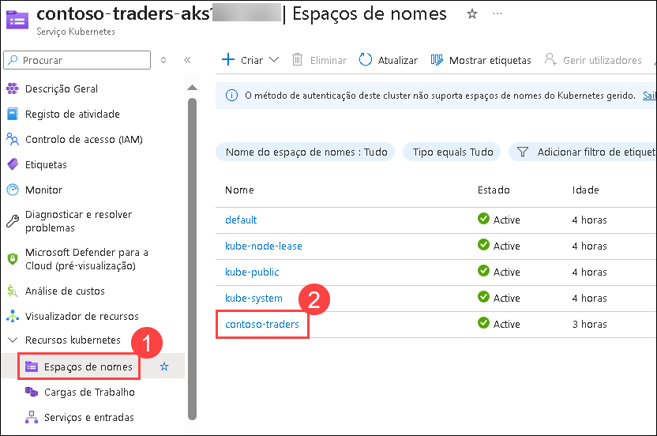
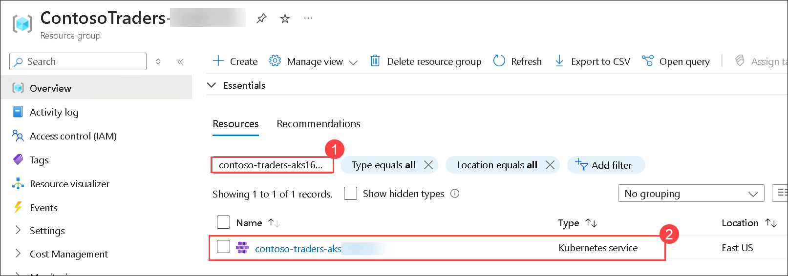
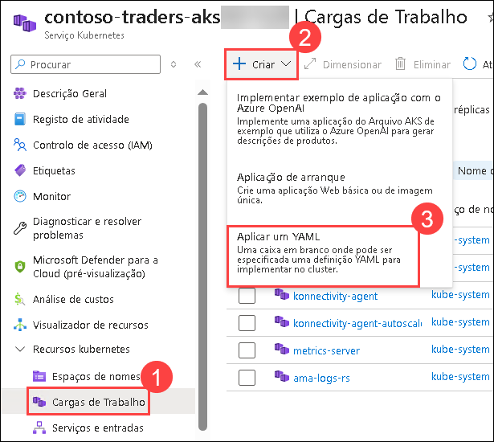
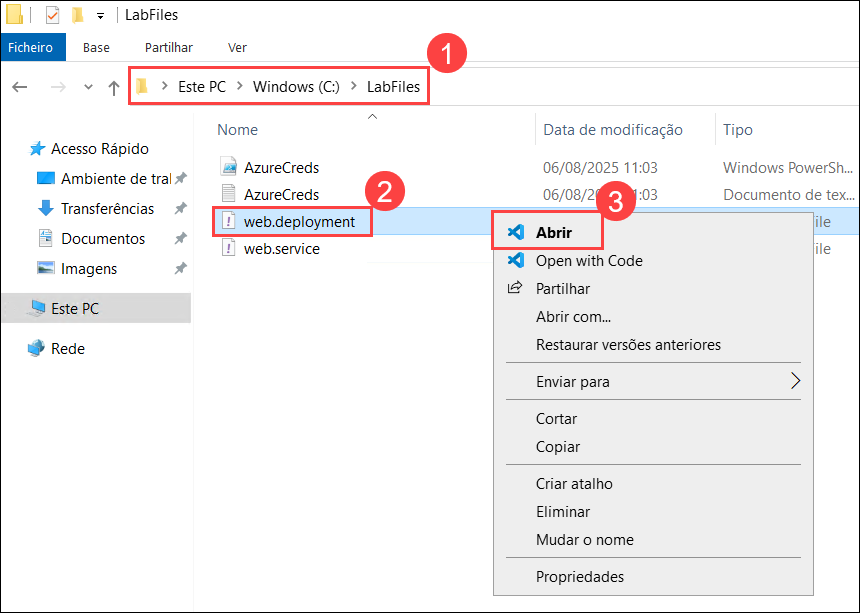
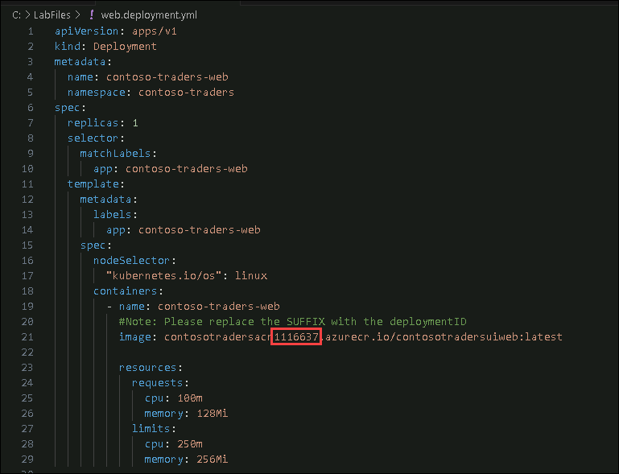

# Exercício 3: Implementar a aplicação no Azure Kubernetes Service

### Duração estimada: 90 Minutos

## Visão geral

Neste exercício, irá implementar a sua aplicação Web containerizado no AKS (Azure Kubernetes Service) usando o serviço Azure Key Vault para gerir segredos e do Azure Container Registry para armazenar as imagens da aplicação Web containerizada. Além disso, irá explorar duas formas de implantar a aplicação no AKS.

## Objectivos do Laboratório

Poderá completar as seguintes tarefas:

- Tarefa 1: Conectar ao cluster do Azure Kubernetes Service
- Tarefa 2: Configurar Key Vault e segredos
- Tarefa 3: Implementar um namespace, serviço e workload no Serviço Azure Kubernetes utilizando o Portal do Azure
- Tarefa 4: Implementar um serviço e workload usando a linha de comandos kubectl

### Tarefa 1: Conectar ao cluster do Azure Kubernetes Service

Esta tarefa irá reunir as informações necessárias sobre o cluster do Serviço Azure Kubernetes para se ligar ao cluster e executar comandos para se ligar ao painel de gestão do Kubernetes a partir da shell da cloud.

> **Nota**: As tarefas seguintes devem ser executadas no **Prompt de comando**.

1. Abra um novo prompt de comando como Administrador em sua VM de salto e faça login no azure com os comandos abaixo após atualizar os valores no comando abaixo.

    ```bash
    az login -u <inject key="AzureAdUserEmail"></inject> -p <inject key="AzureAdUserPassword"></inject>
    ```

    

     > **Observação:** Se você enfrentar algum erro ao executar o comando 'az', execute o comando abaixo para instalar o azure cli e feche o prompt de comando. Execute novamente a etapa 1 em um novo prompt de comando como Administrador.

     ```bash
     choco install azure-cli
     ```

1. Execute o comando abaixo para configurar a conexão do cluster Kubernetes usando kubectl.

    ```bash
    az aks get-credentials -a --name contoso-traders-aks<inject key="DeploymentID" enableCopy="true"/> --resource-group ContosoTraders-<inject key="DeploymentID" enableCopy="true"/>
    ```

    

1. Execute um comando kubectl rápido para gerar uma lista de nós para verificar se a configuração está correta.

    ```bash
    kubectl get nodes
    ```

    

### Tarefa 2: Implementar um namespace, serviço e workload no Serviço Azure Kubernetes utilizando o Portal do Azure

Nesta tarefa, irá implementar a aplicação API Carts no cluster do Azure Kubernetes Service utilizando o Portal do Azure.

1. Já definimos um novo **Espaços de nomes (1)** para a sua implementação de API. Indo mais além, apenas utilizará o namespace **contoso-traders (2)**.

   

1. Defina um serviço para a sua API, para que a aplicação fique acessível dentro do cluster. Selecione o blade **Serviços e entradas (1)** da página de detalhes do recurso **contoso-traders-aks<inject key="DeploymentID" enableCopy="false"/>** AKS no Portal Azure. No separador **Serviços**, selecione **+ Criar (2)** e escolha **Aplicar um YAML (3)**.

   

1. No painel **Aplicar um YAML**, cole o código YAML abaixo que cria um serviço no AKS **(1)** e clique em **Aplicar (2)**. Certifique-se de que substitui o SUFFIX pelo valor DeploymentID **<inject key="DeploymentID" enableCopy="true"/>** fornecido no ficheiro YAML.

   >**Info**: O script YAML abaixo irá criar um serviço AKS dentro do namespace contoso-traders que criou nos passos anteriores. O Serviço AKS é uma forma abstracta de expor uma aplicação em execução num conjunto de Pods como um serviço de rede.

    ```yaml
      #YAML Script
      apiVersion: v1
      kind: Service
      metadata:
        name: contoso-traders-products
        namespace: contoso-traders
        annotations:
          # TODO: Replace 'SUFFIX' in the next line with whatever your ENVIRONMENT GitHub secret value is
          service.beta.kubernetes.io/azure-dns-label-name: contoso-traders-productsSUFFIX
      spec:
        type: LoadBalancer
        ports:
          - port: 80
        selector:
          app: contoso-traders-products

      ```   

    

    **Observação:** certifique-se de que o recuo no seu script YAML corresponda ao formato mostrado na imagem para evitar erros.

1. Selecione **Cargas de trabalho (1)** na secção Recursos do Kubernetes na navegação esquerda. Com **Implantações** selecionadas por defeito, selecione **+ Criar (2)** e escolha **Aplicar um YAML (3)**.

   

1. No painel **Adicionar com YAML**, cole o código YAML abaixo que cria uma carga de trabalho no AKS **(1)** e clique em **Aplicar (2)**. Certifique-se de que substitui o SUFFIX pelo valor DeploymentID **<inject key="DeploymentID" enableCopy="true"/>** fornecido no ficheiro YAML para atualizar o nome LOGINSERVER da instância ACR.

    >**Info**: O ficheiro YAML abaixo irá criar pods de implantação no namespace contoso-traders. Uma implementação do Kubernetes indica ao Kubernetes como criar ou modificar instâncias dos pods que contêm uma aplicação em contentor. As implementações podem ajudar a escalar eficientemente o número de pods de réplica, permitir a implementação de código atualizado de forma controlada ou reverter para uma versão de implementação anterior, se necessário.

    ```YAML
    apiVersion: apps/v1
    kind: Deployment
    metadata:
     name: contoso-traders-products
     namespace: contoso-traders
    spec:
     replicas: 1
     selector:
       matchLabels:
         app: contoso-traders-products
     template:
       metadata:
         labels:
           app: contoso-traders-products
       spec:
         nodeSelector:
           "kubernetes.io/os": linux
         containers:
           - name: contoso-traders-products
             image: contosotradersacrSUFFIX.azurecr.io/contosotradersapiproducts:latest
             env:
               - name: KeyVaultEndpoint
                 valueFrom:
                   secretKeyRef:
                     name: contoso-traders-kv-endpoint
                     key: contoso-traders-kv-endpoint
               - name: ManagedIdentityClientId
                 valueFrom:
                   secretKeyRef:
                     name: contoso-traders-mi-clientid
                     key: contoso-traders-mi-clientid
             resources:
               requests:
                 cpu: 50m
                 memory: 64Mi
               limits:
                 cpu: 250m
                 memory: 256Mi
             ports:
               - containerPort: 3001
                 hostPort: 3001
                 protocol: TCP
    ```

   

1. Após alguns minutos, verá a implementação listada, que deverá estar a ser executada.

   

> **Parabéns** por concluir a tarefa! Agora é hora de validá-lo. Aqui estão as etapas:
> - Se você receber uma mensagem de sucesso, poderá prosseguir para a próxima tarefa.
> - Caso contrário, leia atentamente a mensagem de erro e repita a etapa, seguindo as instruções do guia do laboratório.
> - Se precisar de ajuda, entre em contato conosco em cloudlabs-support@spektrasystems.com. Estamos disponíveis 24/7 para ajudá-lo.

<validation step="8e8b8774-50eb-413f-84e0-c1861a2b10b7" />   

### Tarefa 3: Implementar um serviço e workload usando a linha de comandos kubectl

Nesta tarefa, irá implementar o serviço web e a sua carga de trabalho utilizando o kubectl.

1. Abra um **Explorador de arquivos** no seu JumpVM.

1. Navegue até ao diretório `C:\LabFiles` **(1)** e selecione o ficheiro `web.deployment.yml` **(2)**. Clique com o botão direito do rato e selecione **Abrir** **(3)** para abrir o ficheiro no código VS.

      

1. Certifique-se de que atualiza o SUFFIX com o valor DeploymentID **<inject key="DeploymentID" enableCopy="true"/>** fornecido no ficheiro YAML para corresponder ao nome do seu servidor de início de sessão ACR.

    

1. Guarde as alterações com o botão **CTRL + S** para **Salvar**.

1. Navegue de volta para o prompt de comando do Windows e execute o comando abaixo para alterar o diretório para a pasta `~/LabFiles`.

      ```bash
      cd C:/LabFiles
      ```

          

1. Faça login no Azure se ainda não tiver feito com o comando abaixo após atualizar os valores no comando.

      ```
      az login -u <inject key="AzureAdUserEmail"></inject> -p <inject key="AzureAdUserPassword"></inject>
      ```

1. Execute o comando abaixo para implementar a aplicação descrita nos ficheiros YAML. Receberá uma mensagem indicando que o item `kubectl` criou uma implementação web e um serviço web.
 
    >**Info**: O comando kubectl abaixo irá criar a carga de trabalho de implementação e o serviço no namespace que definimos nos ficheiros YAML.

      ```bash
      kubectl create --save-config=true -f web.deployment.yml -f web.service.yml
      ```

      

1. Volte à folha AKS no Portal Azure. No menu de navegação, selecione **Serviços e entradas (1)** em **Recursos do Kubernetes**. Deverá conseguir aceder ao site através de um **IP Externo (2)**.

      

      

      > **Nota:** Se o site não carregar, tente atualizar a página várias vezes, pois pode demorar um pouco até que o AKS preencha o site.

1. Clique no botão **Próximo** localizado no canto inferior direito deste guia de laboratório para continuar com o exercício seguinte.


> **Parabéns** por concluir a tarefa! Agora é hora de validá-lo. Aqui estão as etapas:
> - Se você receber uma mensagem de sucesso, poderá prosseguir para a próxima tarefa.
> - Caso contrário, leia atentamente a mensagem de erro e repita a etapa, seguindo as instruções do guia do laboratório.
> - Se precisar de ajuda, entre em contato conosco em cloudlabs-support@spektrasystems.com. Estamos disponíveis 24/7 para ajudá-lo. 

<validation step="a9fa4d00-ae23-4b56-a3e3-ee1f2effdfb2" />  

## Resumo

Neste exercício, implementou a sua aplicação Web contentorizada no AKS que contém o namespace, o serviço e a carga de trabalho no Azure Kubernetes. Além disso, criou um serviço para o AKS e acedeu ao site utilizando um endpoint externo. Além disso, configurou o segredo do cofre de chaves para aceder ao MongoDB a partir do AKS.

### Você completou com sucesso este exercício. Clique em "Próximo" para prosseguir para o próximo exercício.


