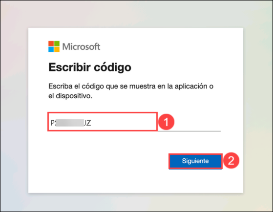
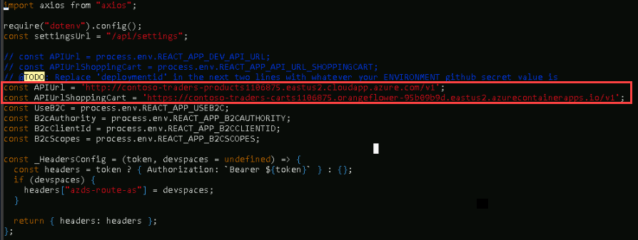

# Exercício 1: Criar imagens Docker para a aplicação

### Duração estimada: 60 minutos

## Visão geral

Neste exercício, aprenderá a contentorizar a aplicação Contoso Traders utilizando imagens Docker. As aplicações em contentores são aplicações que são executadas em ambientes de tempo de execução isolados, chamados contentores. Uma imagem Docker é um ficheiro utilizado para executar código num contentor Docker. As imagens Docker atuam como um conjunto de instruções para construir um contentor Docker, como um modelo. Além disso, enviará as imagens Docker criadas para o Registo de Contentores do Azure.

## Objetivos do laboratório

Poderá completar as seguintes tarefas:

- Tarefa 1: configurar uma infraestrutura local com a VM Linux
- Tarefa 2: Criar imagens Docker para colocar a aplicação em contentor e enviá-las para o registo do contentor

### Tarefa 1: configurar uma infraestrutura local com a VM Linux

Nesta tarefa, irá ligar-se à VM do agente Build utilizando a linha de comandos e clonar o repositório GitHub do site do trader da Contoso.

1. Depois de iniciar sessão na VM, pesquise **cmd** **(1)** na barra de pesquisa do Windows e clique em **Command Prompt** **(2)** para abrir.

   

1. Execute o comando fornecido **<inject key="Command to Connect to Build Agent VM" enableCopy="true" />** para se ligar à VM Linux utilizando o ssh.

    >**Nota**: Na linha de comandos, digite **yes** e prima **Enter** para `Tem a certeza de que pretende continuar a ligação (sim/não/[impressão digital])?`

1. Assim que o SSH estiver ligado à VM, introduza a palavra-passe da VM fornecida abaixo:

    * Password: **<inject key="Build Agent VM Password" enableCopy="true" />**

      

      >**Nota**: Note que ao introduzir a palavra-passe não a poderá ver devido a questões de segurança.

1. Assim que a VM estiver ligada, execute o comando abaixo para clonar o repositório GitHub que iremos utilizar no laboratório.

    ```
    git clone https://github.com/CloudLabsAI-Azure/Cloud-Native-Application
    ```

    

    > **Nota:** Se receber uma mensagem de saída a informar - o caminho de destino 'Cloud-Native-Application' já existe e não é um diretório vazio. Execute os comandos seguintes e execute novamente o passo 4 da tarefa.

    ```
    sudo su
    rm -rf Cloud-Native-Application
    exit
    ```

   

1. Após a conclusão da clonagem do GitHub, execute o comando abaixo para alterar o diretório para os ficheiros de laboratório.

    ```
    cd Cloud-Native-Application/labfiles/
    ```

   

### Tarefa 2: Criar imagens Docker para colocar a aplicação em contentor e enviá-las para o registo do contentor

Nesta tarefa, irá criar as imagens do Docker para contentorizar a aplicação e enviá-las por push para o ACR (Azure Container Registry) para utilização posterior no AKS.

1. Execute o comando abaixo para iniciar sessão no Azure, navegue até ao URL de início de sessão do dispositivo `https://microsoft.com/devicelogin` no browser e copie o código de autenticação.

    ```
    az login
    ```

   

1. Introduza o código de autenticação copiado **(1)** e clique em **Seguinte** **(2)**.

   

1. No separador **Entrar na sua conta** verá um ecrã de login, nele digite o seguinte e-mail/nome de utilizador e clique em **Seguinte**.

    * E-mail/Nome de utilizador: **<inject key="AzureAdUserEmail"></inject>**

      > **Nota:** Se receber um pop-up **Escolha uma conta**, selecione o ID de e-mail acima.

1. Agora digite a seguinte palavra-passe e clique em **Entrar**.

    * Palavra-passe: **<inject key="AzureAdUserPassword"></inject>**

      > **Nota:** Não verá o pop-up para introduzir a palavra-passe se tiver o pop-up **Escolha uma conta** onde escolheu a conta.

1. Num pop-up para confirmar o início de sessão na CLI do Microsoft Azure, clique em **Continuar**.

   

1. Depois de entrar, verá um pop-up de confirmação **Entrou na aplicação Microsoft Azure Cross-platform Command Line Interface no seu dispositivo**. Feche o separador do navegador e abra a sessão anterior do comando de linha.

   

1. Depois de fazer login no Azure, irá construir as imagens do Docker nos próximos passos e enviá-las para o ACR.

   

1. Certifique-se de que está no diretório **labfiles** antes de executar os próximos passos, pois a construção do docker precisa de encontrar o DockerFile para criar a imagem.

    ```
    cd Cloud-Native-Application/labfiles/
    ```

1. Agora crie a imagem docker **contosotraders-carts** utilizando o Dockerfile no diretório. Observe como o Registo de Contentor do Azure implantado é referenciado. Substitua o espaço reservado SUFFIX no comando abaixo pelo valor DeploymentID **<inject key="DeploymentID" enableCopy="true"/>** fornecido.

    ```
    docker build src -f ./src/ContosoTraders.Api.Carts/Dockerfile -t contosotradersacr[SUFFIX].azurecr.io/contosotradersapicarts:latest -t contosotradersacr[SUFFIX].azurecr.io/contosotradersapicarts:latest
    ```

   

1. Repita os passos para criar a imagem docker **contosotraders-Products** com o comando abaixo. Certifique-se de que substitui o SUFFIX pelo valor DeploymentID **<inject key="DeploymentID" enableCopy="true"/>** fornecido no comando abaixo.

    ```
    docker build src -f ./src/ContosoTraders.Api.Products/Dockerfile -t contosotradersacr[SUFFIX].azurecr.io/contosotradersapiproducts:latest -t contosotradersacr[SUFFIX].azurecr.io/contosotradersapiproducts:latest
    ```

   

1. Execute o comando abaixo para alterar o directório para `services` e abra o ficheiro `configService.js`.

    ```
    cd src/ContosoTraders.Ui.Website/src/services
    sudo chmod 777 configService.js
    vi configService.js
    ```

   

1. No editor `vi`, prima **_i_** para entrar no modo `inserir`. Em APIUrl e APIUrlShoppingCart, substitua **deploymentid** pelo valor **<inject key="DeploymentID" enableCopy="true"/>** e **REGION** por **<inject key="Region" enableCopy= " verdadeiro"/>** valor. De seguida, prima **_ESC_**, escreva **_:wq_** para guardar as suas alterações e feche o ficheiro. Precisamos de atualizar o URL da API aqui para que a aplicação Contoso Traders possa ligar-se à API do produto depois de enviado para contentores AKS.

    >**Nota**: Se **_ESC_** não funcionar pressione `ctrl + [` e depois escreva **_:wq_** para guardar as suas alterações e fechar o ficheiro.

    ```
    const APIUrl = 'http://contoso-traders-productsdeploymentid.REGION.cloudapp.azure.com/v1';
    const APIUrlShoppingCart = 'https://contoso-traders-cartsdeploymentid.orangeflower-95b09b9d.REGION.azurecontainerapps.io/v1';
    ```

   

1. Execute o comando abaixo para alterar o directório para a pasta `ContosoTraders.Ui.Website`.

    ```
    cd
    cd Cloud-Native-Application/labfiles/src/ContosoTraders.Ui.Website
    ```

1. Crie agora a imagem docker **contosotraders-UI-Website** com o comando abaixo. Certifique-se de que substitui o SUFFIX pelo valor DeploymentID **<inject key="DeploymentID" enableCopy="true"/>** fornecido no comando abaixo.

    ```
    docker build . -t contosotradersacr[SUFFIX].azurecr.io/contosotradersuiweb:latest -t contosotradersacr[SUFFIX].azurecr.io/contosotradersuiweb:latest
    ```

   


    >**Nota**: Tenha em atenção que o comando acima pode demorar até 5 minutos para completar a compilação. Antes de realizar qualquer ação adicional, certifique-se de que é executada com sucesso. Além disso, poderá notar alguns avisos relacionados com a atualização da versão do npm que é esperada e não afeta a funcionalidade do laboratório.

1. Redirecione para o diretório **labfiles** antes de executar os próximos passos.

    ```
    cd
    cd Cloud-Native-Application/labfiles/
    ```

1. Observe as imagens Docker construídas executando o comando `docker image ls`. As imagens são marcadas com o que há de mais recente, sendo também possível utilizar outros valores de tag para versionamento.

    ```
    docker image ls
    ```

   

1. Navegue até ao portal Azure, abra **contosotradersacr<inject key="DeploymentID" enableCopy="false" />** Registo de contentores de **ContosoTraders-<inject key="DeploymentID" enableCopy="false" / >** grupo de recursos.

   

1. Em **contosotradersacr<inject key="DeploymentID" enableCopy="false" />** **(1)** Registo de contentores, selecione **Chaves de acesso** **(2)** em Definições à esquerda menu lateral. **Copie** **(3)** a palavra-passe e cole-a num ficheiro de texto para utilização posterior.

   

1. Agora volte ao **Comando Prompt** e inicie sessão no ACR utilizando o comando abaixo. Deve conseguir ver a saída abaixo na captura de ecrã. Certifique-se de que substitui o SUFFIX pelo valor DeploymentID **<inject key="DeploymentID" enableCopy="true"/>** fornecido e a palavra-passe pela palavra-passe de registo do contentor copiada que copiou no passo anterior do comando abaixo.

    ```
    docker login contosotradersacr[SUFFIX].azurecr.io -u contosotradersacr[SUFFIX] -p [password]
    ```

   

1. Depois de iniciar sessão no ACR, execute os comandos abaixo para enviar as imagens do Docker para o registo de contentores do Azure. Além disso, certifique-se de que atualiza o valor SUFFIX com o valor DeploymentID **<inject key="DeploymentID" enableCopy="true"/>** fornecido nos comandos abaixo.

    ```
    docker push contosotradersacr[SUFFIX].azurecr.io/contosotradersapicarts:latest 
    ```

    ```
    docker push contosotradersacr[SUFFIX].azurecr.io/contosotradersapiproducts:latest
    ```

    ```
    docker push contosotradersacr[SUFFIX].azurecr.io/contosotradersuiweb:latest
    ```

1. Deverá conseguir ver a imagem do docker a ser enviada para o ACR, como mostra a captura de ecrã abaixo.

   

1. Clique no botão **Seguinte** localizado no canto inferior direito deste guia de laboratório para continuar com o próximo exercício.

## Resumo

Neste exercício, conteinerizou completamente a sua aplicação web com a ajuda do docker e enviou-a para o registo do contentor.

### Concluiu o laboratório com sucesso
