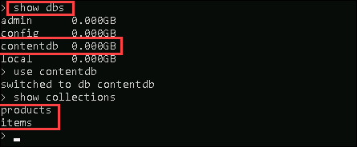
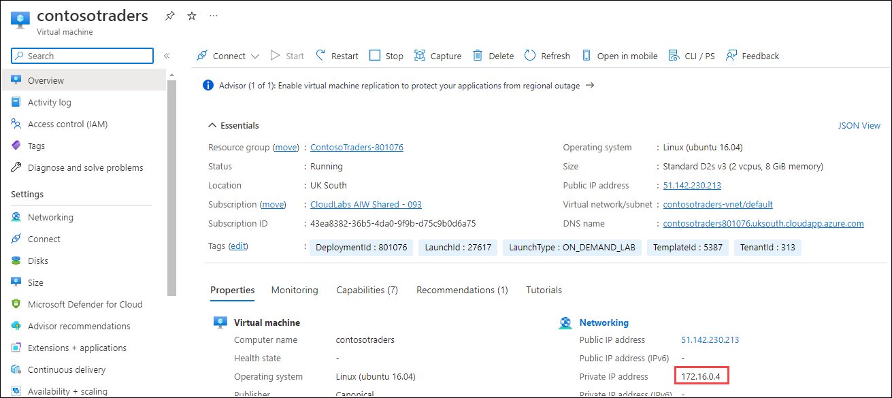
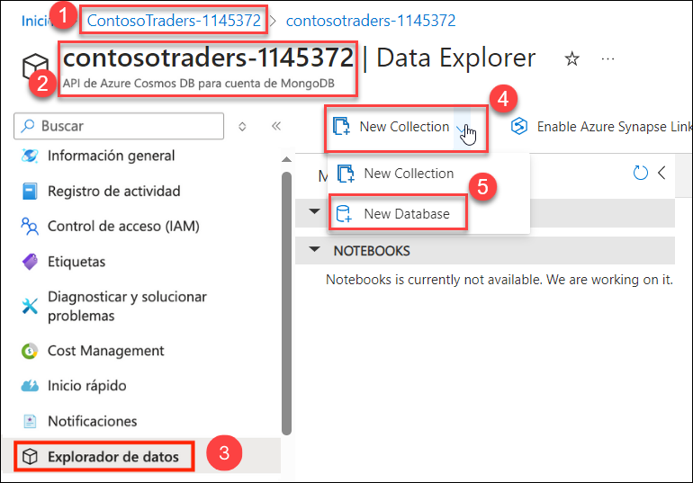
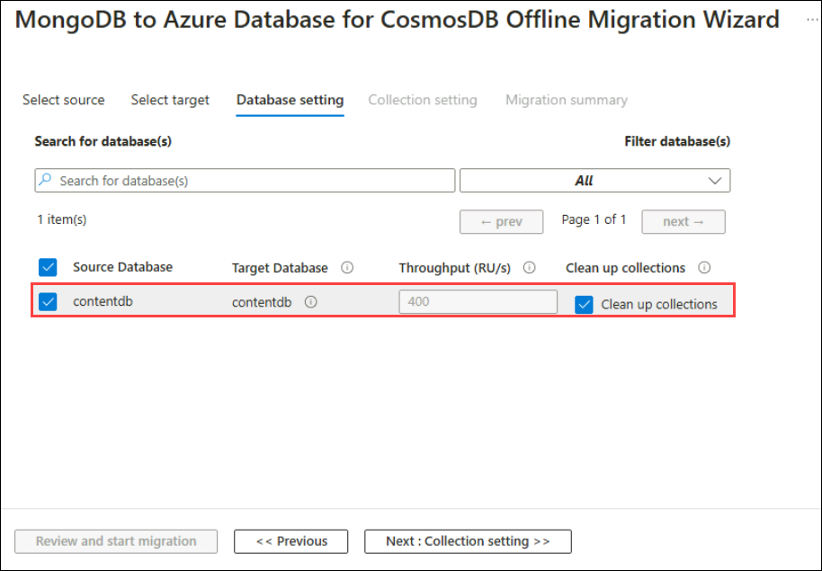
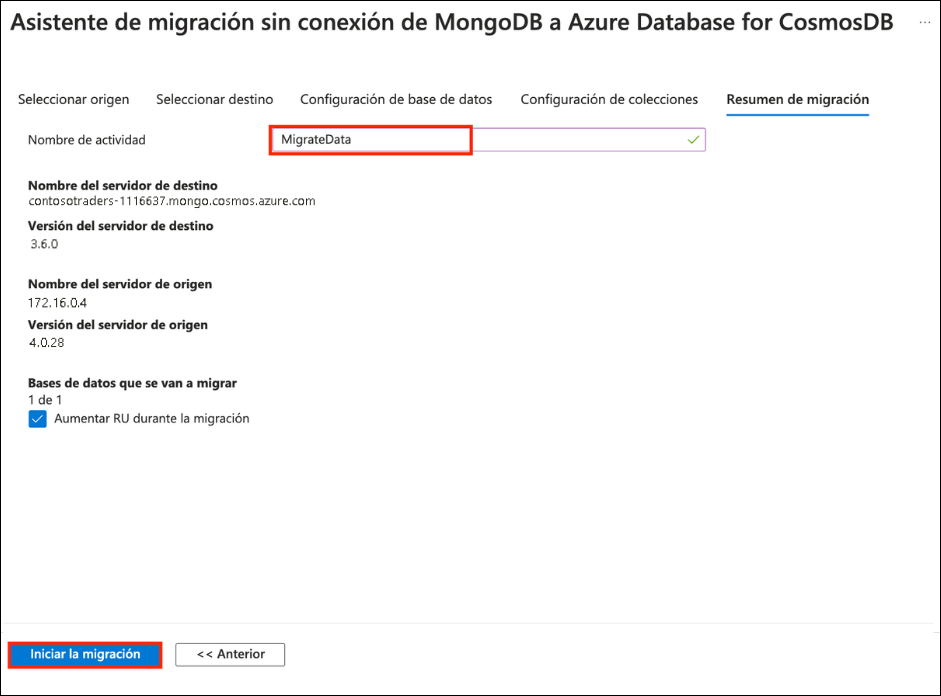
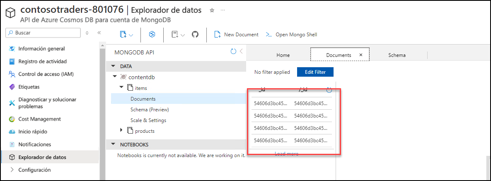
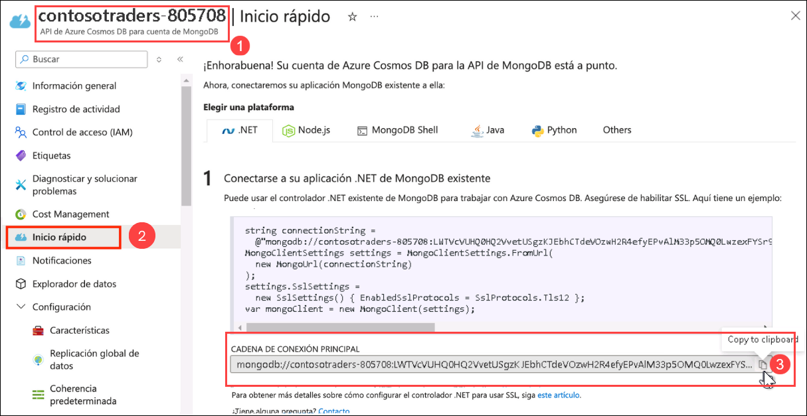

# Exercício 2: Migrar MongoDB para Cosmos DB utilizando o Azure Database Migration

### Duração estimada: 60 minutos

## Visão geral

Neste exercício, irá migrar a sua base de dados MongoDB local alojada na VM do Azure Linux para o Azure CosmosDB utilizando o Azure Database Migration. O Serviço de Migração de Base de Dados do Azure é uma ferramenta que o ajuda a simplificar, orientar e automatizar a migração da sua base de dados para o Azure.

## Objectivos do Laboratório

Poderá completar as seguintes tarefas:

- Tarefa 1: Explore as bases de dados e as coleções no MongoDB
- Tarefa 2: Criar um Projeto de Migração e migrar dados para o Azure CosmosDB

### Tarefa 1: Explore as bases de dados e as coleções no MongoDB

Nesta tarefa, irá ligar-se a uma base de dados Mongo alojada numa VM Linux do Azure e explorar as bases de dados e as coleções nela contidas.

1. Enquanto estiver ligado à sua VM Linux, execute o comando abaixo para se ligar ao shell do Mongo para exibir as bases de dados e as coleções nele contidas utilizando a shell do Mongo.

    ```
    mongo
    ```

    >**Nota**: Se enfrentar um problema ao ligar-se à base de dados de origem com um erro, a ligação será recusada. Execute o comando **<inject key="Command to Connect to Build Agent VM" enableCopy="true" />** e introduza a password da VM **<inject key="Build Agent VM Password" enableCopy="true" />** para ligar à VM Linux utilizando ssh. Execute os seguintes comandos e execute novamente o passo 1 da tarefa.

   ```
   sudo apt install mongodb-server
   cd /etc
   sudo sed -i 's/bind_ip = 127.0.0.1/bind_ip = 0.0.0.0/g' /etc/mongodb.conf
   sudo sed -i 's/#port = 27017/port = 27017/g' /etc/mongodb.conf
   sudo service mongodb stop
   sudo service mongodb start
   ```

   

1. Execute os seguintes comandos para verificar a base de dados no shell do Mongo. Poderá ver as coleções **contentdb** disponíveis e **item & products** dentro de **contentdb**.

   ```
   show dbs
   use contentdb
   show collections
   ```

    

    >**Nota**: Caso não veja os dados dentro do ficheiro Mongo. Siga os passos mencionados abaixo.

    - Introduza `exit` para sair do Mongo.

    - Execute os comandos mencionados abaixo na linha de comandos e execute novamente os passos 1 e 2.

        ```
        cd ~/Cloud-Native-Application/labfiles/src/developer/content-init
        sudo npm ci
        nodejs server.js
        ```

### Tarefa 2: Criar um projeto de migração e migrar dados para o Azure CosmosDB

Nesta tarefa, irá criar um projeto de migração no Serviço de Migração de Base de Dados do Azure e, em seguida, migrar os dados do MongoDB para o Azure Cosmos DB. Nos exercícios posteriores, irá utilizar o Azure CosmosDB para pesquisar os dados da página de produtos.

1. No Portal Azure, navegue até à sua máquina virtual **contosotraders** no grupo de recursos **ContosoTraders-<inject key="DeploymentID" enableCopy="false" />**. Copie o **Endereço IP privado** e cole-o no bloco de notas para utilização posterior.

   

1. Navegue até ao grupo de recursos **ContosoTraders<inject key="DeploymentID" enableCopy="false" /> (1)** e abra o recurso de CosmosDB **contosotraders-<inject key="DeploymentID" enableCopy="false" /> (2 )** e clique em **Data Explorer (3)**. Clique agora na seta suspensa, adjacente a **New Collection (4)** e selecione **New Database (5)**.

   

    > **Nota:** Se receber **Welcome! What is Cosmos DB?**, feche-o clicando em **X**.

1. Forneça o nome como `contentdb` **(1)** para **Database id** e selecione **Databse throughput** como **Manual** **(2)**, forneça o valor RU/s para `400` **(3)** e clique em **OK (4)**.

   

1. Navegue até ao serviço de migração de base de dados do Azure **contosotraders<inject key="DeploymentID" enableCopy="false" />** no grupo de recursos **ContosoTraders-<inject key="DeploymentID" enableCopy= "false" />**.

1. Na página Azure Database Migration Service, selecione **+ New Migration Project** no painel **Overview**.

   

1. No painel **New migration project**, introduza os seguintes valores e selecione **Create and run activity**:

    - Project name: `contoso`
    - Source server type: `MongoDB`
    - Target server type: `CosmosDB (MongoDB API)`
    - Migration activity type: `Offline data migration`

      

      >**Nota**: O tipo de atividade **Offline data migration** está selecionado, uma vez que irá realizar uma migração única do MongoDB para o Cosmos DB. Além disso, os dados da base de dados não serão atualizados durante a migração. Num cenário de produção, irá querer escolher o tipo de atividade de projeto de migração que melhor se adapta aos requisitos da sua solução.

1. No painel **MongoDB for Azure Database for CosmosDB Offline Migration Wizard**, introduza os seguintes valores para o separador **Select source**:

    - Mode: **Standard mode**
    - Source server name: introduza o endereço IP privado do Build Agent VM utilizada neste laboratório.
    - Server port: `27017`
    - Require SSL: desmarcado

    > **Nota:** deixe **User Name** e **Password** em branco, uma vez que a instância do MongoDB na VM do Build Agent deste laboratório não tem a autenticação ativada. O Serviço de Migração da Base de Dados Azure está ligado ao mesmo VNet que o Build Agent VM, pelo que é capaz de comunicar dentro do VNet directamente com o VM sem expor o serviço MongoDB à Internet. Em cenários de produção, deve ter sempre a autenticação ativada no MongoDB.

   

    > **Nota:** Se enfrentar um problema ao ligar-se à base de dados de origem com um erro, a ligação será recusada. Execute os seguintes comandos em **build agent VM connected in CloudShell**. Pode utilizar o **Comando para ligar à VM do agente de compilação**, que é fornecido na página de detalhes do ambiente de laboratório.

    ```bash
    sudo apt install mongodb-server
    cd /etc
    sudo sed -i 's/bind_ip = 127.0.0.1/bind_ip = 0.0.0.0/g' /etc/mongodb.conf
    sudo sed -i 's/#port = 27017/port = 27017/g' /etc/mongodb.conf
    sudo service mongodb stop
    sudo service mongodb start
    ```

1. Selecione **Next: Select target >>**.

1. No painel **Select target**, selecione os seguintes valores:

    - Modo: **Select Cosmos DB target**

    - Subscription: selecione a subscrição do Azure que está a utilizar para este laboratório.

    - Select Cosmos DB name: selecione a instância **contosotraders-<inject key="DeploymentID" enableCopy="false" />** do Cosmos DB.

      

      Note que **Connection String** será preenchido automaticamente com a chave da sua instância do Azure Cosmos DB.

1. Selecione **Next: Database setting >>**.

1. No separador **Database setting**, selecione `contentdb` **Source Database**, para que esta base de dados do MongoDB seja migrada para o Azure Cosmos DB.

   

1. Selecione **Next: Collection setting >>**.

1. No separador **Collection setting**, expanda a base de dados **contentdb** e certifique-se de que as coleções **products** e **items** estão selecionadas para migração. Além disso, atualize **Throughput (RU/s)** para `400` para ambas as coleções.

   

1. Selecione **Next: Migration summary >>**.

1. No separador **Migration summary**, introduza `MigrateData` no campo **Activity name** e selecione **Start migration** para iniciar a migração dos dados do MongoDB para o Azure Cosmos DB.

   

1. Será apresentado o estado da atividade de migração. A migração será concluída em questão de segundos. Selecione **Refresh** para recarregar o estado e garantir que está **complete**.

   

1. Para verificar os dados migrados, navegue até à conta **contosotraders-<inject key="DeploymentID" enableCopy="false" />** Azure CosmosDB for MongoDB em **ContosoTraders-<inject key="DeploymentID" enableCopy = "false" />** grupo de recursos. Selecione **Data Explorer** no menu esquerdo.

   

1. Verá as coleções de `itens` e `produtos` listadas na base de dados `contentdb` e poderá explorar os documentos.

   

1. Dentro da conta **contosotraders-<inject key="DeploymentID" enableCopy="false" />** **(1)** Azure CosmosDB para MongoDB. Selecione **Quick start** **(2)** no menu esquerdo e **Copy** a **PRIMARY CONNECTION STRING** **(3)** e cole-a no ficheiro de texto para utilização posterior no próximo exercício.

   

1. Clique no botão **Next** localizado no canto inferior direito deste guia de laboratório para continuar com o exercício seguinte.

## Resumo

Neste exercício, concluiu a exploração do Mongodb local e a migração da base de dados MongoDB local para o Azure CosmosDB utilizando a migração da base de dados do Azure.

### Concluiu o laboratório com sucesso