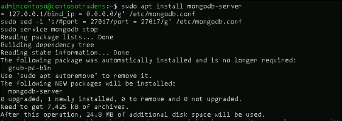
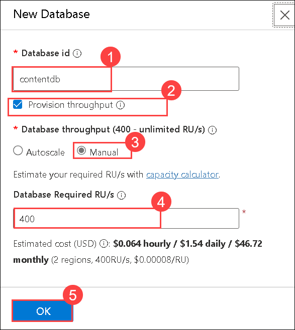
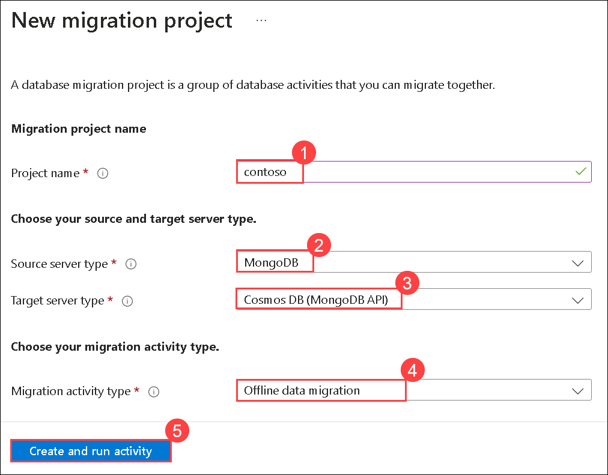
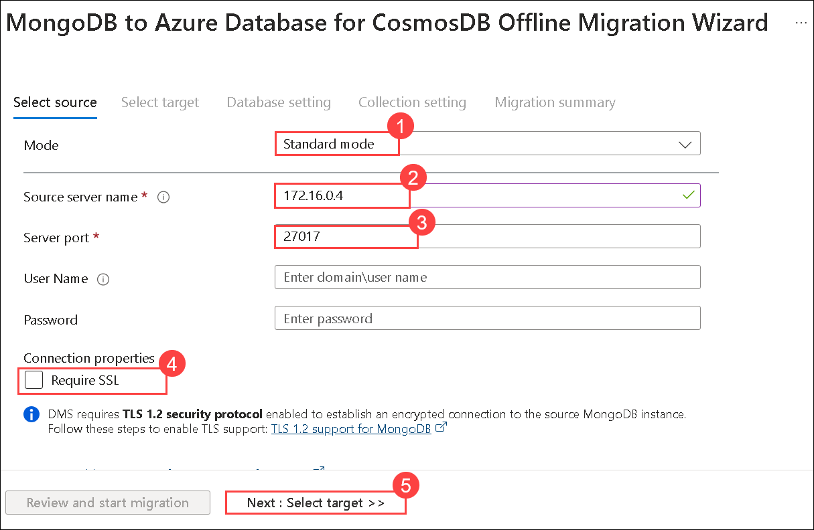
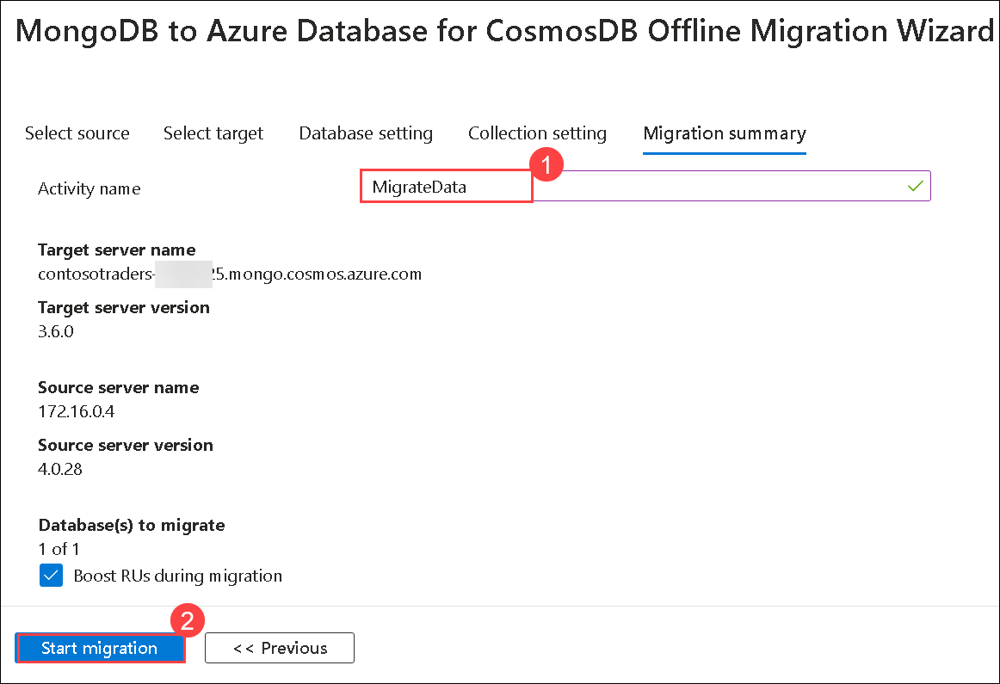
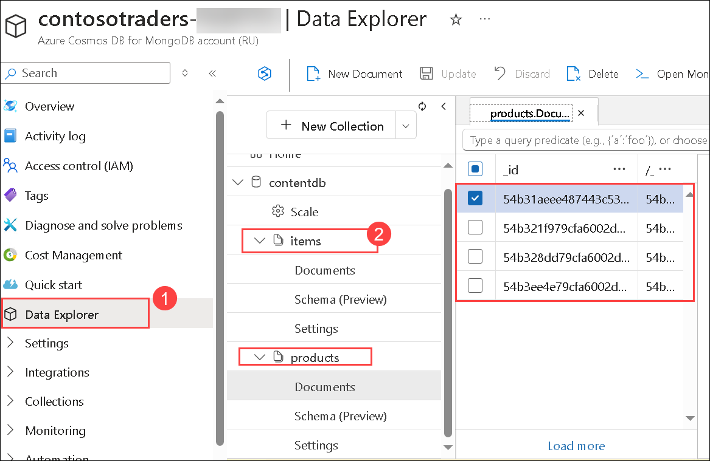
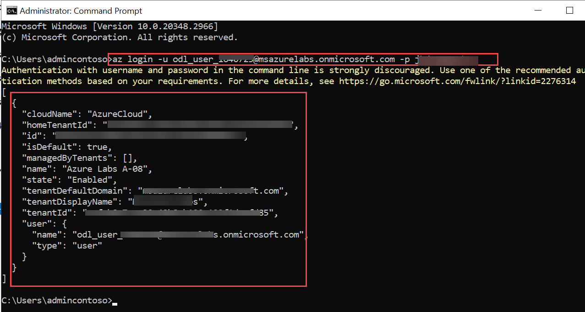
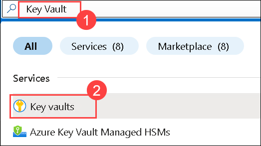

# Exercício 2: Migrar MongoDB para Cosmos DB utilizando o Azure Database Migration

### Duração estimada: 60 minutos

## Visão geral

Neste exercício, irá migrar a sua base de dados MongoDB local alojada na VM do Azure Linux para o Azure CosmosDB utilizando o Azure Database Migration. O Serviço de Migração de Base de Dados do Azure é uma ferramenta que o ajuda a simplificar, orientar e automatizar a migração da sua base de dados para o Azure.

## Objectivos do Laboratório

Poderá completar as seguintes tarefas:

- Tarefa 1: Explore as bases de dados e as coleções no MongoDB
- Tarefa 2: Criar um Projeto de Migração e migrar dados para o Azure CosmosDB

### Tarefa 1: Explore as bases de dados e as coleções no MongoDB

Nesta tarefa, irá ligar-se a uma base de dados Mongo alojada numa VM Linux do Azure e explorar as bases de dados e as coleções nela contidas.

1. Enquanto estiver ligado à sua VM Linux, execute o comando abaixo para se ligar ao shell do Mongo para exibir as bases de dados e as coleções nele contidas utilizando a shell do Mongo.

    ```
    mongo
    ```

    > **Observação**: Os avisos mostrados após a execução do comando podem ser ignorados.

1. Execute os seguintes comandos para verificar a base de dados no shell do Mongo. Poderá ver as coleções **contentdb** disponíveis e **item & products** dentro de **contentdb**.

   ```
   show dbs
   use contentdb
   show collections
   ```

    

    >**Observação**: Caso não veja os dados dentro do ficheiro Mongo. Siga os passos mencionados abaixo.

    - Introduza `exit` para sair do Mongo.

    - Execute os comandos mencionados abaixo na linha de comandos e execute novamente os passos 1 e 2.

        ```
        cd ~/Cloud-Native-Application/labfiles/src/developer/content-init
        npm ci
        nodejs server.js
        ```    

    > **Observação**: Se você enfrentar um problema ao se conectar ao banco de dados de origem com um erro de conexão recusada. Execute o comando **<inject key="Command to Connect to Build Agent VM" enableCopy="true" />**, digite **yes** quando ele disser **Are you sure you want to continue connecting (yes/no/[fingerprint])?** e insira a senha da VM **<inject key="Build Agent VM Password" enableCopy="true" />** para se conectar à VM Linux usando ssh. Execute os seguintes comandos e repita a etapa - 1 da tarefa.

   ```
   cd ..
   cd ..
   sudo apt install mongodb-server
   cd /etc
   sudo sed -i 's/bind_ip = 127.0.0.1/bind_ip = 0.0.0.0/g' /etc/mongodb.conf
   sudo sed -i 's/#port = 27017/port = 27017/g' /etc/mongodb.conf
   sudo service mongodb stop
   sudo service mongodb start
   ```

   


### Tarefa 2: Criar um projeto de migração e migrar dados para o Azure CosmosDB

Nesta tarefa, irá criar um projeto de migração no Serviço de Migração de Base de Dados do Azure e, em seguida, migrar os dados do MongoDB para o Azure Cosmos DB. Nos exercícios posteriores, irá utilizar o Azure CosmosDB para pesquisar os dados da página de products.

1. No Portal Azure, navegue até à sua máquina virtual **contosotraders** no grupo de recursos **ContosoTraders-<inject key="DeploymentID" enableCopy="false" />**. 

   

1. Copie o **Endereço IP privado** e cole-o no bloco de notas para utilização posterior.

   .png)

1. Navegue até ao grupo de recursos **ContosoTraders<inject key="DeploymentID" enableCopy="false" /> (1)** e abra o recurso de CosmosDB **contosotraders-<inject key="DeploymentID" enableCopy="false" /> (2)** e clique em **Data Explorer (3)**. Clique agora na seta suspensa, adjacente a **+ New Collection (4)** e selecione **+ New Database (5)**.

   .png)

    > **Observação:** Se receber **Bem-vindo! O que é Cosmos DB?**, feche-o clicando em **X**.

1. Forneça o nome como `contentdb` **(1)** para **Database id** e selecione **Provision throughput (2)**, selecione **Databse throughput** como **Manual** **(3)**, forneça o valor RU/s para `400` **(4)** e clique em **OK (5)**.

   

   **Observação:** Para visualizar as configurações, certifique-se de que a opção **Provision throughput** esteja **marcada**.

1. Navegue até ao serviço de migração de base de dados do Azure **contosotraders<inject key="DeploymentID" enableCopy="false" />** no grupo de recursos **ContosoTraders-<inject key="DeploymentID" enableCopy= "false" />**.

   

1. Na página Azure Database Migration Service, selecione **+ Novo projeto de migração** no painel **Visão geral**.

   

1. No painel **Novo projeto de migração**, introduza os seguintes valores e selecione **Criar e executar atividade (5)**:

    - Nome do projeto: `contoso` **(1)**
    - Tipo do servidor de origem: `MongoDB` **(2)**
    - Tipo de servidor de destino: `Cosmos DB (API MongoDB)` **(3)**
    - Tipo de atividade de migração: `Migração de dados offline` **(4)**

      

      >**Observação**: O tipo de atividade **Migração de dados offline** está selecionado, uma vez que irá realizar uma migração única do MongoDB para o Cosmos DB. Além disso, os dados da base de dados não serão atualizados durante a migração. Num cenário de produção, irá querer escolher o tipo de atividade de projeto de migração que melhor se adapta aos requisitos da sua solução.

1. No painel **MongoDB para Banco de Dados do Azure para Assistente de Migração Offline CosmosDB**, introduza os seguintes valores para o separador **Selecionar origen**:

    - Modo: **Modo padrão (1)**
    - Nome do servidor de origem: Insira o endereço IP **Privado** da VM **ContosoTraders-<inject key="DeploymentID" enableCopy="false" />** que você copiou anteriormente nesta tarefa **(2)**
    - Porta do servidor: `27017` **(3)**
    - Exigir SSL: desmarcado **(4)**
    - Selecione **Seguinte: Selecionar destino >> (5)**.

    > **Nota:** deixe **Nome de Usuário** e **Senha** em branco, uma vez que a instância do MongoDB na VM do Build Agent deste laboratório não tem a autenticação ativada. O Serviço de Migração da Base de Dados Azure está ligado ao mesmo VNet que o Build Agent VM, pelo que é capaz de comunicar dentro do VNet directamente com o VM sem expor o serviço MongoDB à Internet. Em cenários de produção, deve ter sempre a autenticação ativada no MongoDB.

    

    > **Observação:** Se enfrentar um problema ao ligar-se à base de dados de origem com um erro, a ligação será recusada. Execute os seguintes comandos em **construir VM do agente conectado no CloudShell**. Pode utilizar o **Comando para ligar à VM do agente de compilação**, que é fornecido na página de detalhes do ambiente de laboratório.

    ```bash
    sudo apt install mongodb-server
    cd /etc
    sudo sed -i 's/bind_ip = 127.0.0.1/bind_ip = 0.0.0.0/g' /etc/mongodb.conf
    sudo sed -i 's/#port = 27017/port = 27017/g' /etc/mongodb.conf
    sudo service mongodb stop
    sudo service mongodb start
    ```

1. No painel **Selecionar destino**, selecione os seguintes valores:

    - Modo: **Selecione o destino do Cosmos DB (1)**

    - Assinatura: selecione a subscrição do Azure que está a utilizar para este laboratório **(2)**

    - Selecione o nome do Cosmos DB: selecione a instância **contosotraders-<inject key="DeploymentID" enableCopy="false" />** do Cosmos DB **(3)**

    - Selecione **Seguinte: Definição de base de dados >> (4)**.    

      

      Note que **Cadeia de conexão** será preenchido automaticamente com a chave da sua instância do Azure Cosmos DB.

1. No separador **Definição de base de dados**, selecione `contentdb` **Base de Dados de Origem**, para que esta base de dados do MongoDB seja migrada para o Azure Cosmos DB. **(1)**

   - Selecione **Seguinte: Definição de recolha>> (2)**.

     

1. No separador **Definição de recolha**, expanda a base de dados **contentdb** e certifique-se de que as coleções **products** e **items** estão selecionadas para migração **(1)**. Além disso, atualize **Taxa de Transferência (RU/s)** para `400` para ambas as coleções **(2)**.

   - Selecione **Siguinte: Resumo da migração >> (3)**.

     

1. No separador **Resumo da migração**, introduza `MigrateData` **(1)** no campo **Nome da atividade** e selecione **Iniciar migração (2)** para iniciar a migração dos dados do MongoDB para o Azure Cosmos DB.

   

1. Será apresentado o estado da atividade de migração. A migração será concluída em questão de segundos. Selecione **Atualizar (1)** para recarregar o estado e garantir que está **Concluído (2)**.

   

1. Para verificar os dados migrados, navegue até à conta **contosotraders-<inject key="DeploymentID" enableCopy="false" />** Azure CosmosDB for MongoDB em **ContosoTraders-<inject key="DeploymentID" enableCopy = "false" />** grupo de recursos. Selecione **Data Explorer** no menu esquerdo.

   .png)

1. Verá as coleções de `items` **(1)** e `products` **(2)** listadas na base de dados `contentdb` e poderá explorar os documentos **(3)**.

   

1. Dentro da conta **contosotraders-<inject key="DeploymentID" enableCopy="false" />** **(1)** Azure CosmosDB para MongoDB. Selecione **Guia de introdução** **(2)** no menu esquerdo e **Cópia** a **Cadeia de Ligação Primária** **(3)** e cole-a no ficheiro de texto para utilização posterior no próximo exercício.

   

1. Clique no botão **Próximo** localizado no canto inferior direito deste guia de laboratório para continuar com o exercício seguinte.

<validation step="8b5cf0f8-b2b7-4802-bb0a-ecd34be43ab2" />

> **Parabéns** por concluir a tarefa! Agora é hora de validá-lo. Aqui estão as etapas:
> - Se você receber uma mensagem de sucesso, poderá prosseguir para a próxima tarefa.
> - Caso contrário, leia atentamente a mensagem de erro e repita a etapa, seguindo as instruções do guia do laboratório.
> - Se precisar de ajuda, entre em contato conosco em cloudlabs-support@spektrasystems.com. Estamos disponíveis 24/7 para ajudá-lo.

## Resumo

Neste exercício, concluiu a exploração do Mongodb local e a migração da base de dados MongoDB local para o Azure CosmosDB utilizando a migração da base de dados do Azure.

### Concluiu o laboratório com sucesso
