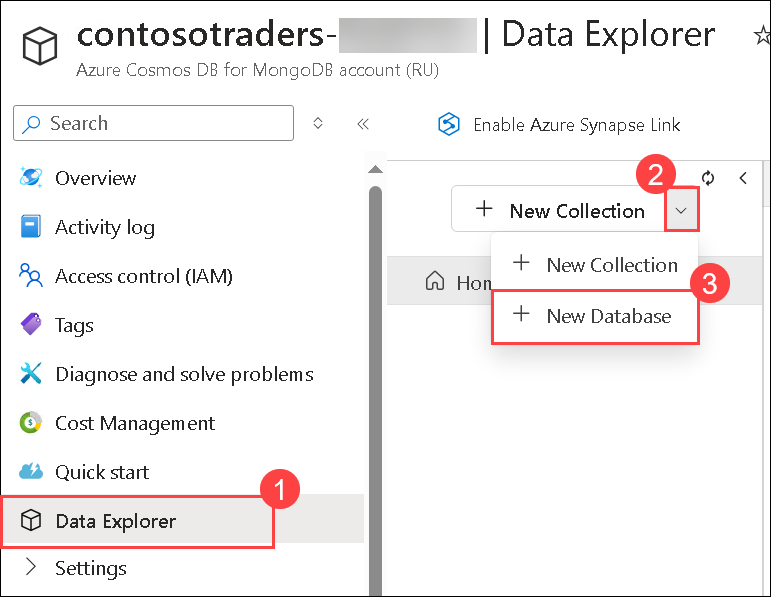
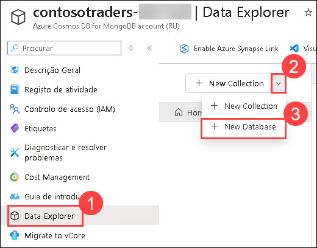
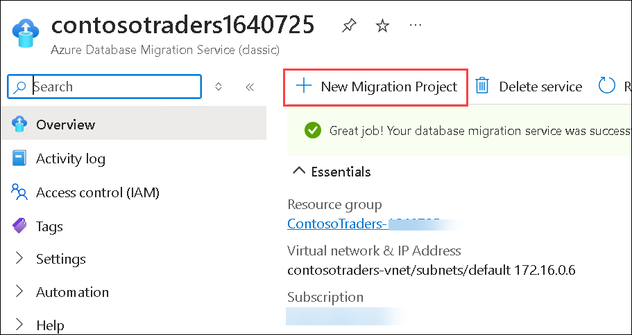
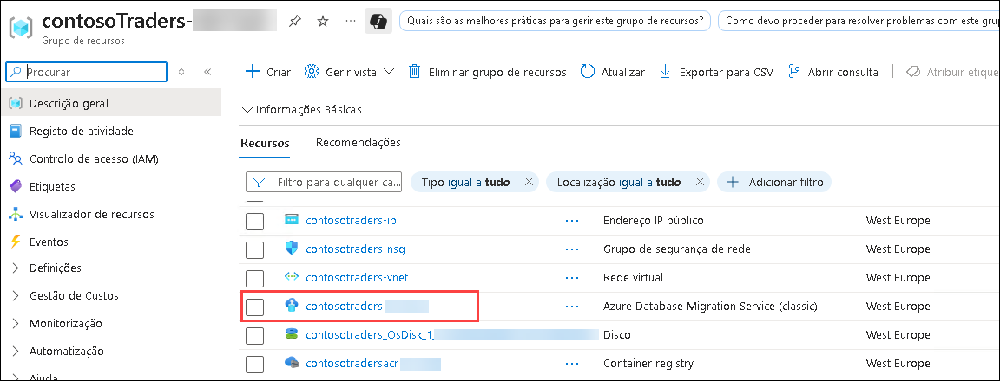
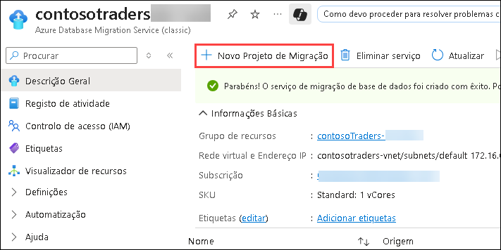
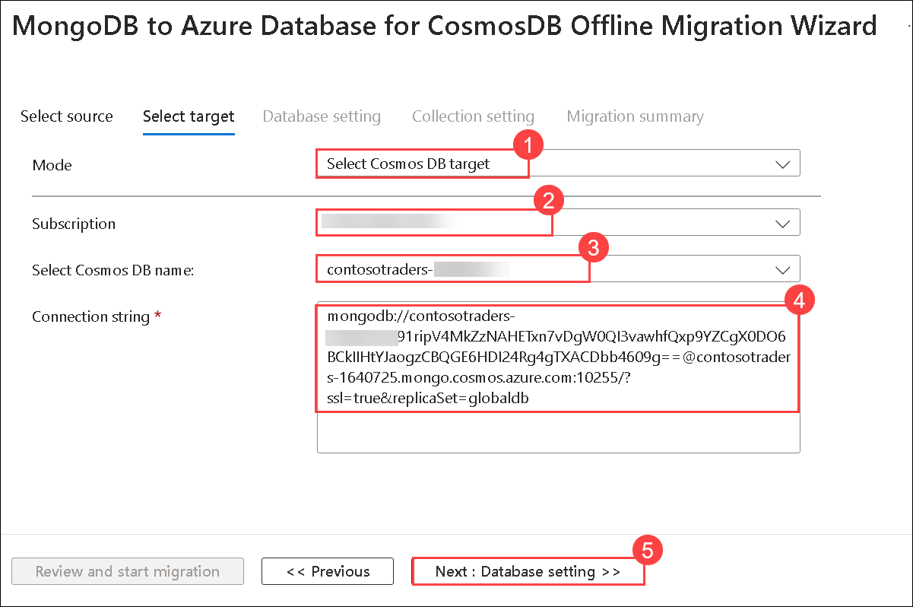
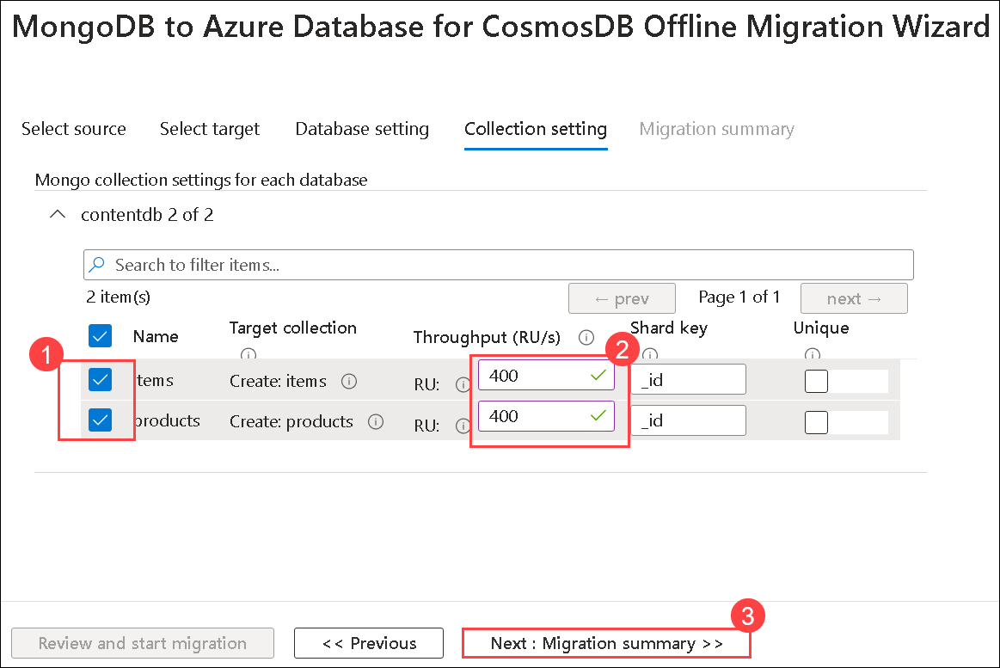
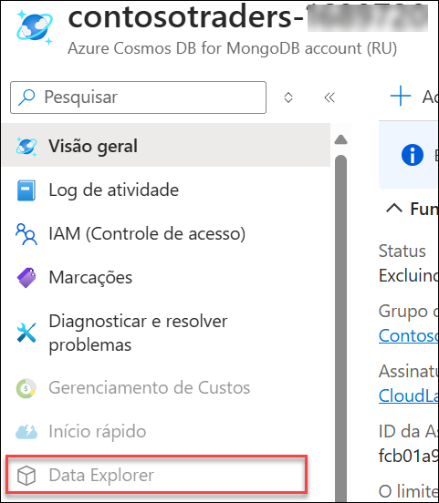

# Exercício 2: Migrar MongoDB para o Azure Cosmos DB usando o Azure Database Migration

### Duração estimada: 65 Minutos

## Visão geral

Neste exercício, você migrará seu banco de dados MongoDB local, hospedado em uma VM Linux do Azure, para o Azure Cosmos DB utilizando o Azure Database Migration. O serviço Azure Database Migration é uma ferramenta que o ajuda a simplificar,  guiar e automatizar a migração do seu banco de dados para o Azure.

## Objetivos do Laboratório

Você será capaz de completar as seguintes tarefas:

- Tarefa 1: Explorar os bancos de dados e as coleções no MongoDB
- Tarefa 2: Criar um Projeto de Migração e migrar os dados para o Azure Cosmos DB

### Tarefa 1: Explorar os bancos de dados e as coleções no MongoDB

Nesta tarefa, você se conectará a um banco de dados MongoDB hospedado em uma VM Linux do Azure e explorará os bancos de dados e as coleções contidos nele.

1. Enquanto estiver conectado à sua VM Linux, execute o seguinte comando para verificar se o MongoDB está instalado:
   
    ```
    mongo --version
    ```

   >**Observação:** Se o MongoDB estiver instalado, prossiga para o próximo passo. Se não estiver instalado, siga os passos de solução de problemas fornecidos abaixo.

   >Execute o comando **<inject key="Command to Connect to Build Agent VM" enableCopy="true" />**, digite **yes** quando surgir a mensagem **Are you sure you want to continue connecting (yes/no/[fingerprint])?** e insira a senha da VM **<inject key="Build Agent VM Password" enableCopy="true" />** para se conectar à VM Linux via SSH. Em seguida, execute os seguintes comandos:

   ```
   sudo apt install mongodb-server
   cd /etc
   sudo sed -i 's/bind_ip = 127.0.0.1/bind_ip = 0.0.0.0/g' /etc/mongodb.conf
   sudo sed -i 's/#port = 27017/port = 27017/g' /etc/mongodb.conf
   cd ~/Cloud-Native-Application/labfiles/src/developer/content-init
   npm ci
   nodejs server.js   
   sudo service mongodb stop
   sudo service mongodb start
   ```   

1. Enquanto estiver conectado à sua VM Linux, execute o seguinte comando para se conectar ao **shell do mongo** e exibir os bancos de dados e as coleções.

    ```
    mongo
    ```

1. Execute os seguintes comandos para verificar o banco de dados no shell do mongo. Você deverá ver o **contentdb** disponível e as coleções **item & products** dentro do **contentdb**.

   ```
   show dbs
   use contentdb
   show collections
   ```

    

### Tarefa 2: Criar um Projeto de Migração e migrar os dados para o Azure Cosmos DB

Nesta tarefa, você criará um projeto de Migração dentro do Azure Database Migration Service e, em seguida, migrará os dados do MongoDB para o Azure Cosmos DB. Nos exercícios posteriores, você usará o Azure Cosmos DB para buscar os dados para a página de produtos.

1. No Portal do Azure, navegue até à sua máquina virtual **contosotraders** no grupo de recursos **contosoTraders-**. Copie o endereço IP privado e cole-o em um Bloco de Notas para uso posterior.

   

1. Navegue até o grupo de recursos **contosoTraders (1)** e abra **contosotraders- (2)**, a conta do Cosmos DB para MongoDB.

   

1.  Clique em **Data Explorer (1)**. Agora, clique na seta suspensa, ao lado de **+ New Collection (2)**, e depois selecione **+ New Database (3)**.

    

    > **Observação:** Se receber **Bem-vindo! O que é Cosmos DB?**, feche-o clicando em **X**.

1. Forneça o nome como `contentdb` **(1)** para **Database id** e selecione **Provision throughput (2)**, selecione **Databse throughput** como **Manual** **(3)**, forneça o valor RU/s para `400` **(4)** e clique em **OK (5)**.

   

   > **Observação:** Para visualizar as configurações, certifique-se de que a opção **Provision throughput** esteja **marcada**.

1. Navegue até ao serviço de migração de base de dados do Azure **contosotraders<inject key="DeploymentID" enableCopy="false" />** no grupo de recursos **contosoTraders-<inject key="DeploymentID" enableCopy= "false" />**.

   

1. Na página Azure Database Migration Service, selecione **+ Novo projeto de migração** no painel **Visão geral**.

   

1. No painel **Novo projeto de migração**, introduza os seguintes valores e selecione **Criar e executar atividade (5)**:

    - Nome do projeto: `contoso` **(1)**
    - Tipo do servidor de origem: `MongoDB` **(2)**
    - Tipo de servidor de destino: `Cosmos DB (API MongoDB)` **(3)**
    - Tipo de atividade de migração: `Migração de dados offline` **(4)**

      

      >**Observação**: O tipo de atividade **Migração de dados offline** está selecionado, uma vez que irá realizar uma migração única do MongoDB para o Cosmos DB. Além disso, os dados no banco de dados não serão atualizados durante a migração. Em um cenário de produção, você deve escolher o tipo de atividade do projeto de migração que melhor se adapta aos requisitos da sua solução.
      
1. No painel **Assistente de Migração Offline do MongoDB para o Azure Cosmos DB**, insira os seguintes valores na aba **Selecionar origem**:

    - Modo: **Modo padrão (1)**
    - Nome do servidor de origem: Insira o **Endereço IP Privado** da VM **contosotraders-<inject key="DeploymentID" enableCopy="false" />** que você copiou anteriormente nesta tarefa **(2)**
    - Porta do servidor: `27017` **(3)**
    - Requerer SSL: Desmarcado **(4)**
    - Clique em **Próximo: Selecionar destino >> (5)**.

    > **Observação:** Deixe o **Nome de Usuário** e **Senha** em branco,  pois a instância do MongoDB na VM do Agente de Build para este laboratório não tem a autenticação ativada. O Azure Database Migration Service está conectado à mesma VNet que a VM do Agente de Build, então ele consegue se comunicar diretamente com a VM dentro da VNet sem expor o serviço MongoDB à Internet. Em cenários de produção, você deve sempre ter a autenticação habilitada no MongoDB.
    

    > **Observação:** Se você enfrentar um problema ao se conectar ao banco de dados de origem com o erro "a conexão foi recusada". Execute os seguintes comandos em **construir VM do agente conectado no CloudShell**.

    ```bash
    sudo apt install mongodb-server
    cd /etc
    sudo sed -i 's/bind_ip = 127.0.0.1/bind_ip = 0.0.0.0/g' /etc/mongodb.conf
    sudo sed -i 's/#port = 27017/port = 27017/g' /etc/mongodb.conf
    sudo service mongodb stop
    sudo service mongodb start
    ```

1. Na aba **Selecionar destino**, selecione os seguintes valores:

    - Modo: **Selecione o destino do Cosmos DB (1)**

    - Assinatura: selecione a assinatura do Azure que está a usando para este laboratório **(2)**

    - Selecione o nome do Cosmos DB: selecione a instância **contosotraders-<inject key="DeploymentID" enableCopy="false" />** do Cosmos DB **(3)**

    - Selecione **Próximo: Configuração do banco de dados >> (4)**.    

      

      >**Observação:** Note que **Cadeia de conexão** será preenchida automaticamente com a chave da sua instância do Azure Cosmos DB.

1. Na aba **Configuração do banco de dados**, selecione `contentdb` **Banco de Dados de Origem**,para que este banco de dados do MongoDB seja migrado para o Azure Cosmos DB. **(1)**

   - Selecione **Próximo: Configuração da coleção>> (2)**.

     

1. Na aba **Configuração da coleção**, expanda o banco de dados **contentdb** e certifique-se de que as coleções **products** e **items** estejam selecionadas para migração **(1)**. Além disso, atualize a **Taxa de Transferência (RU/s)** para `400` para ambas as coleções **(2)**.

   - Selecione **Próximo: Resumo da migração >> (3)**.

     

1. Na aba **Resumo da migração**, insira `MigrateData` **(1)** no campo **Nome da atividade** e, em seguida, selecione **Iniciar migração (2)** para iniciar a migração dos dados do MongoDB para o Azure Cosmos DB.

   

1. O status da atividade de migração será exibido. A migração será concluída em questão de segundos. Selecione **Atualizar (1)** para recarregar o status e garantir que esteja **Concluído (2)**.

   

1. Para verificar os dados migrados, navegue até a conta do **contosotraders-<inject key="DeploymentID" enableCopy="false" />** Azure Cosmos DB for for MongoDB (RU) em **ContosoTraders-<inject key="DeploymentID" enableCopy = "false" />** no grupo de recursos. Selecione **Data Explorer** no menu à esquerda.

   

1. Verá as coleções de `items` **(1)** e `products` **(2)** listadas dentro do banco de dados `contentdb` e poderá explorar os documentos **(3)**.

   

1. Dentro da conta **contosotraders-<inject key="DeploymentID" enableCopy="false" />** **(1)** do Azure Cosmos DB para MongoDB. Selecione **Guia de introdução** **(2)** no menu esquerdo e **Cópia** a **Cadeia de Ligação Primária** **(3)** e cole-a em um arquivo de texto para uso posterior no próximo exercício.

   

1. Clique no botão **Próximo** localizado no canto inferior direito deste guia de laboratório para continuar com o exercício seguinte.

> **Parabéns** por concluir a tarefa! Agora, é hora de validá-la. Aqui estão os passos:
> - Se você receber uma mensagem de sucesso, poderá prosseguir para a próxima tarefa.
> - Caso contrário, leia atentamente a mensagem de erro e repita a etapa, seguindo as instruções do guia do laboratório.
> - Se precisar de ajuda, entre em contato conosco em cloudlabs-support@spektrasystems.com. Estamos disponíveis 24/7 para ajudá-lo.

<validation step="8b5cf0f8-b2b7-4802-bb0a-ecd34be43ab2" />

## Resumo

Neste exercício, você concluiu a exploração do seu MongoDB local e a migração do seu banco de dados MongoDB local para o Azure Cosmos DB usando o Azure Database Migration.

### Você completou o laboratório com sucesso. Clique em "Próximo" para prosseguir para o próximo exercício.


