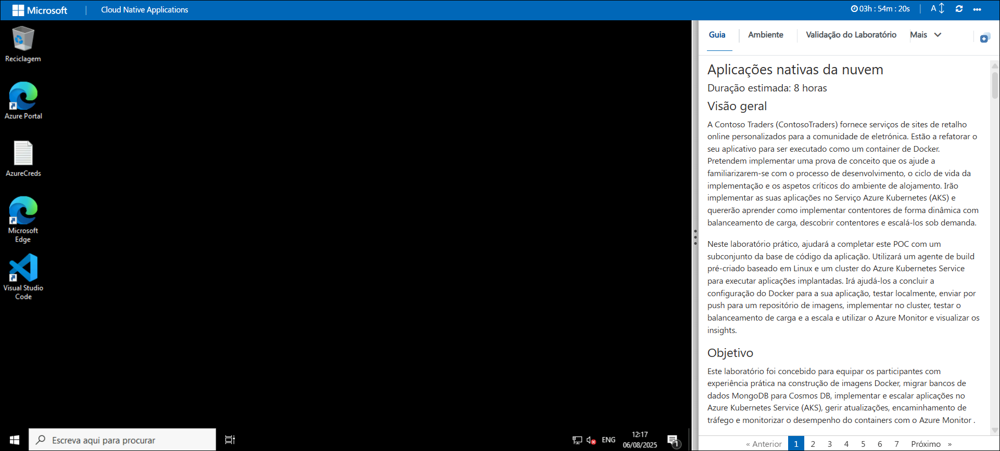
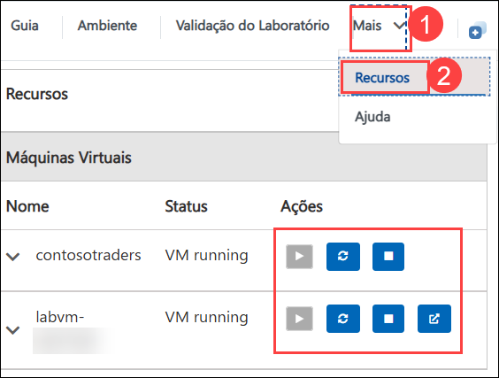
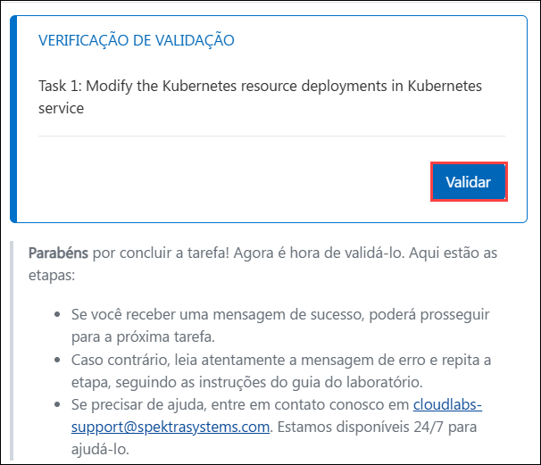
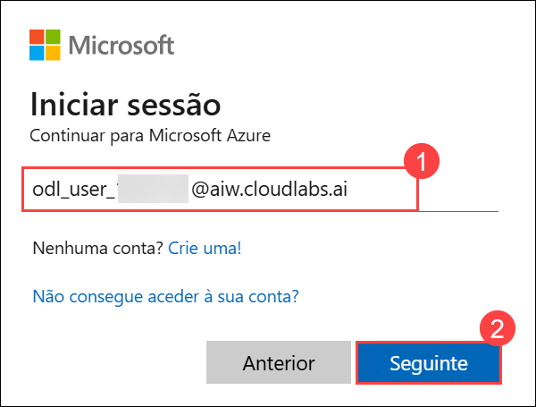
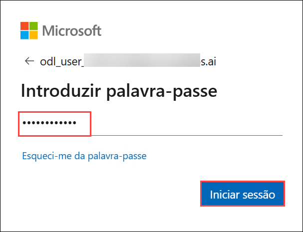
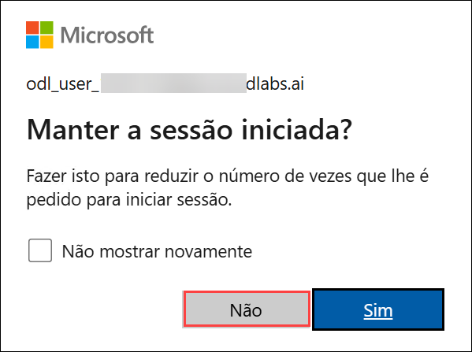

# Aplicações Nativas para Nuvem

### Duração estimada: 8 Horas

## Visão geral

A Contoso Traders oferece serviços de site de varejo online adaptados à comunidade de eletrônicos. Eles estão refatorando sua aplicação para rodar como uma aplicação Docker. O objetivo é implementar uma prova de conceito (POC) que os ajude a se familiarizar com o processo de desenvolvimento, o ciclo de vida da implantação e os aspectos críticos do ambiente de hospedagem. Eles implantarão suas aplicações no **Azure Kubernetes Service** e querem aprender como implantar contêineres de forma dinâmica com balanceamento de carga, descobrir contêineres e escalá-los sob demanda.

Neste laboratório prático, você irá concluir a POC trabalhando com um subconjunto do código da aplicação. Para isso, utilizará um agente de build pré-configurado em Linux e um cluster do Azure Kubernetes Service (AKS) para executar as implantações. As etapas incluem configurar o Docker da aplicação, realizar testes locais, publicar a imagem em um repositório, implantar no AKS, validar o balanceamento de carga e a escalabilidade, além de usar o Azure Monitor para acompanhar métricas e gerar insights do ambiente.

## Objetivo

Este laboratório foi projetado para capacitar os participantes com experiência prática na criação de imagens Docker, migração do MongoDB para o Cosmos DB, implantação e escalonamento de aplicações no Azure Kubernetes Service, gerenciamento de atualizações e roteamento de tráfego, e monitoramento do desempenho de contêineres com o Azure Monitor.

- **Criar imagens Docker para a aplicação:** Este exercício prático tem como objetivo criar imagens Docker para conteinerizar a aplicação, garantindo implantações consistentes, portáteis e fáceis de reproduzir. Ao final, os participantes serão capazes de empacotar a aplicação em contêineres e implantá-la de forma confiável em diferentes ambientes, mantendo padronização e eficiência no processo.

- **Migrar MongoDB para o Azure Cosmos DB usando o Azure Database Migration:** Este exercício prático visa transferir seus dados do MongoDB para o Azure Cosmos DB para aproveitar seus serviços de banco de dados escaláveis e gerenciados. Os participantes migrarão sem problemas os dados do MongoDB para o Azure Cosmos DB, garantindo a disponibilidade e a compatibilidade dos dados com os serviços do Azure.

- **Implantar a aplicação no Serviço Azure Kubernetes:** Este exercício prático tem como objetivo implantar e gerenciar a aplicação conteinerizada utilizando o Azure Kubernetes Service (AKS), explorando seus recursos de orquestração e escalabilidade. Ao final, os participantes terão implantado a aplicação no AKS, obtendo um ambiente gerenciado, resiliente e preparado para suportar diferentes demandas de operação.

- **Escalar a aplicação e validar a Alta Disponibilidade (HA):** Este exercício prático tem como objetivo ajustar a escala da aplicação e validar sua alta disponibilidade, garantindo desempenho estável mesmo sob cargas variáveis. Ao final, os participantes serão capazes de escalar a aplicação conforme a demanda e confirmar sua resiliência para assegurar desempenho e confiabilidade contínuos.

- **Atualização de Aplicações e Gerenciamento do Ingress do Kubernetes:** Este exercício prático visa aplicar atualizações à sua aplicação e configurar o Ingress do Kubernetes para gerenciar e rotear o tráfego externo de forma eficaz. Os participantes atualizarão a aplicação com sucesso e configurarão o Ingress do Kubernetes para gerenciar e rotear o tráfego externo de forma eficaz.

- **Azure Monitor para Contêineres:** Este exercício prático tem como objetivo utilizar o Azure Monitor para Contêineres a fim de rastrear e analisar o desempenho e a saúde das aplicações conteinerizadas no AKS. Ao final, os participantes terão habilitado o monitoramento, obtendo insights valiosos sobre desempenho, disponibilidade e integridade operacional das aplicações.

## Pré-requisitos

Os participantes devem ter:

- Compreensão dos conceitos do Docker, como contêineres, imagens e Dockerfiles.
- Conhecimento das estruturas de dados do MongoDB e das capacidades do Azure Cosmos DB para uma migração eficaz.
- Compreensão básica dos conceitos do Kubernetes, incluindo pods, deployments e services, bem como do Azure Kubernetes Service (AKS).
- Uma assinatura ativa do Azure com as permissões apropriadas para criar e gerenciar recursos.
- Compreensão geral de serviços em nuvem, orquestração de contêineres e estratégias de escalonamento.
- Proficiência no uso de ferramentas e interfaces de linha de comando, como Azure CLI e Docker CLI.
- Familiaridade com práticas de Integração Contínua e Implantação Contínua (CI/CD), pois podem ser relevantes para gerenciar atualizações e implantações.

## Arquitetura

Os exercícios fazem uso de diversos serviços do Azure para construir, implantar e gerenciar aplicações de forma eficaz. O **Azure Container Registry (ACR)** armazena e gerencia imagens de contêiner Docker, enquanto o **Azure Cosmos DB** oferece uma solução de banco de dados multi-modelo, escalável e ideal para cenários de migração de dados. O **Azure Kubernetes Service (AKS)** possibilita a implantação e o gerenciamento de aplicações conteinerizadas em um ambiente Kubernetes totalmente gerenciado. Para garantir escalabilidade e alta disponibilidade, o **Azure Load Balancer** distribui o tráfego entre servidores, enquanto o **Azure Application Gateway** provê balanceamento de carga avançado e roteamento inteligente para aplicações web. Por fim, o **Azure Monitor** acompanha o desempenho e a integridade tanto das aplicações quanto da infraestrutura, incluindo ambientes conteinerizados, fornecendo insights abrangentes para otimização contínua.

## Diagrama de Arquitetura

## Explicação dos Componentes

A arquitetura para este laboratório envolve vários componentes principais:

- **Azure Container Registry (ACR):** Um registro de contêiner Docker gerenciado para armazenar e gerenciar imagens de contêiner Docker.
- **Azure Cosmos DB:** Um serviço de banco de dados NoSQL, multi-modelo e distribuído globalmente, projetado para gerenciar e escalar dados de forma rápida e confiável.
- **Azure Kubernetes Service (AKS):** Um serviço de orquestração de contêineres Kubernetes gerenciado para implantar, escalar e gerenciar aplicações conteinerizadas.
- **Balanceador de carga do Azure (parte do AKS):** Um balanceador de carga de alto desempenho que distribui o tráfego de rede por múltiplos servidores para garantir alta disponibilidade.
- **Azure Application Gateway (parte do AKS):** Um balanceador de carga de tráfego web que permite gerenciar o tráfego para suas aplicações web e fornece roteamento baseado em URL e terminação SSL.
- **Azure Monitor:** Um serviço de monitoramento abrangente que fornece insights sobre o desempenho e a saúde das aplicações e da infraestrutura, incluindo cargas de trabalho conteinerizadas.

## Iniciando o laboratório

Bem-vindo ao seu Workshop de Aplicações Nativas para Nuvem! Preparamos um ambiente integrado para você explorar e aprender sobre os serviços do Azure. Vamos começar aproveitando ao máximo esta experiência:

## Acessando seu Ambiente de Laboratório

1. Assim que o ambiente for provisionado, uma máquina virtual (JumpVM) e um guia serão carregados no seu navegador. Utilize esta máquina virtual durante todo o workshop para realizar o laboratório. Você pode ver o número na parte inferior do guia para alternar entre os diferentes exercícios no **Guia do laboratório**.

   

1. Uma vez na JumpVM, se um painel do Windows aparecer com **Escolha as configurações de privacidade para o seu dispositivo**, clique em **Avançar** > **Avançar** > **Aceitar** to proceed through the setup.

    

1. Para obter os detalhes do ambiente do laboratório, você pode selecionar a aba  **Ambiente**. Além disso, as credenciais também serão enviadas para o seu endereço de e-mail registrado. Você também pode abrir o Guia do Laboratório em uma janela separada e em tela cheia selecionando a opção **Dividir Janela** no canto superior direito. Além disso, você pode iniciar, parar e reiniciar máquinas virtuais a partir da aba **Resources**.

   
 
   > Você verá o valor do **DeploymentID** na aba **Environment**, use-o sempre que vir **SUFFIX** ou **DeploymentID** nos passos do laboratório.

## Gerenciando Sua Máquina Virtual

Sinta-se à vontade para iniciar, parar ou reiniciar sua máquina virtual conforme necessário a partir da aba **Recursos**. Sua experiência está em suas mãos!

Clique em **Mais (1)** e vá à aba **Recursos (2)** para **Iniciar, Parar ou Reiniciar** a máquina virtual..

   

## Utilizando o recurso de aumentar/diminuir zoom   

Para ajustar o nível de zoom da página do ambiente, clique no ícone **A↕ : 100%** localizado ao lado do cronômetro no ambiente do laboratório.

## Validação do Laboratório

1. Após concluir a tarefa, clique no botão **Validar** na aba **Validação** integrada ao seu guia de laboratório. Se você receber uma mensagem de sucesso, pode prosseguir para a próxima tarefa; caso contrário, leia atentamente a mensagem de erro e tente novamente o passo, seguindo as instruções do guia.

   

1. Se precisar de ajuda, entre em contato conosco em cloudlabs-support@spektrasystems.com.

## Faça login no Portal do Azure

1. Na JumpVM, clique no atalho do portal do Azure no navegador Microsoft Edge, que está na área de trabalho.

   

1. Na aba **Entrar no Microsoft Azure**, você verá a tela de login. Insira o seguinte e-mail/usuário **(1)** e clique em **Avançar (2)**.

    * E-mail/Usuário: <inject key="AzureAdUserEmail"></inject>

      

1. Agora digite a seguinte senha e clique em **Entrar**.

    * Senha: <inject key="AzureAdUserPassword"></inject>

      

    > Se a caixa de diálogo **Ajude-nos a proteger a sua conta** aparecer, selecione a opção **Ignorar por enquanto**.

1. Se o pop-up **Permanecer conectado?** aparecer, clique em **Não**.

   

1. Se o pop-up **Você tem recomendações gratuitas do Azure Advisor!** aparecer, feche a janela para continuar o laboratório.

1. Se a janela pop-up **Bem-vindo ao Microsoft Azure** aparecer, clique em **Cancelar** para ignorar o tour.

1. Agora verá o Painel do Portal do Azure, clique em **Grupos de recursos** no painel de navegação para ver os grupos de recursos.

   .png "Resource Groups")

Ao final deste laboratório, os participantes aprenderão a criar imagens Docker para conteinerizar aplicações, migrar dados do MongoDB para o Azure Cosmos DB e implantar aplicações no Azure Kubernetes Service (AKS) para orquestração. Eles também escalarão aplicações, garantirão alta disponibilidade, gerenciarão atualizações e roteamento de tráfego, e usarão o Azure Monitor para rastrear o desempenho e a saúde de suas aplicações conteinerizadas.

## Contato de suporte

A equipe de suporte da CloudLabs está disponível 24 horas por dia, 7 dias por semana, 365 dias por ano, por e-mail e chat ao vivo para garantir assistência contínua a qualquer momento. Oferecemos canais de suporte dedicados, adaptados especificamente para alunos e instrutores, garantindo que todas as suas necessidades sejam atendidas de forma rápida e eficiente.

Contatos de suporte ao aluno:
- Suporte por e-mail: cloudlabs-support@spektrasystems.com
- Suporte por chat ao vivo: https://cloudlabs.ai/labs-support

Agora, clique em **próximo** no canto inferior direito para passar para a próxima página.

### Boa aprendizado!!
