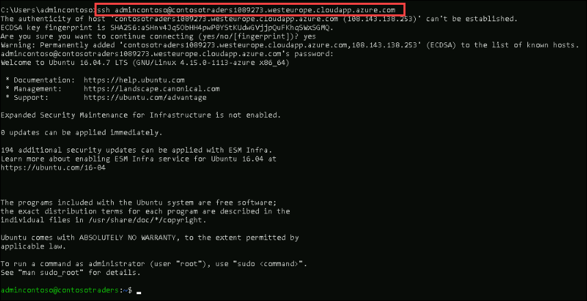
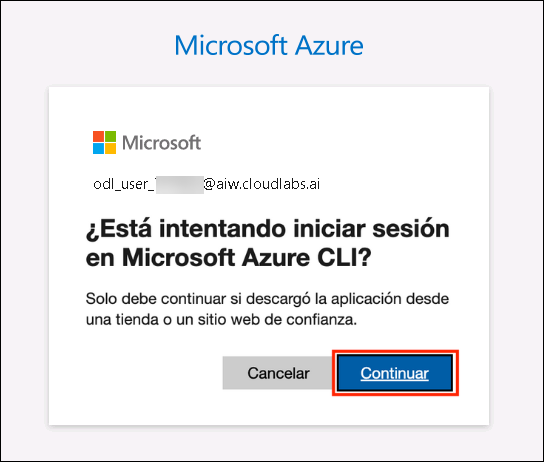

## Ejercicio 1: Crear Imágenes de Docker para la Aplicación
  
**Duración**: 30 Minutos

## Descripción General

En este ejercicio, aprenderá a containerizar la aplicación Contoso Traders utilizando imágenes de Docker. Las aplicaciones en contenedores son aplicaciones que se ejecutan en entornos de ejecución aislados llamados contenedores. Una imagen de Docker es un archivo que se utiliza para ejecutar código en un contenedor de Docker. Las imágenes de Docker actúan como un conjunto de instrucciones para crear un contenedor Docker, como una plantilla. Además, enviará las imágenes de Docker creadas a Azure Container Registry.
   
### Tarea 1: Configurar una infraestructura local con la Máquina Virtual Linux

En esta tarea, se conectará a la Máquina Virtual (MV) del Agente de Compilación mediante el Símbolo del sistema y clonará el repositorio de GitHub del sitio web de Contoso Traders.

1. Una vez que inicie sesión en la Máquina Virtual, busque **cmd** **(1)** en la barra de búsqueda de Windows y haga clic en **Símbolo del sistema** **(2)** para abrirla.

   
    
1. Ejecute el comando proporcionado **<inject key="Command to Connect to Build Agent VM" enableCopy="true" />** para conectarse a la MV de Linux usando ssh.
   
   >**Nota**: En el símbolo del sistema, escriba **yes** y presione **Enter** para `¿Seguro que quiere seguir conectándote (yes/no/[fingerprint])?`
   
1. Una vez que SSH esté conectado a la VM, ingrese la contraseña de la VM que se proporciona a continuación:
   
    * Contraseña: **<inject key="Build Agent VM Password" enableCopy="true" />**

   
   
   >**Nota**: Tenga en cuenta que mientras escribe la contraseña no podrá verla por motivos de seguridad.
    
1. Una vez que la VM esté conectada, ejecute el siguiente comando para clonar el repositorio de GitHub que usaremos para la práctica de laboratorio.

    ``` 
    git clone https://github.com/CloudLabsAI-Azure/Cloud-Native-Application
    ```
    
    
    
    > **Nota:** Si recibe un mensaje de salida que indica: - la ruta de destino 'Cloud-Native-Application' ya existe y no es un directorio vacío, por favor ejecute los siguientes comandos y luego vuelva a realizar el paso 4 de la tarea.

     ```
    sudo su
    rm -rf Cloud-Native-Application
    exit
     ```   
     
    
1. Una vez completada la clonación de GitHub, ejecute el siguiente comando para cambiar el directorio a los archivos de laboratorio.
    
    ```
    cd Cloud-Native-Application/labfiles/ 
    ```
    
    
    
### Tarea 2: Crear Imágenes de Docker para contenerizar la aplicación y empujarlas al registro del contenedor

En esta tarea, creará las imágenes de Docker para contenerizar la aplicación y las enviará a ACR (Azure Container Registry) para usarlas más adelante en AKS.

1. Ejecute el siguiente comando para iniciar sesión en Azure, navegue hasta la URL de inicio de sesión del dispositivo `https://microsoft.com/devicelogin` en el navegador y copie el código de autenticación.

   ``` 
   az login
   ```
    
   
    
1. Ingrese el código de autenticación copiado **(1)** y haga clic en **Siguiente** **(2)**.

   
   
1. En la pestaña **Inicie sesión en su cuenta** verá una pantalla de inicio de sesión, en ella ingrese el siguiente correo electrónico/nombre de usuario y luego haga clic en **Siguiente**.

   * Correo electrónico/Nombre de usuario: **<inject key="AzureAdUserEmail"></inject>**

    > **Nota:** Si aparece una ventana emergente **Elige una cuenta**, seleccione el ID de Correo electrónico anterior.

1. Ahora ingrese la siguiente contraseña y haga clic en **Iniciar sesión**.

   * Contraseña: **<inject key="AzureAdUserPassword"></inject>**

    > **Nota:** No aparecerá la ventana emergente para ingresar la contraseña si apareció la ventana emergente **Elija una cuenta** donde seleccionó la cuenta.

1. En la ventana emergente para confirmar el inicio de sesión en la CLI de Microsoft Azure, haga clic en **Continuar**.

   

1. Después de iniciar sesión, verá una ventana emergente de confirmación **Ha iniciado sesión en la Aplicación Multiplataforma de la Interfaz de Línea de Comandos de Microsoft Azure en su dispositivo**. Cierre la pestaña del navegador y abra la sesión anterior del Símbolo del sistema.

   

1. Una vez que inicie sesión en Azure, creará las imágenes de Docker en los siguientes pasos y las enviará a ACR.

   

1. Por favor asegúrese de estar en el directorio **labfiles** antes de ejecutar los siguientes pasos, ya que el comando docker build necesita encontrar el archivo DockerFile para crear la imagen.

    ```
    cd Cloud-Native-Application/labfiles/
    ```
    
1. Ahora construya la imagen docker **contosotraders-carts** usando el Dockerfile que se encuentra en el directorio. Observe cómo se hace referencia al Azure Container Registry implementado.

    ```
     docker build src -f ./src/ContosoTraders.Api.Carts/Dockerfile -t contosotradersacr<inject key="DeploymentID" enableCopy="true"/>.azurecr.io/contosotradersapicarts:latest -t contosotradersacr<inject key="DeploymentID" enableCopy="true"/>.azurecr.io/contosotradersapicarts:latest
    ```
    
    
    
1. Repita los pasos para crear la imagen docker **contosotraders-Products** con el siguiente comando. 

    ```
     docker build src -f ./src/ContosoTraders.Api.Products/Dockerfile -t contosotradersacr<inject key="DeploymentID" enableCopy="true"/>.azurecr.io/contosotradersapiproducts:latest -t contosotradersacr<inject key="DeploymentID" enableCopy="true"/>.azurecr.io/contosotradersapiproducts:latest
    ```

    

1. Ejecute el siguiente comando para cambiar el directorio a `services` y abra el archivo `configService.js`.

    ```
    cd src/ContosoTraders.Ui.Website/src/services
    sudo chmod 777 configService.js
    vi configService.js
    ```
    
    
    
1. En el editor `vi`, presione **_i_** para ingresar al modo `insertar`. En APIUrl y APIUrlShoppingCart, reemplace **deploymentid** con el valor **<inject key="DeploymentID" enableCopy="true"/>** y **REGION** con el valor **<inject key="Region" enableCopy="true"/>**. Luego presione **_ESC_**, escriba **_:wq_** para guardar los cambios y cierre el archivo. Necesitamos actualizar la URL de la API aquí para que la aplicación Contoso Traders pueda conectarse a la API del producto una vez que se envíe a los contenedores de AKS.
    
    >**Nota**: Si **_ESC_** no funciona, presione `ctrl + [` y luego escriba **_:wq_** para guardar los cambios y cerrar el archivo.
    

    ```
    const APIUrl = 'http://contoso-traders-productsdeploymentid.REGION.cloudapp.azure.com/v1';
    const APIUrlShoppingCart = 'https://contoso-traders-cartsdeploymentid.orangeflower-95b09b9d.REGION.azurecontainerapps.io/v1';
    ```

    

1. Ejecute el siguiente comando para cambiar el directorio a la carpeta `ContosoTraders.Ui.Website`.

    ```
    cd
    cd Cloud-Native-Application/labfiles/src/ContosoTraders.Ui.Website
    ```

1. Ahora construya la imagen docker **contosotraders-UI-Website** con el siguiente comando.

    ```
    docker build . -t contosotradersacr<inject key="DeploymentID" enableCopy="true"/>.azurecr.io/contosotradersuiweb:latest -t contosotradersacr<inject key="DeploymentID" enableCopy="true"/>.azurecr.io/contosotradersuiweb:latest
    ```    
    
    
    
    
    >**Nota**: Tenga en cuenta que el comando anterior puede tardar hasta 5 minutos en finalizar la compilación. Antes de realizar cualquier otra acción, asegúrese de que se ejecute correctamente. Además, es posible que observe algunas advertencias relacionadas con la actualización de la versión de npm, lo cual es esperado y no afecta la funcionalidad del laboratorio.
    
1. Rediríjase al directorio **labfiles** antes de ejecutar los siguientes pasos.

    ```
    cd
    cd Cloud-Native-Application/labfiles/
    ```

1. Observe las imágenes de Docker creadas ejecutando el comando `docker image ls`. Las imágenes están etiquetadas con latest, la última versión, aunque también es posible utilizar otros valores de etiqueta para el control de versiones.

    ```
    docker image ls
    ```

    

1. Navegue al Portal de Azure, abra el Registro de contenedor **contosotradersacr<inject key="DeploymentID" enableCopy="false" />** desde el Grupo de recursos **ContosoTraders-<inject key="DeploymentID" enableCopy="false" />**.

   
   
1. Desde el Registro de Contenedor **contosotradersacr<inject key="DeploymentID" enableCopy="false" />** **(1)** seleccione **Claves de acceso** **(2)** en Configuración del menú lateral de la izquierda. **Copie** **(3)** la Contraseña y péguela en un archivo de texto para usarla más adelante.

       

1. Ahora inicie sesión en ACR usando el siguiente comando, actualice el valor del sufijo y la contraseña de ACR en el siguiente comando. Debería poder ver el resultado a continuación en la captura de pantalla. Asegúrese de reemplazar la contraseña con la contraseña de registro del contenedor copiada que copió en el paso anterior en el siguiente comando.

    ```
    docker login contosotradersacr<inject key="DeploymentID" enableCopy="true"/>.azurecr.io -u contosotradersacr<inject key="DeploymentID" enableCopy="true"/> -p [password]
    ```

    

1. Una vez que inicie sesión en ACR, ejecute los siguientes comandos para enviar las imágenes de Docker al registro del contenedor de Azure.

   ```
   docker push contosotradersacr<inject key="DeploymentID" enableCopy="true"/>.azurecr.io/contosotradersapicarts:latest 
   ```
   
   ```
   docker push contosotradersacr<inject key="DeploymentID" enableCopy="true"/>.azurecr.io/contosotradersapiproducts:latest
   ```
   
   ```
   docker push contosotradersacr<inject key="DeploymentID" enableCopy="true"/>.azurecr.io/contosotradersuiweb:latest
   ```
   
1. Debería poder ver la imagen de docker enviada al ACR como se muestra en la siguiente captura de pantalla.
    
    
    
1. Haga clic en el botón **Siguiente** ubicado en la esquina inferior derecha de esta guía de laboratorio para continuar con el siguiente ejercicio.

## Resumen

En este ejercicio, ha contenedorizado completamente su aplicación web con la ayuda de Docker y la ha empujado al registro de contenedores.
