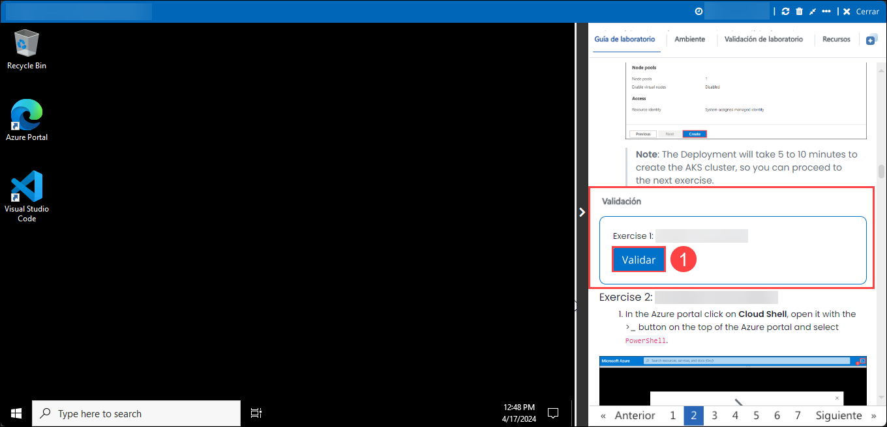
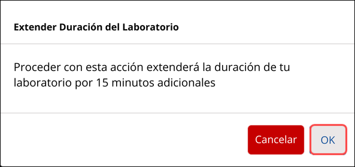

# Cloud Native Application Architecture

### Overall Estimated Duration: 4 hours

## Overview

Contoso Traders (ContosoTraders) provides online retail website services tailored to the electronics community. They are refactoring their application to run as a Docker application. They want to implement a proof of concept that will help them get familiar with the development process, lifecycle of deployment, and critical aspects of the hosting environment.

In this hands-on lab, you will assist in containerizing their application by building Docker images and pushing them to Azure Container Registry (ACR) for secure access. You will also migrate an on-premises MongoDB database from an Azure Linux VM to Azure Cosmos DB using Azure Database Migration Service. Finally, you will deploy the application to Azure Kubernetes Service (AKS), integrating Key Vault Secrets and exploring different deployment strategies. By the end of this lab, you will gain practical experience in containerization, database migration, and Kubernetes-based deployment.

## Objectives

By the end of this lab, you will be able to:

- **Build Docker Images for the Application:** This hands-on exercise aims to create Docker images to containerize your application for consistent and portable deployments. Participants will successfully containerize the application, enabling consistent deployment across various environments.

- **Migrate MongoDB to Cosmos DB using Azure Database Migration:** This hands-on exercise aims to transfer your MongoDB data to Azure Cosmos DB to leverage its scalable and managed database services. Participants will seamlessly migrate MongoDB data to Azure Cosmos DB, ensuring data availability and compatibility with Azure services.

- **Deploy the application to the Azure Kubernetes Service:** This hands-on exercise aims to deploy and manage your containerized application using Azure Kubernetes Service for orchestration and scalability. Participants will deploy the containerized application to Azure Kubernetes Service, providing a scalable and managed environment for operation.

## Prerequisites

Participants should have:

- Understanding Docker concepts such as containers, images, and Dockerfiles.
- Knowledge of MongoDB data structures and Azure Cosmos DB capabilities for effective migration.
- Basic understanding of Kubernetes concepts including pods, deployments, and services, as well as Azure Kubernetes Service (AKS).
- An active Azure subscription with appropriate permissions to create and manage resources.
- General understanding of cloud services, container orchestration, and scaling strategies.
- Proficiency in using command-line tools and interfaces, such as Azure CLI and Docker CLI.

## Architecture

The lab utilize several Azure services to build, deploy, and manage applications effectively. Azure Container Registry (ACR) is used for storing and managing Docker container images, while Azure Cosmos DB provides a scalable, multi-model database solution for data migration. Azure Kubernetes Service (AKS) enables the deployment and management of containerized applications within a managed Kubernetes environment

## Architecture Diagram

## Explanation of Components

The architecture for this lab involves several key components:

- **Azure Container Registry (ACR):** A managed Docker container registry for storing and managing Docker container images.
- **Azure Cosmos DB:** A globally distributed, multi-model database service for managing and scaling NoSQL data.
- **Azure Kubernetes Service (AKS):** A managed Kubernetes container orchestration service for deploying, scaling, and managing containerized applications.
- **Azure Database Migration Service (DMS):** A fully managed service designed to streamline and automate the migration of databases to Azure with minimal downtime. It supports migrations from various database sources, including SQL Server, MySQL, PostgreSQL, MongoDB, and Oracle, to Azure SQL Database, Azure Cosmos DB, and other Azure data platforms.
- **Azure Key Vault:** A cloud service that securely stores and manages sensitive information like secrets, encryption keys, and certificates used by applications and services

1. Once the environment is provisioned, a virtual machine (JumpVM) and lab guide will get loaded in your browser. Use this virtual machine throughout the workshop to perform the lab. You can see the number on the bottom of the lab guide to switch to different exercises of the lab guide.

   

   

1. To get the lab environment details, you can select the **Environment** tab. Additionally, the credentials will also be emailed to your registered email address. You can also open the Lab Guide on a separate and full window by selecting the **Split Window** from the top right corner. Also, you can start, stop, and restart virtual machines from the **Resources** tab.

   
 
   > You will see the DeploymentID value on the **Environment** tab, use it wherever you see SUFFIX or DeploymentID in lab steps.

## Lab Validation

1. After completing the task, hit the **Validate** button under the Validation tab integrated within your lab guide. If you receive a success message, you can proceed to the next task, if not, carefully read the error message and retry the step, following the instructions in the lab guide.

   

1. You can also validate the task by navigating to the **Lab Validation** tab, from the upper right corner in the lab guide section.

   

1. If you need any assistance, please contact us at cloudlabs-support@spektrasystems.com.

## Lab Duration Extension

1. To extend the duration of the lab, kindly click the **Hourglass** icon in the top right corner of the lab environment. 

   

   >**Note:** You will get the **Hourglass** icon when 10 minutes are remaining in the lab.

2. Click **OK** to extend your lab duration.
 
   

3. If you have not extended the duration prior to when the lab is about to end, a pop-up will appear, giving you the option to extend. Click **OK** to proceed.
     
## Login to Azure Portal

1. In the JumpVM, click on the Azure portal shortcut of the Microsoft Edge browser which is created on the desktop.

   
   
1. On the **Sign into Microsoft Azure** tab you will see the login screen, in that enter the following email/username and then click on **Next**. 
   * Email/Username: <inject key="AzureAdUserEmail"></inject>
   
     
     
1. Now enter the following password and click on **Sign in**.
   * Password: <inject key="AzureAdUserPassword"></inject>
   
     
     
   > If you see the **Help us protect your account** dialog box, then select the **Skip for now** option.

     
  
1. If you see the pop-up **Stay Signed in?**, click No

1. If you see the pop-up **You have free Azure Advisor recommendations!**, close the window to continue the lab.

1. If a **Welcome to Microsoft Azure** popup window appears, click **Cancel** to skip the tour.
   
1. Now you will see the Azure Portal Dashboard, click on **Resource groups** from the Navigate panel to see the resource groups.

    
   
1. Now, click on the **Next** from the lower right corner to move to the next page.
