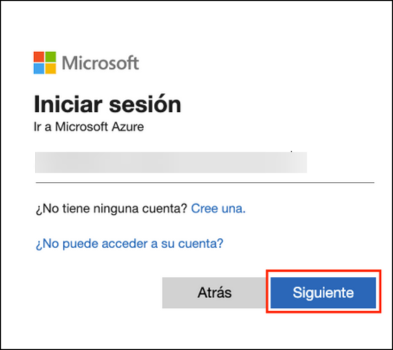
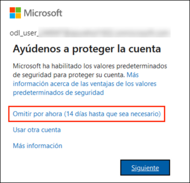
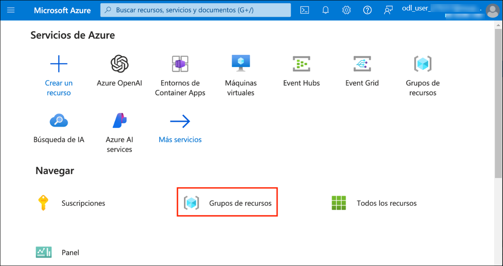

# Comenzando con el Laboratorio

1. Una vez que se haya aprovisionado el entorno, se cargarán una máquina virtual (JumpVM) y una guía de laboratorio en su navegador. Utilice esta máquina virtual en todo el taller para realizar la práctica de laboratorio. Puede ver el número en la parte inferior de la guía de laboratorio para cambiar a diferentes ejercicios de la guía de laboratorio.

   

1. Para obtener los detalles del entorno del laboratorio, puede seleccionar la pestaña **Ambiente**. Además, las credenciales también se enviarán por correo electrónico a su dirección de correo electrónico registrada. También puede abrir la Guía de laboratorio en una ventana completa e independiente seleccionando **Ventana separada** en la esquina superior derecha. Además, puede iniciar, detener y reiniciar máquinas virtuales desde la pestaña **Recursos**.

   
 
   > Verá el valor de DeploymentID en la pestaña **Ambiente**; úselo dondequiera que vea SUFFIX o DeploymentID en los pasos del laboratorio.

## Validación de Laboratorio

1. Después de completar la tarea, presione el botón **Validar** en la pestaña Validación que se encuentra integrada en su guía de laboratorio. Si recibe un mensaje de éxito, puede continuar con la siguiente tarea; de lo contrario, lea atentamente el mensaje de error y vuelva a intentar el paso, siguiendo las instrucciones de la guía de laboratorio.

   

1. También puede validar la tarea navegando a la pestaña **Validación de laboratorio**, en la esquina superior derecha de la sección de la guía de laboratorio.

   

1. Si necesita ayuda, póngase en contacto con nostros en cloudlabs-support@spektrasystems.com.

## Extensión de la Duración del Laboratorio

1. Para extender la duración del laboratorio, haga clic en el ícono **Reloj de arena** en la esquina superior derecha del ambiente del laboratorio.

   

   >**Nota:** Aparecerá el ícono **Reloj de arena** cuando queden 10 minutos en el laboratorio.

2. Haga clic en **OK** para ampliar la duración de la práctica de laboratorio.
 
   

3. Si no ha extendido la duración antes de que la práctica de laboratorio esté a punto de finalizar, aparecerá una ventana emergente que le dará la opción de extenderla. Haga clic en **OK** para continuar.
     
## Inicie sesión en el Portal de Azure

1. En JumpVM, haga clic en el acceso directo de Azure Portal del navegador Microsoft Edge que se crea en el escritorio.

   
   
1. En la pestaña **Iniciar sesión en Microsoft Azure** verá la pantalla de inicio de sesión, en ella introduzca el siguiente correo electrónico/nombre de usuario y, a continuación, haga clic en **Siguiente**.  
   * Correo electrónico/Nombre de usuario: <inject key="AzureAdUserEmail"></inject>
   
     
     
1. Ahora ingrese la siguiente contraseña y haga clic en **Iniciar sesión**.
   * Contraseña: <inject key="AzureAdUserPassword"></inject>
   
     
     
   > Si ve el cuadro de diálogo **Ayúdenos a proteger su cuenta**, seleccione la opción **Omitir por ahora**.

     
  
1. Si ve la ventana emergente **¿Permanecer conectado?**, haga clic en No

1. Si ve la ventana emergente **¡Tiene recomendaciones gratuitas de Azure Advisor!**, cierre la ventana para continuar con la práctica de laboratorio.

1. Si aparece una ventana emergente **Bienvenido a Microsoft Azure**, haga clic en **Quizás más tarde** para omitir el recorrido.
   
1. Ahora verá el Panel de Azure Portal, haga clic en **Grupos de recursos** en el panel Navegar para ver los grupos de recursos.

    
   
1. Ahora, haga clic en **Siguiente** en la esquina inferior derecha para pasar a la página siguiente.