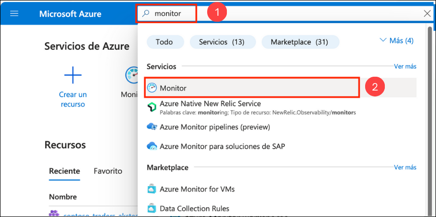
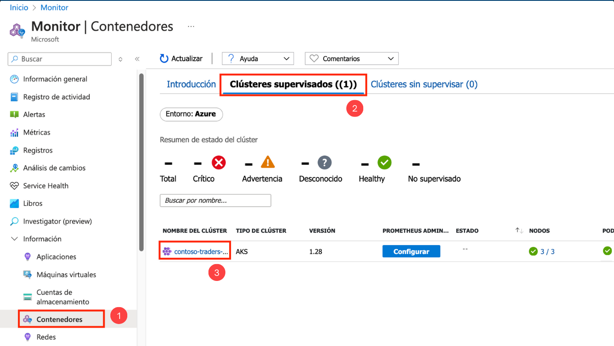

## Exercise 6: Azure Monitor for Containers
   
**Duration**: 10 Minutes

## Overview

In this exercise, you will be reviewing the Azure Monitor container insights for the AKS cluster. Azure Monitor helps you maximize the availability and performance of your applications and services. It delivers a comprehensive solution for collecting, analyzing, and acting on telemetry from your cloud and on-premises environments.

A few examples of what you can do with Azure Monitor include:

- Detect and diagnose issues across applications and dependencies with Application Insights.
- Correlate infrastructure issues with VM insights and Container insights.
- Collect data from monitored resources by using Azure Monitor Metrics.
  

### Task 1: Review Azure Monitor metrics

In this task, you will be reviewing the monitored AKS cluster.

1. Navigate back to the Azure portal in the browser and search for **Monitor (1)**, Select **Monitor (2)** from the result.

   
     
1. From the left navigation pane, select **Containers (1)** from under the Insights menu, navigate to the **Monitored clusters (2)** section to review logs and select your **Kubernetes service (3)**.

   
   
1. You will be redirected to the Insight section in your Kubernetes service resource blade and you should be able to see some logs.

   > **Note**: The Azure Monitor can take up to 15 minutes to populate the data in the insight blade.
    
    

## Summary

In this exercise, you have Reviewed Azure Monitor container insights for the AKS cluster.

## Lab ends
