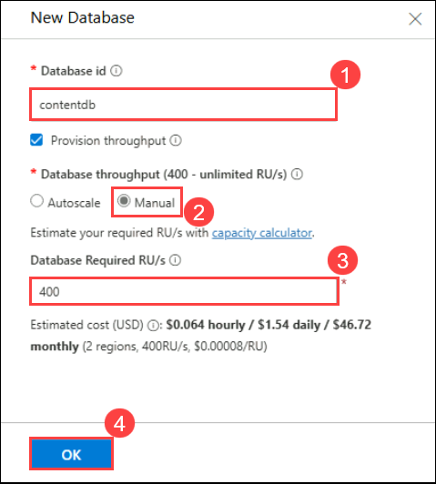
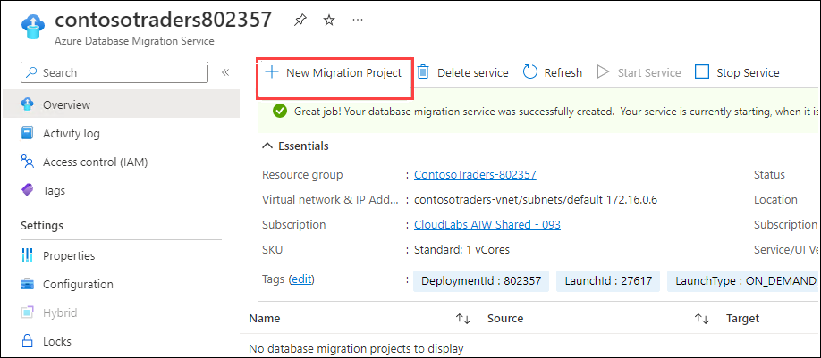
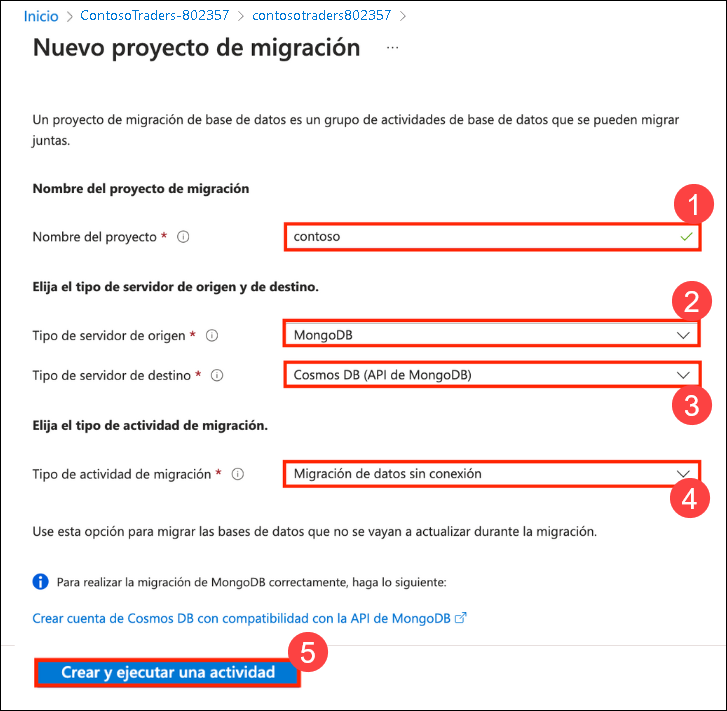

## Ejercicio 2: Migrar MongoDB a Cosmos DB mediante Azure Database Migration
  
**Duración**: 30 Minutos

## Descripción General

En este ejercicio, migrará su base de datos MongoDB on-premises (local) hospedada en una Máquina Virtual (MV) Linux de Azure a Azure CosmosDB utilizando la Azure Database Migration. Azure Database Migration Service es una herramienta que le ayuda a simplificar, guiar y automatizar la migración de su base de datos a Azure.

### Tarea 1: Explorar las bases de datos y colecciones en MongoDB

En esta tarea, se conectará a una base de datos Mongo alojada en una Máquina Virtual Linux de Azure y explorará las bases de datos y colecciones que contiene.

1. Mientras está conectado a su MV Linux, ejecute el siguiente comando para conectarse a Mongo shell y mostrar las bases de datos y colecciones que contiene usando Mongo shell.

   ```
   mongo
   ```
   
   >**Nota**: Si tiene un problema al conectarse a la base de datos de origen con un error de conexión rechazada, ejecute el comando **<inject key="Command to Connect to Build Agent VM" enableCopy="true" />**, escriba **yes** cuando diga **Are you sure you want to continue connecting (yes/no/[fingerprint])?** e ingrese la contraseña de la máquina virtual **<inject key="Build Agent VM Password" enableCopy="true" />** para conectarse a la máquina virtual Linux mediante ssh. Ejecute los siguientes comandos y vuelva a realizar el paso 1 de la tarea. 

   ```
   sudo apt install mongodb-server
   cd /etc
   sudo sed -i 's/bind_ip = 127.0.0.1/bind_ip = 0.0.0.0/g' /etc/mongodb.conf
   sudo sed -i 's/#port = 27017/port = 27017/g' /etc/mongodb.conf
   sudo service mongodb stop
   sudo service mongodb start
   ```
   
   
   
1. Ejecute los siguientes comandos para verificar la base de datos en Mongo shell. Debería poder ver la base de datos **contentdb** disponible y las colecciones **item & products** dentro de **contentdb**.

   ```
   show dbs
   use contentdb
   show collections
   ```
   
    

   >**Nota**: En caso de que no vea los datos dentro de Mongo. Siga los pasos que se mencionan a continuación.

   - Ingrese `exit` para salir de Mongo.

   - Por favor ejecute los comandos que se mencionan a continuación en el símbolo del sistema y realice los pasos 1 y 2 nuevamente.

      ```
      cd ~/Cloud-Native-Application/labfiles/src/developer/content-init
      sudo npm ci
      nodejs server.js
      ```     

### Tarea 2: Crear un Proyecto de Migración y migrar datos a Azure CosmosDB

En esta tarea, creará un Proyecto de Migración dentro de Azure Database Migration Service, y luego migrará los datos de MongoDB a Azure Cosmos DB. En los ejercicios posteriores, utilizará Azure CosmosDB para recuperar los datos de la página de productos. 

1. En el Portal de Azure, navegue a su máquina virtual **contosotraders** en el grupo de recursos **ContosoTraders-<inject key="DeploymentID" enableCopy="false" />**. Copie la **Dirección IP Privada** y péguela en el bloc de notas para usarla más adelante.

   

1. Navegue al grupo de recursos **ContosoTraders<inject key="DeploymentID" enableCopy="false" />(1)** y abra el recurso CosmosDB **contosotraders-<inject key="DeploymentID" enableCopy="false" />(2)** , haga clic en **Explorador de datos (3)**. Ahora haga clic en la flecha desplegable, junto a **New Collection (4)** y luego seleccione **New Database (5)**.

   

   > **Nota:** Si recibe una ventana emergente **¡Bienvenido! ¿Qué es Cosmos DB?** ventana emergente, ciérrela haciendo clic en **X**.

1. Proporcione el nombre `contentdb` **(1)** para **Database id** y establezca el **Database throughput** como **Manual** **(2)**, asigne el valor `400` para los RU/s **(3)** y haga clic en **OK (4)**.

   

   **Nota:** Para visualizar las configuraciones, asegúrate de que la opción Provision throughput esté **marcada**.

1. Navegue a la hoja de recursos **contosotraders<inject key="DeploymentID" enableCopy="false" />** de Azure Database Migration Service en el grupo de recursos **ContosoTraders-<inject key="DeploymentID" enableCopy="false" />**.

1. En la hoja Azure Database Migration Service, seleccione **+ Nuevo Proyecto de Migración** en el panel **Descripción general**.

   

1. En el panel **Nuevo proyecto de migración**, ingrese los siguientes valores y luego seleccione **Crear y ejecutar actividad**:

    - Nombre de proyecto: `contoso`
    - Tipo de servidor de origen: `MongoDB`
    - Tipo de servidor de destino: `CosmosDB (MongoDB API)`
    - Tipo de actividad de migración: `Offline data migration`

      

      >**Nota**: El tipo de actividad **Migración de datos sin conexión** está seleccionado ya que realizará una migración única de MongoDB a Cosmos DB. Además, los datos de la base de datos no se actualizarán durante la migración. En un escenario de producción, deberá elegir el tipo de actividad del proyecto de migración que mejor se adapte a los requisitos de su solución.

1. En el panel **Asistente para la Migración Sin Conexión (Offline) de MongoDB a Azure Database for CosmosDB**, ingrese los siguientes valores para la pestaña **Seleccionar origen**:

    - Modo: **Modo estándar**
    - Nombre del servidor de origen: ingrese la Dirección IP Privada de la MV del Agente de Compilación (Build Agent VM) utilizada en esta práctica de laboratorio.
    - Puerto del servidor: `27017`
    - Requerir SSL: Sin seleccionar

    > **Nota:** Deje el **Nombre de usuario** y la **Contraseña** en blanco ya que la instancia de MongoDB en la MV del Agente de Compilación para esta práctica de laboratorio no tiene la autenticación activada. Azure Database Migration Service está conectado a la misma red virtual que la MV del Agente de Compilación, por lo que puede comunicarse dentro de la red virtual directamente con la MV sin exponer el servicio MongoDB a Internet. En escenarios de producción, siempre debe tener habilitada la autenticación en MongoDB.

    
    
    > **Nota:** Si se encuentra con un problema al conectarse a la base de datos de origen tal como error: conexión denegada, por favor ejecute los siguientes comandos en **la MV del Agente de Compilación conectado en CloudShell**. Puede usar el **Comando para Conectarse a la MV del Agente de Compilación**, el cual se proporciona en la página de detalles del ambiente de laboratorio.
    

    ```bash
    cd /etc
    sudo sed -i 's/bind_ip = 127.0.0.1/bind_ip = 0.0.0.0/g' /etc/mongodb.conf
    sudo sed -i 's/#port = 27017/port = 27017/g' /etc/mongodb.conf
    sudo service mongodb stop
    sudo service mongodb start
    ```
    
1. Seleccione **Siguiente: Seleccionar destino >>**.

1. En el panel **Seleccionar destino**, elija los siguientes valores: 

    - Modo: **Seleccionar el destino de Cosmos DB**

    - Suscripción: seleccione la suscripción de Azure que está usando para esta práctica de laboratorio.

    - Seleccionar el nombre de Cosmos DB: Seleccione la instancia de CosmosDB  **contosotraders-<inject key="DeploymentID" enableCopy="false" />** .

      

      Tenga en cuenta que la **Cadena de conexión** se completará automáticamente con la clave de su instancia de Azure Cosmos DB.

1. Seleccione **Siguiente: Configuración de base de datos >>**.

1. En la pestaña **Configuración de base de datos**, seleccione la **Base de datos de origen** `contentdb`, a fin de que esta base de datos de MongoDB se migre a Azure Cosmos DB.

   

1. Seleccione **Siguiente: Configuración de colección >>**.

1. En la pestaña **Configuración de colección**, expanda la base de datos **contentdb** y asegúrese de que tanto las colecciones **products** como **items** estén seleccionadas para la migración. Además, actualice el **Rendimiento (RU/s)** a `400` para ambas colecciones.

   

1. Seleccione **Siguiente: Resumen de migración >>**.

1. En la pestaña **Resumen de migración**, ingrese `MigrateData` en el campo **Nombre de actividad** y luego seleccione **Iniciar migración** para iniciar la migración de los datos de MongoDB a Azure Cosmos DB.

   

1. Se mostrará el estado de la actividad de migración. La migración finalizará en cuestión de segundos. Seleccione **Actualizar** para recargar el estado y asegurarse de que sea **completo**.

   

1. Para verificar los datos migrados, navegue hasta la cuenta Azure CosmosDB for MongoDB **contosotraders-<inject key="DeploymentID" enableCopy="false" />** en el Grupo de recursos **ContosoTraders-<inject key="DeploymentID" enableCopy="false" />**. Seleccione **Explorador de datos** del menú izquierdo.

   

1. Verá las colecciones `items` y `products` listadas dentro de la base de datos `contentdb` y podrá explorar los documentos.

   

1. Dentro de la cuenta Azure CosmosDB for MongoDB **contosotraders-<inject key="DeploymentID" enableCopy="false" />** **(1)** , seleccione **Inicio rápido** **(2)** del menú a la izquierda y **Copie** la **CADENA DE CONEXIÓN PRIMARIA** **(3)** y péguela en el archivo de texto para usarla más tarde en el siguiente ejercicio. 

   

1. Haga clic en el botón **Siguiente** ubicado en la esquina inferior derecha de esta guía de laboratorio para continuar con el siguiente ejercicio.

<validation step="8b5cf0f8-b2b7-4802-bb0a-ecd34be43ab2" />

> **Felicitaciones** por completar la tarea. Ahora es momento de validarla. Estos son los pasos:
> - Si recibe un mensaje de éxito, puede continuar con la siguiente tarea.
> - Si no es así, lea atentamente el mensaje de error y vuelva a intentar el paso, siguiendo las instrucciones de la guía de laboratorio.
> - Si necesita ayuda, comuníquese con nosotros a cloudlabs-support@spektrasystems.com. Estamos disponibles las 24 horas, los 7 días de la semana para ayudarlo.

## Resumen

En este ejercicio, completó la exploración de su MongoDB on-premises (local) y la migración de su base de datos MongoDB local a Azure CosmosDB mediante el servicio Azure Database Migration.
