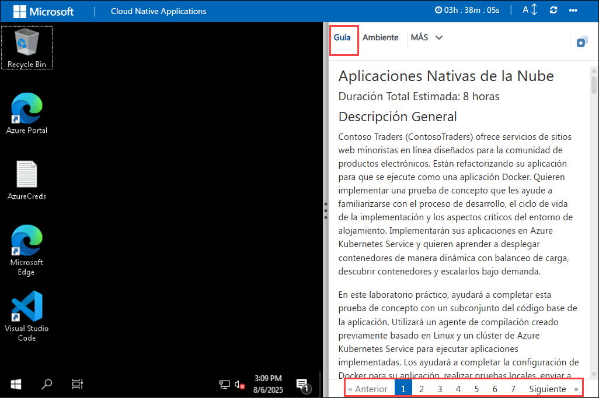
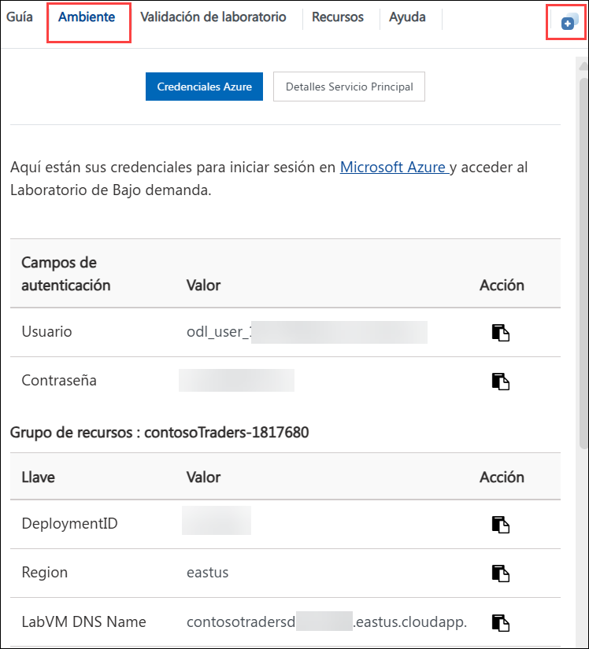
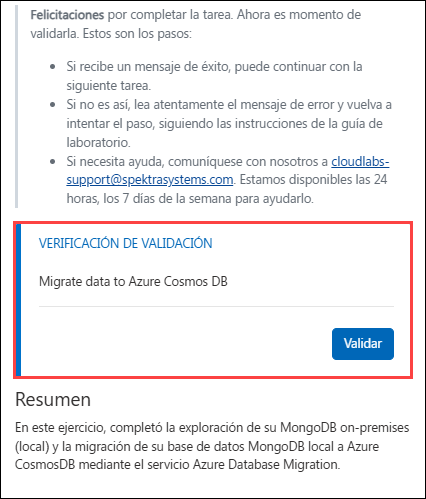
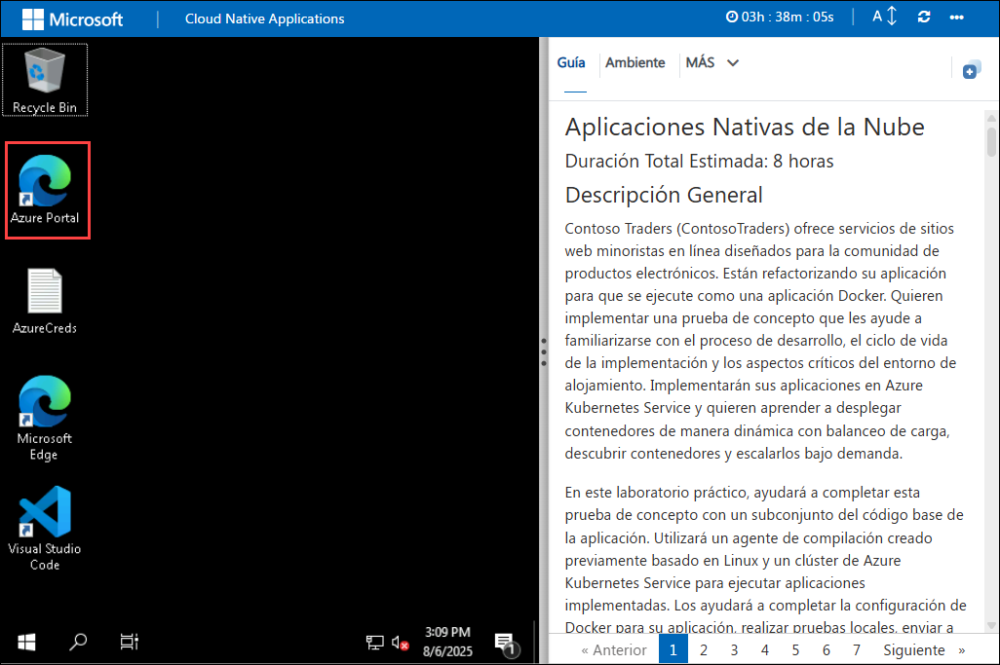
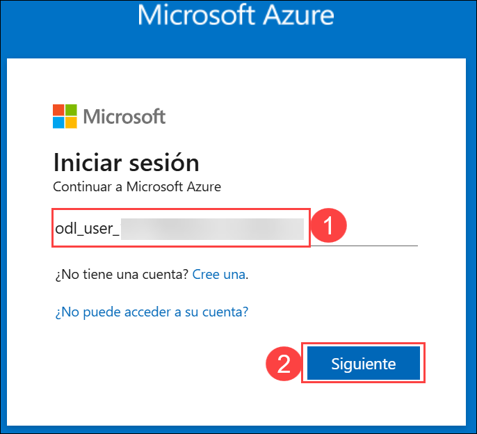
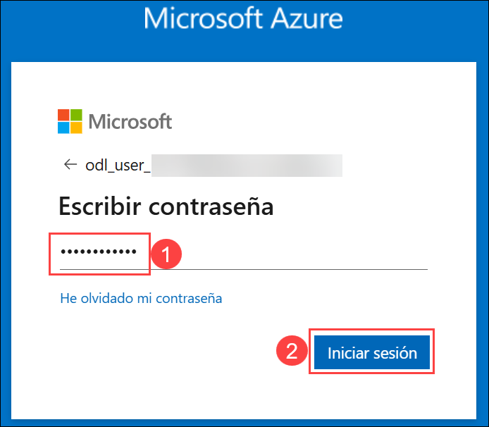
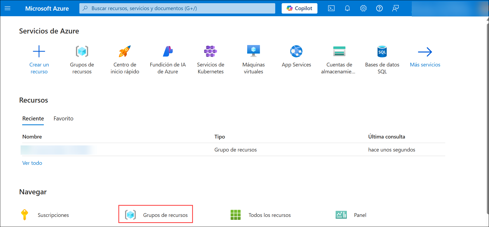

# Aplicaciones Nativas de la Nube

### Duración Total Estimada: 8 horas

## Descripción General

Contoso Traders (ContosoTraders) ofrece servicios de sitios web minoristas en línea diseñados para la comunidad de productos electrónicos. Están refactorizando su aplicación para que se ejecute como una aplicación Docker. Quieren implementar una prueba de concepto que les ayude a familiarizarse con el proceso de desarrollo, el ciclo de vida de la implementación y los aspectos críticos del entorno de alojamiento. Implementarán sus aplicaciones en Azure Kubernetes Service y quieren aprender a desplegar contenedores de manera dinámica con balanceo de carga, descubrir contenedores y escalarlos bajo demanda.

En este laboratorio práctico, ayudará a completar esta prueba de concepto con un subconjunto del código base de la aplicación. Utilizará un agente de compilación creado previamente basado en Linux y un clúster de Azure Kubernetes Service para ejecutar aplicaciones implementadas. Los ayudará a completar la configuración de Docker para su aplicación, realizar pruebas locales, enviar a un repositorio de imágenes, desplegar en el clúster, probar el equilibrio de carga y escalar, y usar Azure Monitor y ver los resultados.

## Objetivo

Este laboratorio está diseñado para brindar a los participantes experiencia práctica en la creación de imágenes de Docker, la migración de MongoDB a Cosmos DB, la implementación y el escalado de aplicaciones en Azure Kubernetes Service, la administración de actualizaciones y el enrutamiento del tráfico, y el monitoreo del rendimiento de los contenedores con Azure Monitor.

- **Crear imágenes de Docker para la Aplicación:** Este ejercicio práctico tiene como objetivo crear imágenes de Docker para contenerizar su aplicación para despliegues consistentes y portátiles. Los participantes podrán contenerizar la aplicación con éxito, permitiendo una implementación consistente en varios entornos.

- **Migrar MongoDB a Cosmos DB mediante Azure Database Migration:** Este ejercicio práctico tiene como objetivo transferir sus datos de MongoDB a Azure Cosmos DB para aprovechar sus servicios de base de datos escalables y administrados. Los participantes migrarán sin problemas los datos de MongoDB a Azure Cosmos DB, garantizando la disponibilidad de los datos y la compatibilidad con los servicios de Azure.

- **Implementar la aplicación en Azure Kubernetes Service:** Este ejercicio práctico tiene como objetivo implementar y administrar su aplicación en contenedores mediante Azure Kubernetes Service para la orquestación y la escalabilidad. Los participantes desplegarán la aplicación en contenedores en Azure Kubernetes Service, proporcionando un entorno escalable y administrado para su funcionamiento.

- **Escalar la aplicación y validar la Alta Disponibilidad:** Este ejercicio práctico tiene como objetivo ajustar la escala de la aplicación y confirmar su alta disponibilidad para asegurarse de que funcione bien bajo cargas variables. Los participantes escalarán la aplicación para manejar cargas variables y confirmarán su alta disponibilidad para mantener el rendimiento y la confiabilidad.

- **Actualización de Aplicaciones y Gestión de Kubernetes Ingress:** Este ejercicio práctico tiene como objetivo aplicar actualizaciones a su aplicación y configurar Kubernetes Ingress para administrar y enrutar el tráfico externo de manera eficaz. Los participantes actualizarán la aplicación con éxito y configurarán Kubernetes Ingress para administrar y enrutar el tráfico externo de manera eficaz.

- **Azure Monitor para Contenedores:** Este ejercicio práctico tiene como objetivo utilizar Azure Monitor para Containers a fin de realizar un seguimiento y analizar el rendimiento y el estado de sus aplicaciones en contenedores en AKS. Los participantes habilitarán la supervisión de aplicaciones en contenedores con Azure Monitor, proporcionando información sobre el rendimiento y el estado operativo.

## Requisitos previos

Los participantes deben tener:

- Comprensión de conceptos de Docker, como contenedores, imágenes y Dockerfiles.
- Conocimiento de las estructuras de datos de MongoDB y las capacidades de Azure Cosmos DB para una migración efectiva.
- Comprensión básica de los conceptos de Kubernetes, incluyendo pods, implementaciones y servicios, así como Azure Kubernetes Service (AKS).
- Una suscripción activa de Azure con los permisos adecuados para crear y administrar recursos.
- Comprensión general de los servicios en la nube, la orquestación de contenedores y las estrategias de escalado.
- Competencia en el uso de herramientas e interfaces de línea de comandos, como Azure CLI y Docker CLI.
- Familiaridad con las prácticas de integración continua e implementación continua, dado que pueden ser relevantes para administrar actualizaciones e implementaciones.

## Arquitectura

Los ejercicios utilizan varios servicios de Azure para crear, implementar y administrar aplicaciones de forma eficaz. Azure Container Registry (ACR) se utiliza para almacenar y gestionar imágenes de contenedores de Docker, mientras que Azure Cosmos DB proporciona una solución de base de datos escalable y multimodelo para la migración de datos. Azure Kubernetes Service (AKS) permite la implementación y la administración de aplicaciones en contenedores dentro de un entorno de Kubernetes administrado. Para lograr una alta disponibilidad y escalabilidad, Azure Load Balancer distribuye el tráfico entre servidores, y Azure Application Gateway ofrece balanceo de carga y enrutamiento avanzados para aplicaciones web. Por último, Azure Monitor realiza un seguimiento del rendimiento y el estado de las aplicaciones y la infraestructura, incluyendo los entornos en contenedores, garantizando una supervisión y una información completas.

## Diagrama de Arquitectura

## Explicación de Componentes

La arquitectura de este laboratorio incluye varios componentes clave:

- **Azure Container Registry (ACR):** Un registro de contenedores Docker administrado para almacenar y gestionar imágenes de contenedores Docker.
- **Azure Cosmos DB:** Un servicio de base de datos multimodelo distribuido globalmente para administrar y escalar datos NoSQL.
- **Azure Kubernetes Service (AKS):** Un servicio de orquestación de contenedores Kubernetes administrado para implementar, escalar y gestionar aplicaciones en contenedores.
- **Azure Load Balancer (parte de AKS):** Un balanceador de carga de alto rendimiento que distribuye el tráfico de red entre varios servidores para garantizar una alta disponibilidad.
- **Azure Application Gateway (parte de AKS):** Un balanceador de carga de tráfico web que le permite administrar el tráfico de sus aplicaciones web y proporciona enrutamiento basado en URL y terminación SSL.
- **Azure Monitor:** Un servicio de monitoreo integral que brinda información sobre el rendimiento y el estado de las aplicaciones y la infraestructura, incluyendo las cargas de trabajo en contenedores.

## Comenzando con el Laboratorio

1. Una vez que se haya aprovisionado el ambiente, se cargarán una máquina virtual (JumpVM) y una guía de laboratorio en su navegador. Utilice esta máquina virtual durante todo el taller para realizar el laboratorio. Puede ver el número en la parte inferior de la guía de laboratorio para cambiar a los diferentes ejercicios de la guía de laboratorio.

   

1. Para obtener los detalles del ambiente de laboratorio, puede seleccionar la pestaña **Ambiente**. Además, las credenciales también se enviarán por correo electrónico a su dirección de correo electrónico registrada. También puede abrir la Guía de Laboratorio en una ventana separada y completa seleccionando **Ventana Dividida** en la esquina superior derecha. Además, puede iniciar, detener y reiniciar máquinas virtuales desde la pestaña **Recursos**.

   
 
   > Verá el valor de DeploymentID en la pestaña **Ambiente**, úselo donde vea SUFFIX o DeploymentID en los pasos del laboratorio.

## Validación de Laboratorio

1. Después de completar la tarea, presione el botón **Validar** en la pestaña Validación integrada en la guía de laboratorio. Si recibe un mensaje de éxito, puede continuar con la siguiente tarea; de lo contrario, lea cuidadosamente el mensaje de error y vuelva a intentar el paso, siguiendo las instrucciones de la guía de laboratorio.

   

1. Si necesita ayuda, póngase en contacto con nosotros en cloudlabs-support@spektrasystems.com

## Iniciar Sesión en el Portal de Azure

1. En JumpVM, haga clic en el acceso directo del portal de Azure del navegador Microsoft Edge que se crea en el escritorio.

   
   
1. En la pestaña **Iniciar sesión en Microsoft Azure** verá la pantalla de inicio de sesión, en ella ingrese el siguiente correo electrónico/nombre de usuario y luego haga clic en **Siguiente**.
   * Correo electrónico/Nombre de usuario: <inject key="AzureAdUserEmail"></inject>
   
     
     
1. Ahora ingrese la siguiente contraseña y haga clic en **Iniciar sesión**.
   * Contraseña: <inject key="AzureAdUserPassword"></inject>
   
     
     
     > Si ve el cuadro de diálogo **Ayúdenos a proteger su cuenta**, seleccione la opción **Omitir por ahora**.

     
  
1. Si ve la ventana emergente **¿Desea permanecer conectado?**, haga clic en No

      

1. Si ve la ventana emergente **¡Tiene recomendaciones gratuitas de Azure Advisor!**, cierre la ventana para continuar con el laboratorio.

1. Si aparece una ventana emergente **Bienvenido a Microsoft Azure**, haga clic en **Quizás más tarde** para omitir la visita guiada.
   
1. Ahora verá el Panel del portal de Azure; haga clic en **Grupos de recursos** en el panel Navegar para ver los grupos de recursos.

    
   
Al finalizar este laboratorio, los participantes aprenderán a crear imágenes de Docker para contenerizar aplicaciones, migrar datos de MongoDB a Azure Cosmos DB e implementar aplicaciones en Azure Kubernetes Service (AKS) para la orquestación. También escalarán aplicaciones y garantizarán una alta disponibilidad, administrarán actualizaciones y enrutamiento de tráfico, y usarán Azure Monitor para realizar un seguimiento del rendimiento y el estado de sus aplicaciones en contenedores.

## Contacto de Soporte
 
El equipo de soporte de CloudLabs está disponible las 24 horas del día, los 7 días de la semana, los 365 días del año, por correo electrónico y chat en vivo para garantizar una asistencia sin inconvenientes en cualquier momento. Ofrecemos canales de soporte dedicados, diseñados específicamente tanto para estudiantes como para instructores, garantizando que todas sus necesidades sean atendidas de forma rápida y eficiente.

Contactos de Soporte para Estudiantes:
- Soporte por Correo Electrónico: cloudlabs-support@spektrasystems.com
- Soporte por Chat En Vivo: https://cloudlabs.ai/labs-support

Ahora, haga clic en **Siguiente** en la esquina inferior derecha para pasar a la página siguiente.

### ¡Feliz Aprendizaje!!
